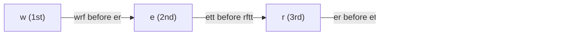

**Short answer:** Each pair of adjacent words gives at most one fact: at the first position where they differ, the letter in the first word comes before the letter in the second. Those facts are edges of a directed graph on letters. A topological sort (Kahn's BFS) gives a valid alphabet. If the sort cannot place every letter there is a cycle, so return `""`. Also return `""` when a word is followed by its own proper prefix.

## Picture it

Words `["wrt","wrf","er","ett","rftt"]`. Each adjacent pair gives one edge at its first difference:



Kahn's algorithm on that graph (in-degrees start as w 0, e 1, r 1, t 1, f 1):

| Step | Queue | Pop | Output | In-degree changes |
|---|---|---|---|---|
| 1 | [w] | w | `w` | e: 1 → 0, push e |
| 2 | [e] | e | `we` | r: 1 → 0, push r |
| 3 | [r] | r | `wer` | t: 1 → 0, push t |
| 4 | [t] | t | `wert` | f: 1 → 0, push f |
| 5 | [f] | f | `wertf` | none |

All 5 letters placed, so there is no cycle: answer `"wertf"`.

**The picture in one sentence:** the first differing letter of each adjacent pair is a "comes before" edge, and a topological sort of those edges is the alphabet.

## Approach

- **Wrong turn to avoid:** comparing every pair of words, or comparing letters past the first difference. Only the first differing letter of *adjacent* words carries information. Later letters say nothing, and non-adjacent pairs follow from transitivity.
- **Key insight:** "letter u comes before letter v" is a precedence constraint. A set of precedence constraints is a DAG problem, and any topological order satisfies all of them. A cycle means the constraints contradict each other.
- **Optimal:**
  1. Mark every letter that appears, even ones in no edge. They must still be in the output.
  2. For each adjacent pair, find the first difference and add edge `u → v` once (deduplicate, or the in-degrees will be wrong).
  3. If there is no difference and the first word is longer (`"abc"` before `"ab"`), the input is invalid.
  4. Kahn's algorithm: start with in-degree-0 letters, pop, append, lower neighbours' in-degree.
  5. If the output is shorter than the number of letters, there was a cycle.

## Solution

```java
import java.util.*;

class Solution {
    public String alienOrder(String[] words) {
        boolean[] present = new boolean[26];
        for (String w : words) for (char c : w.toCharArray()) present[c - 'a'] = true;

        boolean[][] edge = new boolean[26][26];
        int[] indeg = new int[26];
        for (int i = 0; i + 1 < words.length; i++) {
            String a = words[i], b = words[i + 1];
            int j = 0;
            while (j < a.length() && j < b.length() && a.charAt(j) == b.charAt(j)) j++;
            if (j == a.length() || j == b.length()) {
                if (a.length() > b.length()) return "";   // longer word before its prefix
                continue;                                  // a is a prefix of b: no information
            }
            int u = a.charAt(j) - 'a', v = b.charAt(j) - 'a';
            if (!edge[u][v]) {                             // count each edge once
                edge[u][v] = true;
                indeg[v]++;
            }
        }

        ArrayDeque<Integer> q = new ArrayDeque<>();
        int letters = 0;
        for (int c = 0; c < 26; c++) {
            if (!present[c]) continue;
            letters++;
            if (indeg[c] == 0) q.add(c);
        }
        StringBuilder sb = new StringBuilder();
        while (!q.isEmpty()) {
            int u = q.poll();
            sb.append((char) ('a' + u));
            for (int v = 0; v < 26; v++) if (edge[u][v] && --indeg[v] == 0) q.add(v);
        }
        return sb.length() == letters ? sb.toString() : "";   // shorter = cycle
    }
}
```

## Complexity

- **Time:** O(C) to scan all characters (C = total length of all words), plus O(26²) for the topological sort with an adjacency matrix. In general terms O(C + V + E).
- **Space:** O(26²) = O(1) for the graph.

## Edge cases

- A single word: no edges, return its distinct letters in any order.
- Contradiction `["z","x","z"]` → cycle → `""`.
- Prefix rule: `["ab","abc"]` is fine; `["abc","ab"]` is invalid.
- Duplicate edges from different word pairs must not double-count in-degree.
- A self-edge cannot happen, because the letters differ at position `j`.

## Variations

- **DFS topological sort** with three colours (unvisited, visiting, done). Meeting a "visiting" node means a cycle.
- **Is the order unique?** It is unique only if the queue never holds more than one letter at a time.
- **Verifying an alien dictionary** (LeetCode 953) is the reverse problem: map letters to ranks and compare adjacent words.

Practise it in the app: Run / Submit on this page.
