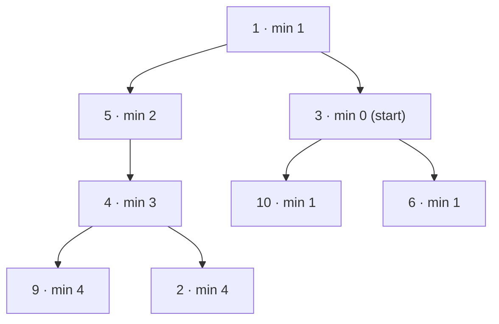

**Short answer:** Fire spreads to children *and* the parent, so treat the tree as an undirected graph. One traversal records each node's parent and finds the start node. Then run a level-by-level BFS from the start node over left, right and parent. The number of levels minus one is the answer. O(n) time and space.

## Picture it

Tree `[1,5,3,null,4,10,6,9,2]`, `start = 3`. The label is the minute each node catches fire. The parent map lets the fire also travel upward (3 → 1), and from there down the other side (1 → 5 → 4):



| Level (minute) | Queue at start of level | Newly added (left, right, parent) |
|---|---|---|
| 0 | [3] | 10, 6, 1 (parent) |
| 1 | [10, 6, 1] | 5 (left of 1; 3 already seen) |
| 2 | [5] | 4 (parent 1 already seen) |
| 3 | [4] | 9, 2 |
| 4 | [9, 2] | none, queue empties |

`minutes` ends at 4.

**The picture in one sentence:** add a parent pointer to every node so the tree becomes an undirected graph, then the answer is simply the number of BFS levels from `start` minus one.

## Approach

- **Key insight:** "spreads one step per minute to every neighbour" is exactly BFS distance. The answer is the largest BFS distance from `start`, which is the tree's eccentricity at that node. The only thing a tree lacks is the upward edge, so we add it with a parent map.
- **Steps:**
  1. Iterative DFS (a stack, not recursion, so a deep tree cannot overflow the call stack). Store `parent.put(child, node)` and remember the node whose value is `start`.
  2. BFS from that node with a `seen` set. Process the queue one level at a time. Each level is one minute.
- **One-pass alternative:** a post-order DFS that returns the depth of each subtree, and the distance to `start` if `start` is inside it. At each ancestor of `start`, combine "distance to start + depth of the other subtree". That is also O(n) but harder to get right under pressure. Mention it, but code the BFS.

## Solution

```java
import java.util.*;

class Solution {
    public int amountOfTime(TreeNode root, int start) {
        // 1. Record each node's parent and find the start node.
        Map<TreeNode, TreeNode> parent = new HashMap<>();
        TreeNode src = null;
        ArrayDeque<TreeNode> stack = new ArrayDeque<>();
        stack.push(root);
        while (!stack.isEmpty()) {
            TreeNode n = stack.pop();
            if (n.val == start) src = n;
            if (n.left != null) { parent.put(n.left, n); stack.push(n.left); }
            if (n.right != null) { parent.put(n.right, n); stack.push(n.right); }
        }
        // 2. BFS outward from the start node; one level = one minute.
        Set<TreeNode> seen = new HashSet<>();
        ArrayDeque<TreeNode> q = new ArrayDeque<>();
        q.add(src);
        seen.add(src);
        int minutes = -1;
        while (!q.isEmpty()) {
            minutes++;
            for (int s = q.size(); s > 0; s--) {
                TreeNode n = q.poll();
                for (TreeNode m : new TreeNode[] {n.left, n.right, parent.get(n)}) {
                    if (m != null && seen.add(m)) q.add(m);
                }
            }
        }
        return minutes;
    }
}
```

`minutes` starts at -1 because the first level (the start node itself) burns at minute 0.

## Complexity

- **Time:** O(n). Each node is pushed once in the DFS and enqueued once in the BFS.
- **Space:** O(n) for the parent map, the seen set and the queue.

## Edge cases

- A single node → 0.
- `start` is the root → the answer is the tree's height (in edges).
- `start` is a deep leaf in a skewed tree (a linked list) → the fire must go all the way up. Recursion here could overflow the stack; the iterative version is safe.
- The root has no parent: `parent.get(root)` returns `null` and is skipped.

## Variations

- **All nodes at distance K** (LeetCode 863): the same parent map + BFS, stopping at level K.
- **Given parent pointers** (as in the original sighting): skip step 1 and BFS directly over `left`, `right` and `parent`.

Practise it in the app: Run / Submit on this page.
