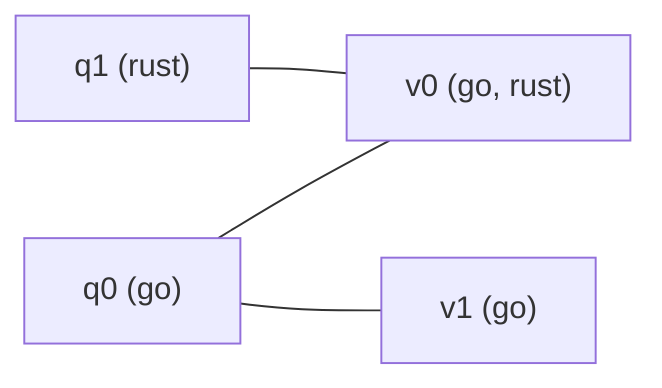

**Short answer:** This is maximum bipartite matching. Questions are one side, volunteers the other, and there is an edge when they share a tag. Greedy fails, because an early choice can block a later question. Augmenting paths fix that: Kuhn's algorithm is O(V·E), and Hopcroft–Karp is O(E·√V). Build the edges with a tag → volunteers index rather than comparing every pair.

## Picture it

A cut-down Example 2: questions `[["go"],["rust"]]`, volunteers `[["go","rust"],["go"]]`. The tag index gives `go → [v0, v1]`, `rust → [v0]`, so the bipartite graph is:



| Phase | BFS layers (`dist`) | DFS | Matching after phase |
|---|---|---|---|
| 1 | q0 = 0, q1 = 0 (both free) | q0 takes free v0. q1's only volunteer v0 is held by q0, but `dist[q0]` is not `dist[q1] + 1`, so q1 fails | q0–v0 (1) |
| 2 | q1 = 0, q0 = 1 (reached through v0); v1 is free, so BFS returns true | q1 → v0 is held by q0, layer 1 matches, recurse: q0 moves to free v1, then q1 takes v0 | q0–v1, q1–v0 (2) |
| 3 | no free questions, BFS finds nothing | stop | answer **2** |

The phase-2 chain `q1 → v0 → q0 → v1` is the augmenting path: flipping it undoes the greedy choice q0–v0.

**The picture in one sentence:** when a question's volunteer is taken, follow the chain "volunteer → the question holding it → its other volunteer" until a free volunteer appears, then flip every edge on the chain.

## Approach

- **Greedy fails:** in Example 2, giving a "go" question to volunteer 0 (who also knows "rust") leaves the rust question with nobody. You need a way to *undo* earlier choices.
- **Key insight — augmenting paths:** to match a new question, try each volunteer it can use. If that volunteer is already taken, ask the question that holds them to move to another volunteer, recursively. If such a chain ends at a free volunteer, flipping every edge along it grows the matching by one. Berge's theorem says a matching is maximum exactly when no augmenting path exists.
- **Kuhn's algorithm:** one DFS per question with a fresh `visited` array. O(Q · E). With up to 500 × 500 = 250k edges that is about 10⁸ simple steps, which is usually fine.
- **Hopcroft–Karp (used below):** each phase runs a BFS from all free questions to layer the graph by distance. Then a DFS follows only layer `+1` edges, which finds many shortest augmenting paths that share no vertices. Only O(√V) phases are needed.
- **Building edges:** map each tag to the list of volunteers with it. A question's neighbours are the union over its (at most 5) tags. Use a `LinkedHashSet` so a volunteer who shares two tags is not added twice.

## Solution

```java
import java.util.*;

class Solution {
    private List<Integer>[] adj;
    private int[] volunteerOf, questionOf, dist;

    @SuppressWarnings("unchecked")
    public int maxAssignments(String[][] questions, String[][] volunteers) {
        int q = questions.length, v = volunteers.length;
        Map<String, List<Integer>> byTag = new HashMap<>();
        for (int j = 0; j < v; j++)
            for (String t : volunteers[j]) byTag.computeIfAbsent(t, k -> new ArrayList<>()).add(j);
        adj = new List[q];
        for (int i = 0; i < q; i++) {
            Set<Integer> can = new LinkedHashSet<>();
            for (String t : questions[i]) can.addAll(byTag.getOrDefault(t, List.of()));
            adj[i] = new ArrayList<>(can);
        }
        volunteerOf = new int[q];
        questionOf = new int[v];
        dist = new int[q];
        Arrays.fill(volunteerOf, -1);
        Arrays.fill(questionOf, -1);
        int matched = 0;
        while (bfs(q)) {                                   // one phase
            for (int i = 0; i < q; i++) if (volunteerOf[i] == -1 && dfs(i)) matched++;
        }
        return matched;
    }

    // Layer questions by distance from the free questions; true if some free volunteer is reachable.
    private boolean bfs(int q) {
        Deque<Integer> queue = new ArrayDeque<>();
        boolean found = false;
        for (int i = 0; i < q; i++) {
            if (volunteerOf[i] == -1) { dist[i] = 0; queue.add(i); }
            else dist[i] = -1;
        }
        while (!queue.isEmpty()) {
            int i = queue.poll();
            for (int j : adj[i]) {
                int other = questionOf[j];
                if (other == -1) found = true;
                else if (dist[other] == -1) { dist[other] = dist[i] + 1; queue.add(other); }
            }
        }
        return found;
    }

    // Find an augmenting path along the BFS layers and flip it.
    private boolean dfs(int i) {
        for (int j : adj[i]) {
            int other = questionOf[j];
            if (other == -1 || (dist[other] == dist[i] + 1 && dfs(other))) {
                volunteerOf[i] = j;
                questionOf[j] = i;
                return true;
            }
        }
        dist[i] = -1;                                      // dead end: prune for this phase
        return false;
    }
}
```

## Complexity

- **Building the graph:** O(total tags + E), where E ≤ Q·V edges.
- **Matching:** Hopcroft–Karp is O(E·√(Q+V)). Kuhn's would be O(Q·E).
- **Space:** O(E) for the adjacency lists, plus the tag map.

## Edge cases

- No shared tags at all → 0.
- More questions than volunteers (or the reverse) → the answer is at most `min(Q, V)`.
- A volunteer sharing several tags with one question → only one edge (the set handles it).
- Tags are case-sensitive: `"Java"` ≠ `"java"`.

## Variations

- **Each volunteer can take up to k questions:** make k copies of each volunteer, or use max-flow with capacity k on the volunteer → sink edge.
- **Weighted (best-fit) assignment:** the Hungarian algorithm, or min-cost max-flow.
- **Return the actual pairs:** read them from `volunteerOf`.

Practise it in the app: Run / Submit on this page.
