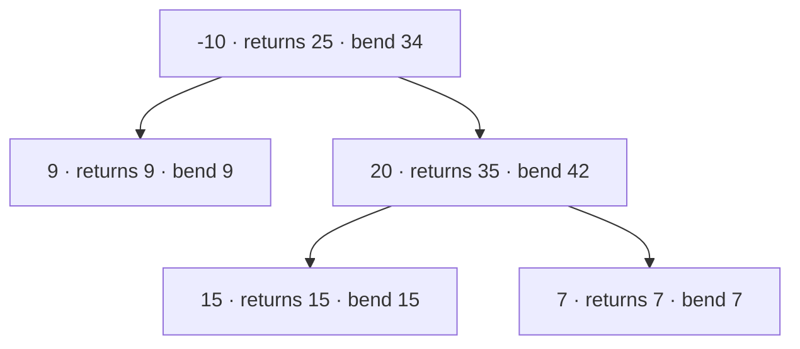

**Short answer:** Do one post-order DFS. Each call returns the best "downward" path that starts at the node and goes into at most one child, ignoring a child whose best chain is negative. At each node, the best path that bends there is `val + leftGain + rightGain`; keep the maximum of these in a field. O(n) time, O(h) stack.

## Picture it

`root = [-10,9,20,null,null,15,7]`. Each label shows what `gain` returns upward and the bend candidate `val + l + r`:



| Post-order visit | `l` | `r` | Bend `val + l + r` | `best` | Returns `val + max(l, r)` |
|---|---|---|---|---|---|
| 9 | 0 | 0 | 9 | 9 | 9 |
| 15 | 0 | 0 | 15 | 15 | 15 |
| 7 | 0 | 0 | 7 | 15 | 7 |
| 20 | 15 | 7 | 42 | **42** | 35 |
| -10 | 9 | 35 | 34 | 42 | 25 |

Answer **42**: the path 15 → 20 → 7 bends at 20.

**The picture in one sentence:** every node returns a one-sided chain to its parent but records a two-sided bend as a candidate, and negative chains are clamped to 0.

## Approach

**Brute force.** Treat every node as the top of a path and compute the best downward sums from it with a fresh traversal. That repeats work and is O(n²) on a skewed tree.

**Key insight.** Every path has exactly one highest node, where it bends. At that node the path is: the best downward chain into the left subtree, the node itself, and the best downward chain into the right subtree. A chain with a negative sum only hurts, so clamp it to 0 (meaning "do not go that way").

A parent can extend only one side of a child's path, because a path cannot fork. So the value **returned** upward is `val + max(left, right)`, while the value **recorded** as a candidate answer is `val + left + right`.

**Optimal.** Post-order DFS that computes both numbers in one visit per node.

## Solution

```java
import java.util.*;

class Solution {
    private int best;

    public int maxPathSum(TreeNode root) {
        best = Integer.MIN_VALUE;
        gain(root);
        return best;
    }

    // Best sum of a path that starts at n and goes down into one subtree (never negative contribution).
    private int gain(TreeNode n) {
        if (n == null) return 0;
        int l = Math.max(0, gain(n.left));
        int r = Math.max(0, gain(n.right));
        best = Math.max(best, n.val + l + r);
        return n.val + Math.max(l, r);
    }
}
```

## Complexity

- **Time:** O(n). Each node is visited once.
- **Space:** O(h) for the recursion stack, where h is the tree height. That becomes O(n) for a skewed tree; a very deep chain can overflow Java's default stack, and an iterative post-order avoids that.

## Edge cases

- All values negative: the answer is the largest single node. It works because `best` starts at `Integer.MIN_VALUE` and each node's own value is always a candidate.
- A single node: its value.
- The best path does not touch the root (example 2).
- No overflow: at most 3·10⁴ × 1000 = 3·10⁷, which fits in `int`.

## Follow-ups

- **All-negative trees.** The clamp to 0 means "do not extend into this child", never "count an empty path". So `[-3]` gives -3 and `[-2,-1]` gives -1. The classic bug is starting `best` at 0, which wrongly returns 0.
- **How would you unit-test these edge cases?** One small JUnit test per case: single positive node, single negative node, all-negative tree, a path that skips the root, left- and right-skewed chains, a best path that bends at a deep node, and one large skewed tree to check stack depth. A helper that builds a tree from a level-order array keeps the tests short.

Practise it in the app: Run / Submit on this page.
