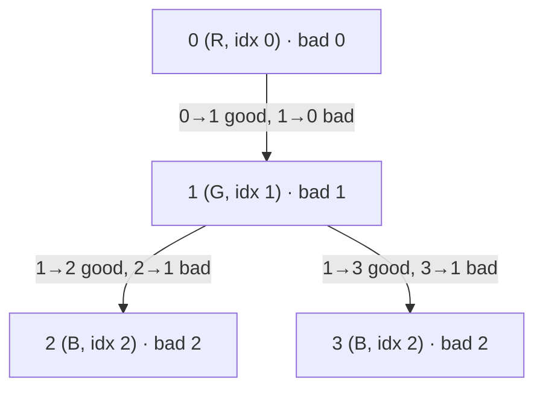

**Short answer:** Root the tree anywhere and count the "bad" edges: edges where the child's colour is not the pattern colour that comes right after its parent's. Moving the root across one edge flips the direction of only that edge, so each neighbour's count follows from its parent's in O(1). A node is a good root when its count is 0, its colour is `pattern[0]`, and it has at most 2 neighbours. Total O(n).

## Picture it

Example 2: edges `0-1, 1-2, 1-3`, colours `"RGBB"`, pattern `"RGB"`, so `idx = [0, 1, 2, 2]`. An edge `par → child` is good when `idx[child] == (idx[par] + 1) % 3`.



| Step | Node | From parent | `bad` | Good root? (`bad` 0, `idx` 0, degree ≤ 2) |
|---|---|---|---|---|
| 1 | 0 | BFS from 0: all three edges point the good way | 0 | yes (degree 1) |
| 2 | 1 | `bad[0] − 0 + 1` (edge 0–1 flips to 1→0, which is bad) | 1 | no |
| 3 | 2 | `bad[1] − 0 + 1` (edge 1–2 flips to 2→1, which is bad) | 2 | no |
| 4 | 3 | `bad[1] − 0 + 1` (edge 1–3 flips to 3→1, which is bad) | 2 | no |

Answer `[0]`.

**The picture in one sentence:** count bad edges once from one root, then re-root across each edge, which flips only that one edge, so every node's count costs O(1).

## Approach

**Base question.** Every node has at most 3 neighbours. When rooted at `r`, each non-root node uses one neighbour as its parent, so it has at most 2 children. The tree is binary exactly when `r` has degree 2 or less. Any leaf works.

**Brute force for colours, O(n²).** For each candidate root, BFS and check that every node at depth `d` has colour `pattern[d mod L]`.

**Key insight.** Map each colour to its position in the pattern, `idx[v]`. The depth rule holds from root `r` exactly when `idx[r] == 0` and every edge, oriented parent to child, satisfies `idx[child] == (idx[parent] + 1) mod L`. So whether `r` is good depends only on how each edge is oriented, and each edge can be checked on its own.

Count `bad[0]` with one BFS from node 0. When the root moves from `u` to a neighbour `v`, only the edge `u–v` changes direction; all other edges keep their orientation. So:

`bad[v] = bad[u] − (u→v bad ? 1 : 0) + (v→u bad ? 1 : 0)`

Process nodes in BFS order so a parent's count is ready before its child's. This is the standard re-rooting technique.

If some colour is not in the pattern at all, no depth can hold it, so the answer is empty.

## Solution

```java
import java.util.*;

class Solution {
    public List<Integer> findRoots(int n, int[][] edges, String colors, String pattern) {
        int len = pattern.length();
        int[] idx = new int[n];
        for (int v = 0; v < n; v++) {
            idx[v] = pattern.indexOf(colors.charAt(v));
            if (idx[v] < 0) return new ArrayList<>(); // colour never allowed at any depth
        }
        List<Integer>[] adj = adjacency(n, edges);

        // bad[r] = number of edges that break the pattern when the tree hangs from r.
        // Compute it for root 0, then re-root: moving the root across one edge flips only that edge.
        int[] parent = new int[n];
        int[] order = new int[n];
        Arrays.fill(parent, -1);
        boolean[] seen = new boolean[n];
        int head = 0, tail = 0;
        order[tail++] = 0;
        seen[0] = true;
        int bad0 = 0;
        while (head < tail) {
            int u = order[head++];
            for (int v : adj[u]) {
                if (seen[v]) continue;
                seen[v] = true;
                parent[v] = u;
                if (!down(idx, u, v, len)) bad0++;
                order[tail++] = v;
            }
        }
        int[] bad = new int[n];
        bad[0] = bad0;
        for (int i = 1; i < n; i++) { // BFS order: parent is done before child
            int v = order[i], u = parent[v];
            bad[v] = bad[u] - (down(idx, u, v, len) ? 0 : 1) + (down(idx, v, u, len) ? 0 : 1);
        }
        List<Integer> out = new ArrayList<>();
        for (int r = 0; r < n; r++) {
            if (bad[r] == 0 && idx[r] == 0 && adj[r].size() <= 2) out.add(r);
        }
        return out;
    }

    /** true if `child` may sit directly below `par` in the pattern. */
    private boolean down(int[] idx, int par, int child, int len) {
        return idx[child] == (idx[par] + 1) % len;
    }

    @SuppressWarnings("unchecked")
    private List<Integer>[] adjacency(int n, int[][] edges) {
        List<Integer>[] adj = new List[n];
        for (int i = 0; i < n; i++) adj[i] = new ArrayList<>();
        for (int[] e : edges) {
            adj[e[0]].add(e[1]);
            adj[e[1]].add(e[0]);
        }
        return adj;
    }
}
```

## Complexity

- **Time:** O(n · L) for the `indexOf` lookups (L ≤ 26, so effectively O(n)), plus one BFS and one re-rooting pass, each O(n).
- **Space:** O(n) for the adjacency lists, BFS order, parents and counts. The BFS is iterative, so a long path does not overflow the stack.

## Edge cases

- `n = 1`: no edges; good exactly when its colour is `pattern[0]`.
- A colour missing from the pattern: return an empty list immediately.
- Pattern of length 1: every edge needs both ends the same colour; if that holds, every node of degree 2 or less is good.
- A node with 3 neighbours is never good, even if the colours fit.

## Follow-ups

- **Black/White alternating by depth, O(n), no BFS from every node.** With two colours, colours alternate by depth from some root only if every edge joins a black and a white node, and that check does not depend on the root. Check all edges once. If it holds, every black node of degree 2 or less is a valid root (with the colour the pattern puts at depth 0); otherwise there is none.
- **Three colours with a fixed repeating sequence.** Now direction matters (R→G is fine, G→R is not), so the "check each edge once" trick is not enough. The re-rooting count above handles it in O(n) for any pattern length.

Practise it in the app: Run / Submit on this page.
