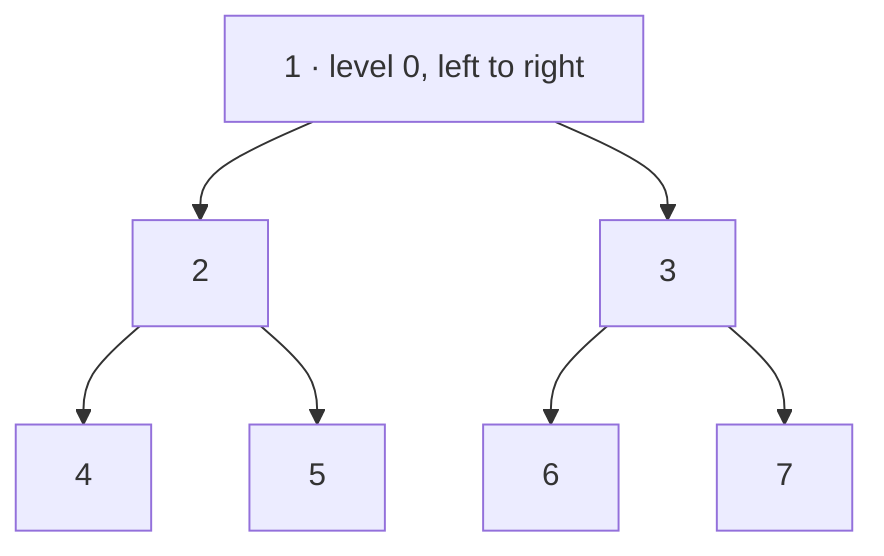

**Short answer:** Do a normal BFS, processing exactly `queue.size()` nodes per level. Keep a direction flag: on left-to-right levels append each value to the end of the level list, on right-to-left levels add it to the front. Children are always enqueued left then right, so the queue never changes; only how you write each level does. O(n) time.

## Picture it

`root = [1,2,3,4,5,6,7]`:



| Level | Queue polled (always left to right) | Direction | Level list as it is built | Output |
|---|---|---|---|---|
| 0 | [1] | left to right (`addLast`) | [1] | [1] |
| 1 | [2, 3] | right to left (`addFirst`) | [2] → [3, 2] | [3, 2] |
| 2 | [4, 5, 6, 7] | left to right (`addLast`) | [4] → [4, 5] → [4, 5, 6] → [4, 5, 6, 7] | [4, 5, 6, 7] |

Result `[[1],[3,2],[4,5,6,7]]`.

**The picture in one sentence:** the BFS queue never changes order; only the write end of each level's list (`addLast` or `addFirst`) alternates.

## Approach

**Straightforward.** Standard level-order traversal, then reverse every second level list. That is already O(n) and acceptable.

**Cleaner.** Build each level in a deque and choose `addLast` or `addFirst` by the flag. No separate reverse step.

**Why not flip the child order?** Alternating between two stacks also works, but it is easier to get wrong. Keeping the BFS untouched and changing only the output step is the "minimal modification" design the prompt asks for. The same skeleton gives plain level order (always `addLast`), bottom-up order (add each finished level to the front of the result), or zigzag.

## Solution

```java
import java.util.*;

class Solution {
    public List<List<Integer>> zigzagLevelOrder(TreeNode root) {
        List<List<Integer>> out = new ArrayList<>();
        if (root == null) return out;
        Deque<TreeNode> q = new ArrayDeque<>();
        q.add(root);
        boolean leftToRight = true;
        while (!q.isEmpty()) {
            int size = q.size();
            LinkedList<Integer> level = new LinkedList<>();
            for (int i = 0; i < size; i++) {
                TreeNode node = q.poll();
                if (leftToRight) level.addLast(node.val);
                else level.addFirst(node.val);
                if (node.left != null) q.add(node.left);
                if (node.right != null) q.add(node.right);
            }
            out.add(level);
            leftToRight = !leftToRight;
        }
        return out;
    }
}
```

## Complexity

- **Time:** O(n). Each node is enqueued and dequeued once, and `addFirst` on a `LinkedList` is O(1).
- **Space:** O(w) for the queue, where w is the widest level (up to about n/2), plus O(n) for the output.

## Edge cases

- Empty tree: return `[]`, not `[[]]`.
- Single node: `[[1]]`.
- A skewed tree: one value per level, so the direction is invisible.
- `ArrayDeque` throws on `null`, so enqueue only non-null children.

## Variations

- **Plain level order:** drop the flag and always `addLast`.
- **Bottom-up level order:** keep the result as a `LinkedList` and `addFirst` each finished level.
- **Right side view:** keep only the last node polled on each level.
- To make the variant pluggable, pass a strategy (for example a `BiConsumer<Deque<Integer>, Integer>` called with the level list and the value, chosen by depth).

Practise it in the app: Run / Submit on this page.
