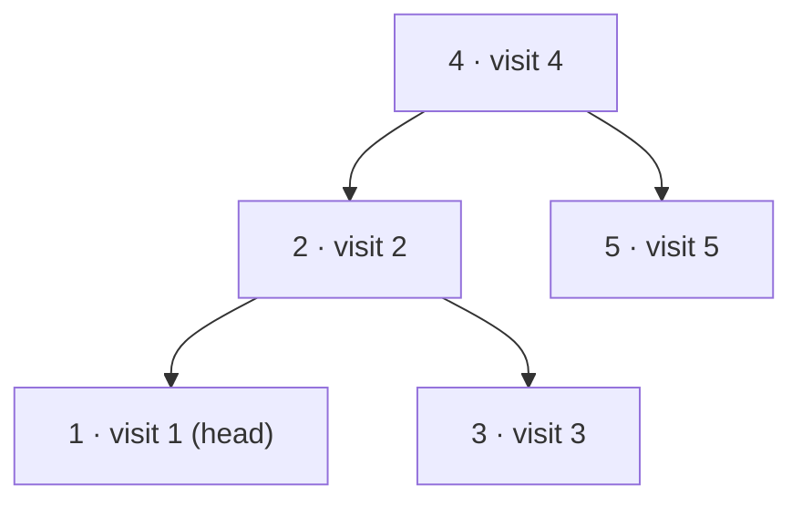

**Short answer:** An in-order traversal of a BST visits nodes in sorted order. Walk it and keep a `prev` pointer: when you visit `cur`, link `prev.right = cur` and `cur.left = prev`. The first node visited is the head. At the end, link the last node and the head to close the circle. O(n) time, O(h) extra space for the traversal stack.

## Picture it

`root = [4,2,5,1,3]`. The label is the in-order visit number:



| Step | Stack (bottom → top) before pop | Pop `cur` | Saved `next` | Link made | `prev` after |
|---|---|---|---|---|---|
| 1 | [4, 2, 1] | 1 | null | none, `head = 1` | 1 |
| 2 | [4, 2] | 2 | 3 | 1 ⇄ 2 | 2 |
| 3 | [4, 3] | 3 | null | 2 ⇄ 3 | 3 |
| 4 | [4] | 4 | 5 | 3 ⇄ 4 | 4 |
| 5 | [5] | 5 | null | 4 ⇄ 5 | 5 |
| 6 | [] | – | – | close: 5.right = 1, 1.left = 5 | – |

Result: 1 ⇄ 2 ⇄ 3 ⇄ 4 ⇄ 5 ⇄ (back to 1).

**The picture in one sentence:** in-order hands you the nodes already sorted, so stitching each one to `prev` builds the list, and one final link closes the circle.

## Approach

**Simple but not in place.** Collect the nodes in order into a list, then link neighbours. Correct and O(n), but it uses O(n) extra space, and the prompt asks for O(h).

**Key insight.** In-order traversal already hands you the nodes in sorted order, one at a time. You only need to remember the previous node to stitch each new one onto the list. Rewriting `left` and `right` during the traversal is safe if you are careful:

- `cur.left` can be overwritten when `cur` is visited, because its left subtree is already finished.
- `cur.right` must be read **before** it is overwritten, because the right subtree has not been visited yet. The code saves it as `next`.

**Optimal.** Iterative in-order with an explicit stack, linking as you go, then close the circle.

## Solution

```java
import java.util.*;

class Solution {
    public TreeNode treeToDoublyList(TreeNode root) {
        if (root == null) return null;
        TreeNode head = null, prev = null;
        // iterative in-order traversal, linking each node to the previous one
        Deque<TreeNode> stack = new ArrayDeque<>();
        TreeNode cur = root;
        while (cur != null || !stack.isEmpty()) {
            while (cur != null) {
                stack.push(cur);
                cur = cur.left;
            }
            cur = stack.pop();
            TreeNode next = cur.right; // read before overwriting
            if (prev == null) head = cur;
            else {
                prev.right = cur;
                cur.left = prev;
            }
            prev = cur;
            cur = next;
        }
        // close the circle
        prev.right = head;
        head.left = prev;
        return head;
    }
}
```

## Complexity

- **Time:** O(n). Each node is pushed and popped once.
- **Space:** O(h) for the stack, where h is the tree height (O(log n) balanced, O(n) skewed). No new nodes are created.

## Edge cases

- Empty tree: return `null`.
- Single node: after the loop `prev == head`, so it points to itself both ways, a valid circle of one.
- Skewed trees (all left or all right): still correct; the stack grows to n for a left chain.
- Forgetting to close the circle, or closing it before the traversal ends, are the two usual bugs.

## Variations

- **Recursive version:** a helper `inorder(node)` with `prev` and `head` as fields. Shorter, same O(h) stack, but uses the call stack.
- **Morris traversal:** O(1) extra space by temporarily threading predecessor links; trickier to combine with relinking, so mention it rather than code it unless asked.
- **Non-circular list:** skip the last two assignments, and set `head.left = null` and `prev.right = null`.

Practise it in the app: Run / Submit on this page.
