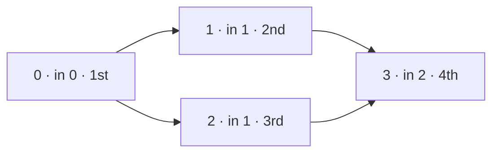

**Short answer:** This is a topological sort. Build a graph with an edge `b → a` for each prerequisite `[a, b]` and count each course's in-degree. Start with every course that has in-degree 0, repeatedly take one, append it to the order and decrement its dependants; any that reach 0 join the queue (Kahn's algorithm). If the order ends up shorter than `numCourses`, some courses never reached 0 because they are on or behind a cycle, so return an empty array. O(V + E).

## Picture it

Example 2: `numCourses = 4`, prerequisites `[[1,0],[2,0],[3,1],[3,2]]`. Edges point from prerequisite to dependant; the label shows the starting in-degree and the position in the output:



| Step | Queue | Poll | `order` | In-degree changes |
|---|---|---|---|---|
| 1 | [0] | 0 | [0] | 1: 1 → 0 (enqueue), 2: 1 → 0 (enqueue) |
| 2 | [1, 2] | 1 | [0, 1] | 3: 2 → 1 |
| 3 | [2] | 2 | [0, 1, 2] | 3: 1 → 0 (enqueue) |
| 4 | [3] | 3 | [0, 1, 2, 3] | none |

`k = 4 == numCourses`, so return `[0,1,2,3]`. With the cycle `[[1,0],[0,1]]` both in-degrees start at 1, the queue starts empty, and `k = 0` gives `[]`.

**The picture in one sentence:** keep taking courses whose prerequisites are all done, and if some courses are never freed, a cycle is holding them.

## Approach

**Brute force.** Repeatedly scan all courses for one whose prerequisites are all done. O(V · (V + E)).

**Key insight.** A course can be taken once its in-degree (number of unfinished prerequisites) is 0. Taking it lowers the in-degree of its dependants. A queue of ready courses avoids rescanning. In a cycle, no course ever reaches in-degree 0, so cycle detection comes for free: count how many courses were emitted.

**Optimal.** Kahn's BFS. (DFS with three colours — unvisited, on stack, done — also works: a back edge to an on-stack node is a cycle, and reversed post-order is a valid order.)

## Solution

```java
import java.util.*;

class Solution {
    public int[] findOrder(int numCourses, int[][] prerequisites) {
        List<List<Integer>> next = new ArrayList<>();
        for (int i = 0; i < numCourses; i++) next.add(new ArrayList<>());
        int[] indeg = new int[numCourses];
        for (int[] p : prerequisites) {
            next.get(p[1]).add(p[0]);   // p[1] must come before p[0]
            indeg[p[0]]++;
        }
        ArrayDeque<Integer> q = new ArrayDeque<>();
        for (int i = 0; i < numCourses; i++) if (indeg[i] == 0) q.add(i);
        int[] order = new int[numCourses];
        int k = 0;
        while (!q.isEmpty()) {
            int c = q.poll();
            order[k++] = c;
            for (int d : next.get(c)) if (--indeg[d] == 0) q.add(d);
        }
        return k == numCourses ? order : new int[0];
    }
}
```

## Complexity

- **Time:** O(V + E) — each course is queued once and each edge is relaxed once.
- **Space:** O(V + E) for the adjacency lists, in-degrees and queue.

## Edge cases

- No prerequisites → any permutation; this returns 0..n−1.
- Cycle (even a 2-cycle) → `[]`.
- Disconnected components: all in-degree-0 nodes are seeded at the start, so every component is covered.
- Edge direction: `[a, b]` means b before a. Reversing the edge gives the order backwards, so check it against Example 1 before submitting.

## Follow-ups

- **Report the tasks involved in cyclic dependencies.** After Kahn's, every course with `indeg > 0` is either on a cycle or depends on one. To list only the cycle members, run DFS with colours and a path stack: when you meet a grey (on-stack) node, pop the stack back to it — those nodes form the cycle. Alternatively, find strongly connected components (Tarjan or Kosaraju); any SCC with more than one node is a cycle group.
- **Latency, throughput, scale, fault tolerance (open discussion).** For a dependency-resolution service: cache resolved orders keyed by a hash of the graph; resolve incrementally when one edge changes instead of recomputing; for huge graphs, store adjacency in a database and process levels in batches; run independent nodes (same Kahn "level") in parallel, which is how build systems and DAG schedulers work; make execution idempotent and checkpoint completed nodes so a crash resumes rather than restarts. See [F7 · DAGs: workflow orchestration and schedulers](../academy/lessons/F7.md).
- **Pseudocode.**

```text
build adjacency b -> a and indeg[a]++ for each [a, b]
queue <- all nodes with indeg 0
while queue not empty:
    c <- pop; append c to order
    for each d in next[c]: indeg[d]--; if indeg[d] == 0: push d
return order if |order| == n else []
```

Practise it in the app: Run / Submit on this page.
