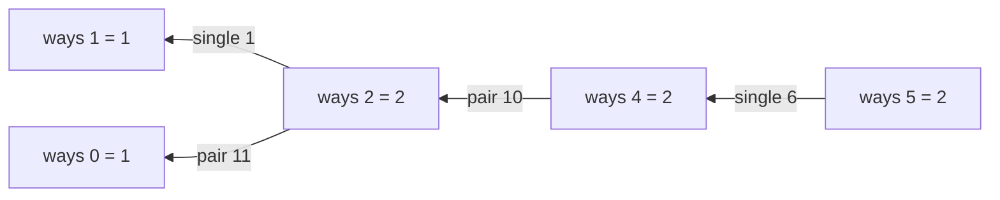

**Short answer:** Let `ways(i)` be the number of decodings of the first i characters. The last group is either one digit (valid if it is not `'0'`) or two digits (valid if they form 10..26). So `ways(i) = ways(i−1)·[s[i−1] ≠ '0'] + ways(i−2)·[10 ≤ s[i−2..i−1] ≤ 26]`. Only the last two values are needed, so it is O(n) time and O(1) space — a Fibonacci with conditions.

## Picture it

`s = "11106"`. Each cell `ways(i)` reads at most two earlier cells: `ways(i−1)` through the single digit and `ways(i−2)` through the pair.

| i | Prefix | Single `s[i−1]` | Pair `s[i−2..i−1]` | `ways(i)` |
|---|---|---|---|---|
| 0 | "" | – | – | 1 (base) |
| 1 | "1" | '1' ok | – | 1 (base) |
| 2 | "11" | '1' ok: + ways(1) = 1 | "11" ok: + ways(0) = 1 | 2 |
| 3 | "111" | '1' ok: + ways(2) = 2 | "11" ok: + ways(1) = 1 | 3 |
| 4 | "1110" | '0' not allowed | "10" ok: + ways(2) = 2 | 2 |
| 5 | "11106" | '6' ok: + ways(4) = 2 | "06" < 10, not allowed | **2** |



The two decodings are `1 1 10 6` (AAJF) and `11 10 6` (KJF). The `0` forces the `10` pair, which cuts off the extra choices from `ways(3)`.

**The picture in one sentence:** it is Fibonacci where each of the two steps back is allowed only if its digit group is a valid letter.

## Approach

**Brute force.** Recursively try a one-digit group and a two-digit group at each position. The same suffixes get re-solved over and over, so the cost is exponential (Fibonacci-like) on strings such as "1111…".

**Key insight.** The number of ways to decode a prefix depends only on the number of ways for the two shorter prefixes and on the last one or two digits. That is a 1-D DP.

**Optimal.** Iterate i from 2 to n with base cases `ways(0) = 1` (the empty prefix has one decoding) and `ways(1) = 1` if `s[0] ≠ '0'` else 0.

- Single digit `s[i−1]`: allowed when it is 1..9 → add `ways(i−1)`.
- Pair `s[i−2..i−1]`: allowed when it is 10..26 (the `≥ 10` check rejects a leading zero like "06") → add `ways(i−2)`.

## Solution

```java
import java.util.*;

class Solution {
    // ways(i) = number of decodings of the first i characters; only the last two values are kept.
    public int numDecodings(String s) {
        int prev2 = 1, prev1 = s.charAt(0) == '0' ? 0 : 1; // ways(0), ways(1)
        for (int i = 2; i <= s.length(); i++) {
            int cur = 0;
            if (s.charAt(i - 1) != '0') cur += prev1;
            int two = (s.charAt(i - 2) - '0') * 10 + (s.charAt(i - 1) - '0');
            if (two >= 10 && two <= 26) cur += prev2;
            prev2 = prev1;
            prev1 = cur;
        }
        return prev1;
    }
}
```

Trace "226": ways = 1, 1, 2 ("2 2", "22"), then for '6': single → 2, pair "26" → +1 = 3.

## Complexity

- **Time:** O(n) — one pass.
- **Space:** O(1) — two rolling values.

## Edge cases

- Leading zero ("06", "0") → 0. Once a count hits 0 with no way to recover, it stays 0.
- "10", "20": the '0' cannot stand alone, only the pair is valid → 1.
- "30", "100": a '0' preceded by 3..9 or by another '0' makes the whole string undecodable → 0.
- "27": the pair is above 26, only "2 7" → 1.

## Variations

- **Decode Ways II** (LeetCode 639): `*` matches 1..9; the same recurrence with multiplied counts and a modulus.
- **List all decodings:** backtracking; the output itself can be exponential.
- **Top-down with memo:** `f(i)` = ways for the suffix from i; equivalent, slightly easier to explain first.

See also [C4 · The optimisation playbook](../academy/lessons/C4.md).

Practise it in the app: Run / Submit on this page.
