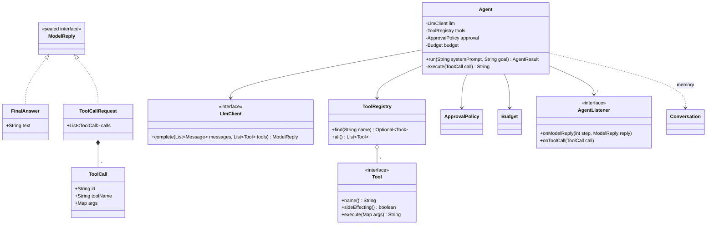
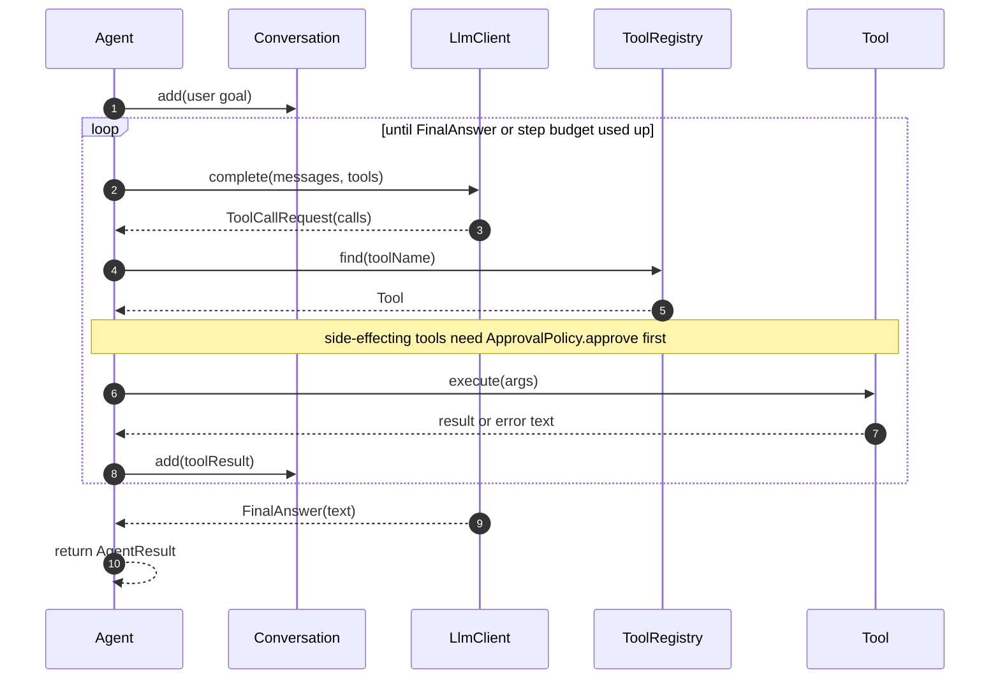

**Short answer:** The core is an **agent loop**. Send the conversation and the tool specs to the model. If it asks for tool calls, run them and add the results to memory. Repeat until it gives a final answer or a budget runs out. Around that loop sit a `Tool` abstraction with a registry, a swappable `LlmClient`, memory, guardrails (step and token budgets, an allow-list, human approval for side-effecting tools) and event listeners for tracing. For multi-step business processes, a **workflow** is a DAG of steps, and some steps are agents. It runs with persisted state so it can resume and retry.

## Picture it





**How to read it:**
- `Agent` is the loop. It depends only on interfaces: `LlmClient` for the model and `Tool` (found through `ToolRegistry`) for actions.
- The model's reply is a sealed `ModelReply`: either a `FinalAnswer` that ends the run or a `ToolCallRequest` holding `ToolCall` commands.
- Each tool call is looked up, checked against the approval policy if it has side effects, run, and its result (or error text) is added to memory.
- The loop repeats until the model answers or `Budget.maxSteps` runs out. Listeners see every model reply and tool call for tracing.

## Requirements

The prompt is open-ended, so state the scope first:

- Given a goal, an agent reasons with an LLM and calls tools (search, DB query, HTTP API, code) until it can answer.
- Tools are pluggable. Adding one must not change the agent code.
- The model provider is swappable.
- Safety: a maximum number of steps and tokens, tool allow-lists, and human approval before side effects (sending email, writing data).
- Workflows: several steps (LLM step, tool step, agent step, human approval) with dependencies. Independent steps run in parallel. A run can be paused and resumed.
- Observability: every model call and tool call is traced.
- Out of scope: model training, and the vector store internals for RAG (that is just another tool).

## Classes

- `LlmClient`: `complete(messages, toolSpecs) -> ModelReply`. Implementations wrap Claude, OpenAI or a local model.
- `ModelReply`: a sealed type, either `FinalAnswer` or `ToolCallRequest(List<ToolCall>)`.
- `Tool`: `name()`, `description()`, `inputSchema()` (JSON Schema), `sideEffecting()`, `execute(args)`. `ToolRegistry` maps a name to a `Tool`.
- `Conversation` (memory): the ordered messages. A `MemoryStrategy` can trim or summarise old turns to fit the context window.
- `Budget` and `ApprovalPolicy`: guardrails.
- `Agent`: runs the loop. `AgentListener`: gets `onModelReply`, `onToolCall` and `onFinish` events for tracing and metrics.
- `Workflow`: nodes `Step` plus edges. `WorkflowEngine` runs ready steps (all dependencies done) on an executor. It stores a `RunState` per step (PENDING, RUNNING, WAITING_APPROVAL, DONE, FAILED) in a repository, so a crashed or paused run can resume.

## Patterns used

- **Strategy**: `LlmClient`, `MemoryStrategy` and `ApprovalPolicy` are swappable behaviours.
- **Command**: each `ToolCall` is a request object that can be validated, logged, approved and retried before it runs.
- **Registry** (a simple map-based lookup): tools found by name, open for extension (OCP).
- **Observer**: listeners for tracing, cost accounting and UI streaming.
- **State machine**: run and step status.
- **Template-like loop**: the fixed reason → act → observe skeleton, with pluggable parts.

## Code

```java
public sealed interface ModelReply permits FinalAnswer, ToolCallRequest {}
public record FinalAnswer(String text) implements ModelReply {}
public record ToolCallRequest(List<ToolCall> calls) implements ModelReply {}
public record ToolCall(String id, String toolName, Map<String, Object> args) {}

public interface Tool {
    String name();
    String description();
    String inputSchema();          // JSON Schema shown to the model
    boolean sideEffecting();
    String execute(Map<String, Object> args) throws Exception;
}

public interface LlmClient {
    ModelReply complete(List<Message> messages, List<Tool> tools);
}

public record Budget(int maxSteps) {}
public record AgentResult(String answer, int steps, boolean completed) {}

public final class Agent {
    private final LlmClient llm;
    private final ToolRegistry tools;
    private final ApprovalPolicy approval;
    private final Budget budget;
    private final List<AgentListener> listeners;

    // constructor omitted

    public AgentResult run(String systemPrompt, String goal) {
        Conversation memory = new Conversation(systemPrompt);
        memory.add(Message.user(goal));
        for (int step = 1; step <= budget.maxSteps(); step++) {
            ModelReply reply = llm.complete(memory.messages(), tools.all());
            for (AgentListener l : listeners) l.onModelReply(step, reply);
            switch (reply) {
                case FinalAnswer f -> {
                    return new AgentResult(f.text(), step, true);
                }
                case ToolCallRequest r -> {
                    memory.add(Message.assistantToolCalls(r.calls()));
                    for (ToolCall call : r.calls()) {
                        memory.add(Message.toolResult(call.id(), execute(call)));
                    }
                }
            }
        }
        return new AgentResult("Stopped: step budget exhausted", budget.maxSteps(), false);
    }

    private String execute(ToolCall call) {
        Optional<Tool> found = tools.find(call.toolName());
        if (found.isEmpty()) return "error: unknown tool " + call.toolName();
        Tool tool = found.get();
        if (tool.sideEffecting() && !approval.approve(call)) return "error: denied by policy";
        listeners.forEach(l -> l.onToolCall(call));
        try {
            return tool.execute(call.args());
        } catch (Exception e) {
            return "error: " + e.getMessage();   // the model sees the error and can recover
        }
    }
}
```

Tool errors go back to the model as tool results instead of crashing the run. Models can often fix bad arguments themselves.

## Extensions

- **Workflow engine:** model the workflow as a DAG. Use Kahn's algorithm (in-degree counts) to find ready steps and submit them to an `ExecutorService`. Virtual threads fit well, because steps mostly wait on I/O. When a step finishes, lower the in-degree of each successor. Persist each step's output and status, so a restart skips finished steps. Detect cycles when the workflow is defined.
- **Human in the loop:** an approval step sets status to WAITING_APPROVAL, persists, and releases the thread. An approve or reject API call resumes it.
- **Idempotency:** side-effecting tools take an idempotency key (run id + step id). Then a retry after a crash does not send the email twice.
- **Cost and limits:** a token budget per run, a timeout per tool, and retry with backoff on model rate-limit errors.
- **Multi-agent:** an orchestrator agent can expose sub-agents as tools. Each sub-agent is an `Agent` with its own narrower tool set.
- **Structured output:** validate tool arguments against the JSON Schema before `execute`. Return a validation error to the model.
- **Prompt injection:** tool output is data, not instructions. Keep powerful tools behind approval, and do not let retrieved text widen the allow-list.

Related: [G5 · Agents and DAG workflows](../academy/lessons/G5.md), [G2 · Using the models](../academy/lessons/G2.md), [G4 · MCP](../academy/lessons/G4.md), [F7 · DAGs](../academy/lessons/F7.md), [E4 · Behavioural patterns](../academy/lessons/E4.md).
