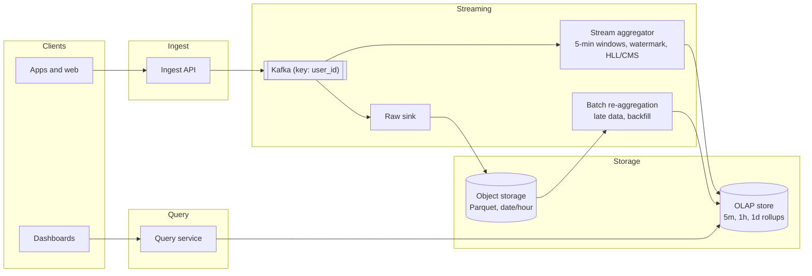
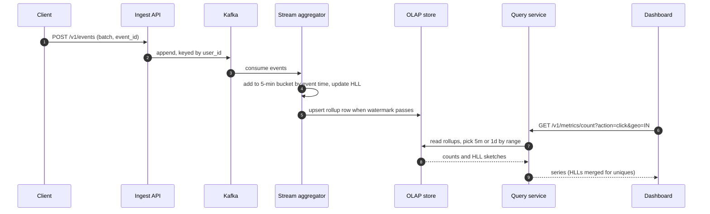
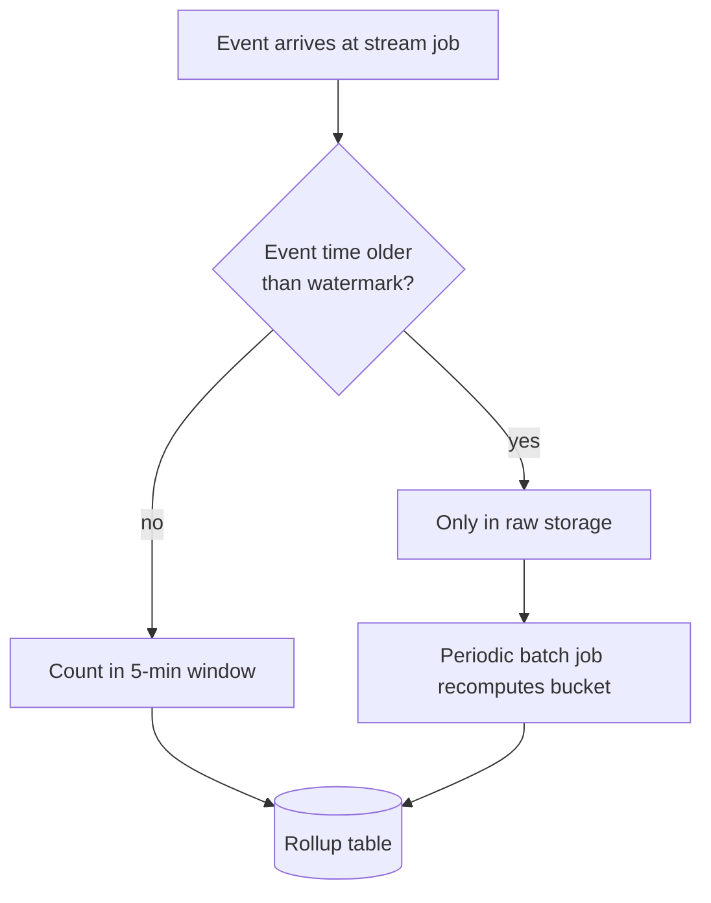

**Short answer:** Ingest action events through a queue, store raw events cheaply in partitioned columnar files, and pre-aggregate into 5-minute rollups keyed by (bucket, action, geo, language) in an OLAP or time-series store. Partition by time first (it drives retention and pruning), then by a dimension. Exact counts come from the rollups; unique users and heavy hitters use approximate sketches (HyperLogLog, Count-Min Sketch), which can be merged across buckets.

## Picture it







**How to read it:**
- Steps 1–2: clients send batches of events; the ingest API writes them to Kafka keyed by user_id so load spreads evenly.
- Steps 3–5: the stream aggregator counts each event into its 5-minute bucket by event time and writes the rollup row (count plus HyperLogLog) once the watermark passes.
- In parallel a raw sink writes every event to Parquet in object storage; that is the source of truth for backfill and late events.
- Steps 6–9: dashboards query only the small rollup tables; long ranges use daily rollups, and HLL sketches merge across buckets for unique users.
- The third picture: an event later than the watermark misses the stream window, so a batch job recomputes its bucket from raw data.

## Requirements

Functional:
- Record user actions (`click`, `view`, `purchase`, ...) with user, timestamp, geo, language.
- Query counts per action over a time range at 5-minute granularity, filtered or grouped by geo and language.
- Unique users per range; top-N actions or items.
- Keep data for 18 months.

Non-functional:
- High write throughput, bursty.
- Dashboard queries in under a second or two.
- Late events (mobile clients offline) must still be counted.
- Small, bounded error is acceptable for uniques and top-N.

## Estimates

- 100 M daily users × 50 actions = 5 B events/day ≈ 58k/s average, ~200k/s peak.
- Raw event ≈ 200 bytes → ~1 TB/day raw, ~550 TB for 18 months before compression. Columnar compression (often 5-10×) brings it to tens of TB.
- Rollups: 288 buckets/day × ~50 actions × ~200 geos × ~50 languages is the worst case, but most combinations are empty. Realistically tens of millions of rows/day, which is small.

## API

```text
POST /v1/events            (batch of events, client-generated event_id)
GET  /v1/metrics/count?action=click&from=..&to=..&geo=IN&lang=hi&granularity=5m
GET  /v1/metrics/uniques?action=..&from=..&to=..&geo=..
GET  /v1/metrics/topk?dimension=item&from=..&to=..&k=10
```

## Data model

Raw events (object storage, Parquet), partitioned by `date/hour`:

```text
event_id, user_id, action, ts, geo, language, device, props(json)
```

Rollup table (5-minute buckets):

```sql
CREATE TABLE action_rollup_5m (
  bucket_start  timestamptz,
  action        text,
  geo           text,
  language      text,
  event_count   bigint,
  users_hll     bytea,       -- serialised HyperLogLog
  PRIMARY KEY (bucket_start, action, geo, language)
) PARTITION BY RANGE (bucket_start);   -- one partition per day
```

Plus coarser rollups (1 hour, 1 day) built from the 5-minute table for long-range queries.

## Architecture

The diagram in **Picture it** above shows the components.

## Deep dives

**Partitioning.** Partition by time (day). Retention becomes "drop partitions older than 18 months", which is instant compared with `DELETE`. Time-range queries prune partitions. Inside a partition, sort or cluster by (action, geo, language) so filters read little data. Do not partition by geo alone: hot geos create skew and retention gets harder.

**SQL vs time-series vs OLAP.** A plain row-store RDBMS can hold the rollups (they are small), and PostgreSQL range partitioning works fine there. Raw events at ~1 TB/day need columnar storage: an OLAP engine (ClickHouse, Druid, Pinot, BigQuery) or Parquet + a query engine. Time-series databases are built for numeric series with tags; they suit this if dimension cardinality is low, but high-cardinality tags (user_id) hurt them. My pick: columnar OLAP for raw + rollups, because ad-hoc filters on geo/language are exactly what column stores do well.

**Late and duplicate events.** The stream job uses event time and a watermark (for example 10 minutes). Events later than that go to raw storage, and a periodic batch job recomputes affected buckets. Dedup by `event_id` within a window, or accept small over-count.

**Approximate structures.**
- HyperLogLog: unique users with ~1-2% error in a few KB. HLLs merge, so 5-minute sketches union into a day or month.
- Count-Min Sketch: frequency of many items in fixed memory, overestimates only. Pair it with a min-heap to keep top-K.
- Use them where exact answers cost too much (distinct counts across 18 months). Keep exact `event_count` since sums are cheap.

## Trade-offs

- Pre-aggregation makes queries fast but fixes the dimensions. A new filter (device) needs a new rollup or a scan of raw data.
- Streaming gives fresh numbers; batch recompute gives correct ones. Running both (lambda style) costs two code paths. A single streaming path with replay from Kafka/raw files is simpler if the engine supports it.
- Sketches trade accuracy for memory. Tell product owners the error bound.

## Follow-ups

- **Why 5-minute and not 1-minute?** 5× fewer rows; ask the requirement owner before going finer.
- **Queries over 18 months?** Serve from daily rollups; only recent ranges hit 5-minute data.
- **GDPR delete of a user?** Raw data must be rewritten or keyed for deletion; aggregates without user_id are fine. HLL sketches cannot remove one user.
- **Hot partition in Kafka?** Key by user_id, not action, to spread load.

Further reading: [Q8 · Scaling databases](../academy/lessons/Q8.md), [F6 · Distributed cache, metrics & monitoring](../academy/lessons/F6.md).
