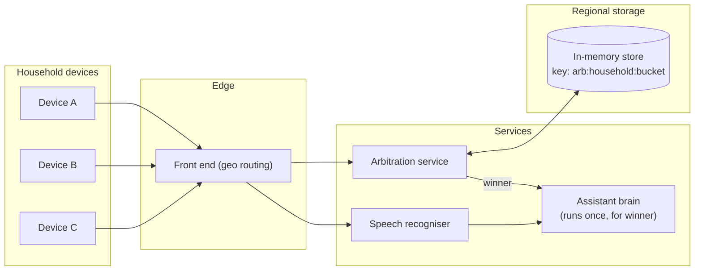
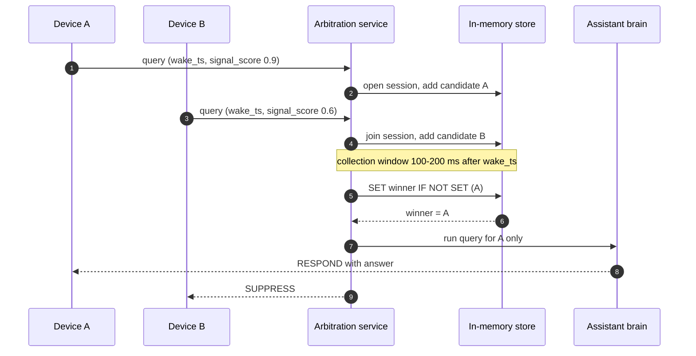
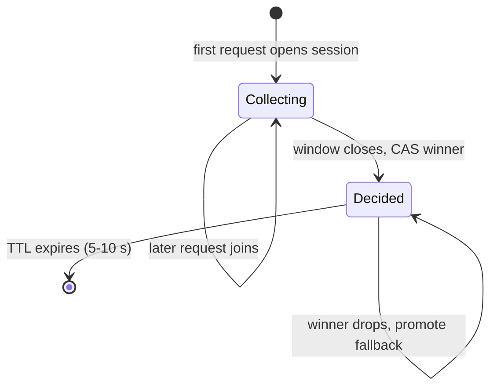

**Short answer:** Each device sends the query with its account, a coarse location or network context, the wake-word timestamp and an audio confidence score. The backend groups requests from the same user (or household) that arrive within a short window (a few hundred ms) into one "utterance session", elects one device as the responder (best signal, or a preferred speaker), and tells the others to stay silent. The election runs through a fast shared store keyed by the session, so whichever backend server receives each request gets the same answer.

## Picture it







**How to read it:**
- Steps 1–4: every device in the household sends the same query; requests are routed by household_id to the same regional arbitration shard, and each one adds itself as a candidate to one session record.
- The session waits a short window (100–200 ms after the wake timestamp) so that slower devices can join.
- Steps 6–7: the winner (highest signal score, then capability and device_id tie-breaks) is written with compare-and-set, so two servers can never pick different winners.
- Steps 8–10: only the winner's query runs through the expensive assistant pipeline; the others get SUPPRESS. If the store is down, fail open and let every device answer.
- The state picture shows the session's life: collecting, decided, then gone when its TTL expires.

## Requirements

Functional:
- Several devices hear the same wake word and stream the same query.
- Exactly one device responds; the others go back to idle.
- Pick the "best" device: closest (loudest), or the one with a screen if the answer needs one.

Non-functional:
- Adds little latency (target under ~150 ms of extra wait).
- Requests for one user may hit different data centres or servers.
- If coordination fails, prefer one duplicate answer over no answer.

## Estimates

- Hundreds of millions of devices; peak tens of thousands of queries per second.
- Per arbitration: a few small records in memory, alive for seconds. Storage is trivial; latency is the constraint.

## API

```text
POST /v1/query  (stream)
  { account_id, device_id, household_id, wake_ts, signal_score,
    capabilities: [speaker, screen], audio_stream }
<- { role: RESPOND | SUPPRESS, session_id, response? }
```

## Data model

Arbitration record in an in-memory store (Redis / Memcache-style), TTL 5-10 s:

```text
key   = arb:{household_id}:{time_bucket}
value = { session_id, candidates: [{device_id, signal_score, arrived_at}],
          winner_device_id?, decided_at? }
```

`household_id` is the group of devices linked to the same account and network or room. `time_bucket` alone is risky at a boundary, so the lookup checks the current and previous bucket, or uses a "open session" key with TTL instead of buckets.

## Architecture

The diagram in **Picture it** above shows the components.

## Deep dives

**Grouping requests.** Devices of one household are usually in the same region, so route them (by household_id) to the same regional arbitration shard. The first request opens a session and starts a short collection window, say 100-200 ms after its wake timestamp. Later requests in that window join it. Comparing wake timestamps (device clocks synced via NTP) beats comparing arrival times, because network delay differs per device.

**Electing the winner.** When the window closes, pick the highest `signal_score`, with tie-breaks on capability (screen needed?), user preference, and device_id for determinism. Store the decision with a compare-and-set (`SET winner IF NOT SET`), so two arbitration servers cannot pick different winners. A request that arrives after the decision just reads the winner and gets SUPPRESS.

**Saving work.** Only the winner's query goes to the expensive assistant pipeline. Losers' audio streams are cut early. Optionally do speech recognition on the first stream immediately and switch only if a better stream wins, to hide the window delay.

**Failure handling.**
- Arbitration store down: fail open, every device responds (duplicate, not silence).
- Winner disconnects mid-response: the session record lets a fallback device be promoted.
- Two different users speaking at once in one home: compare recognised text or speaker identity; different queries form different sessions.

## Trade-offs

- A longer window catches more devices but adds latency to every query. Tune it from data on how spread wake timestamps are.
- Doing arbitration on the local network (devices talk to each other) avoids a round trip but fails with mixed networks and older devices. Server-side is the single source of truth; device-side can be a fast first pass.
- Strongly consistent store gives clean decisions but costs latency; a single regional Redis primary with CAS is a good middle point.

## Follow-ups

- **Devices on different accounts in one room?** Group by network or location instead of account, with user consent.
- **Clock skew?** Use server-side receive time adjusted by measured round-trip, or allow a skew margin in the window.
- **How do you test it?** Replay recorded multi-device traces and measure duplicate and silent rates.

Further reading: [F2 · CAP, consistency, consensus](../academy/lessons/F2.md).
