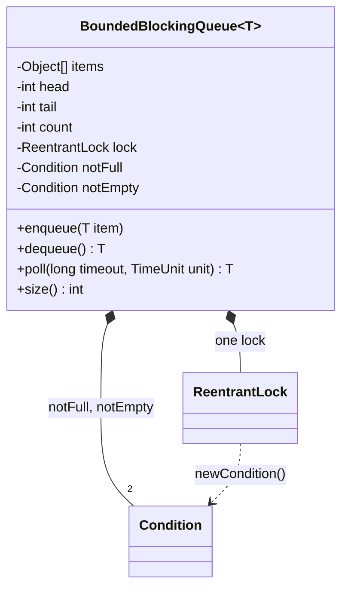
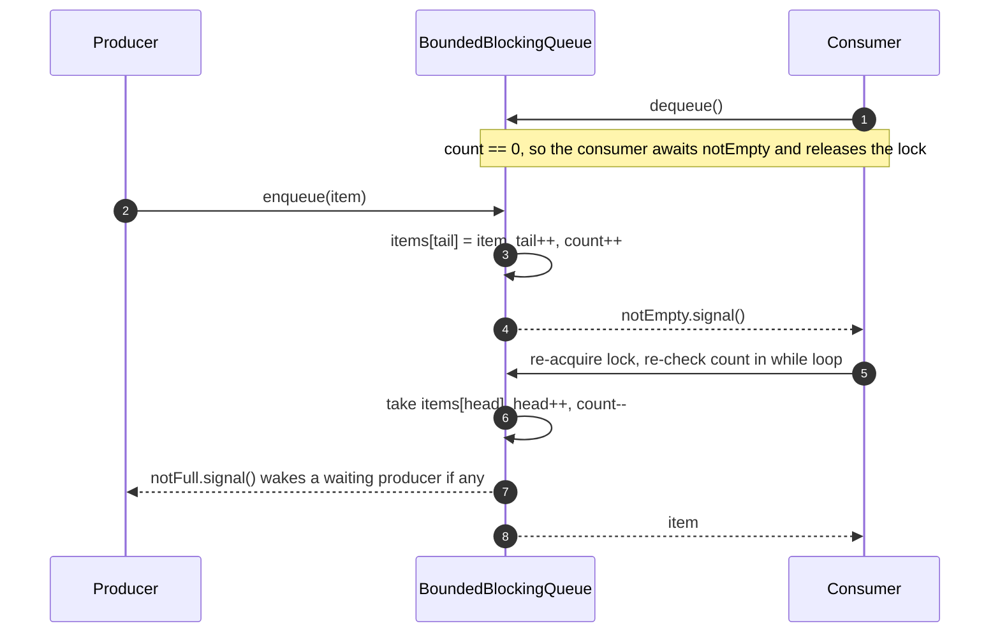

**Short answer:** Use a fixed-size circular array guarded by one `ReentrantLock` with two conditions, `notFull` and `notEmpty`. `enqueue` waits on `notFull` while the queue is full, inserts, then signals `notEmpty`. `dequeue` does the reverse. The waits sit in `while` loops because of spurious wakeups and because another thread may get there first. This is the design of `java.util.concurrent.ArrayBlockingQueue`.

## Picture it





**How to read it:**
- One class does it all: a circular array (`items`, `head`, `tail`, `count`) protected by one `ReentrantLock`.
- The lock hands out two `Condition`s, so producers wait on `notFull` and consumers wait on `notEmpty` separately.
- In the flow, the consumer finds the queue empty and parks. The producer inserts and signals `notEmpty`, which wakes exactly one consumer.
- The woken consumer re-checks the condition in a `while` loop before taking the item, then signals `notFull` for any blocked producer.

## Requirements

- `BoundedBlockingQueue(int capacity)`, `void enqueue(T)`, `T dequeue()`, `int size()` (LeetCode 1188).
- `enqueue` blocks while full. `dequeue` blocks while empty.
- Many producers and consumers. No lost items, no duplicates, no busy waiting.
- Blocking calls respond to interruption. Optional: timed `offer` and `poll`.

## Classes

- `BoundedBlockingQueue<T>`: an `Object[] items`, `head`, `tail` and `count`, one lock, two conditions.
- Nothing more is needed. The point of this question is correct synchronisation, not class hierarchy.

## Patterns used

- **Producer-consumer** with a bounded buffer. The bound gives **back-pressure**: fast producers slow down instead of running the heap out of memory.
- **Monitor** (a lock plus condition variables), the standard way to wait for a state change.
- **Circular buffer**: O(1) enqueue and dequeue with no allocation per item.

## Code

```java
import java.util.concurrent.TimeUnit;
import java.util.concurrent.locks.Condition;
import java.util.concurrent.locks.ReentrantLock;

public final class BoundedBlockingQueue<T> {
    private final Object[] items;
    private int head;      // next index to take
    private int tail;      // next index to put
    private int count;

    private final ReentrantLock lock = new ReentrantLock();
    private final Condition notFull = lock.newCondition();
    private final Condition notEmpty = lock.newCondition();

    public BoundedBlockingQueue(int capacity) {
        if (capacity <= 0) throw new IllegalArgumentException("capacity must be > 0");
        items = new Object[capacity];
    }

    public void enqueue(T item) throws InterruptedException {
        if (item == null) throw new NullPointerException();
        lock.lockInterruptibly();
        try {
            while (count == items.length) notFull.await();   // while, not if
            items[tail] = item;
            tail = (tail + 1) % items.length;
            count++;
            notEmpty.signal();                                // one waiting consumer is enough
        } finally {
            lock.unlock();
        }
    }

    @SuppressWarnings("unchecked")
    public T dequeue() throws InterruptedException {
        lock.lockInterruptibly();
        try {
            while (count == 0) notEmpty.await();
            T item = (T) items[head];
            items[head] = null;                               // let GC reclaim it
            head = (head + 1) % items.length;
            count--;
            notFull.signal();
            return item;
        } finally {
            lock.unlock();
        }
    }

    /** Timed variant: returns null if nothing arrived in time. */
    @SuppressWarnings("unchecked")
    public T poll(long timeout, TimeUnit unit) throws InterruptedException {
        long nanos = unit.toNanos(timeout);
        lock.lockInterruptibly();
        try {
            while (count == 0) {
                if (nanos <= 0) return null;
                nanos = notEmpty.awaitNanos(nanos);
            }
            T item = (T) items[head];
            items[head] = null;
            head = (head + 1) % items.length;
            count--;
            notFull.signal();
            return item;
        } finally {
            lock.unlock();
        }
    }

    public int size() {
        lock.lock();
        try { return count; } finally { lock.unlock(); }
    }
}
```

**Why each detail matters:**

- **`while`, not `if`:** a woken thread must re-check the condition. Wakeups can be spurious. Another consumer may also take the item between the signal and this thread getting the lock back.
- **Two conditions:** producers and consumers wait on different queues. So `signal()` (wake one) is safe and cheap. With a single `synchronized` monitor you must use `notifyAll()`. Otherwise `notify()` could wake a producer when a consumer was needed, and every thread could end up waiting.
- **`size()` under the lock:** otherwise there is no happens-before edge, and a reader may see a stale count.
- **`lockInterruptibly` and `await`** both throw `InterruptedException`, so a shutdown can stop blocked threads.

## Extensions

- **`synchronized` version:** the same logic with `wait()` and `notifyAll()` on `this`. It is simpler, but every state change wakes all waiters.
- **Semaphore version:** `Semaphore slots = new Semaphore(capacity)`, `Semaphore available = new Semaphore(0)`, plus a mutex around the buffer. `enqueue` does `slots.acquire(); mutex { put }; available.release();`. Acquire the counting semaphore *before* the mutex, or you can deadlock (holding the mutex while waiting for space).
- **Two-lock queue (like `LinkedBlockingQueue`):** separate put and take locks with an `AtomicInteger` count. Producers and consumers no longer block each other, which gives more throughput under contention.
- **Fairness:** `new ReentrantLock(true)` gives FIFO lock order, but lower throughput.
- **Shutdown:** add a `closed` flag, or a poison-pill item each consumer stops on.
- **Lock-free:** single-producer/single-consumer ring buffers (the LMAX Disruptor idea) avoid locks altogether. Mention it, but do not write it in an interview unless asked.

Related: [B7 · Classic problems](../academy/lessons/B7.md), [B2 · Locks](../academy/lessons/B2.md), [A6 · Java Memory Model](../academy/lessons/A6.md).
