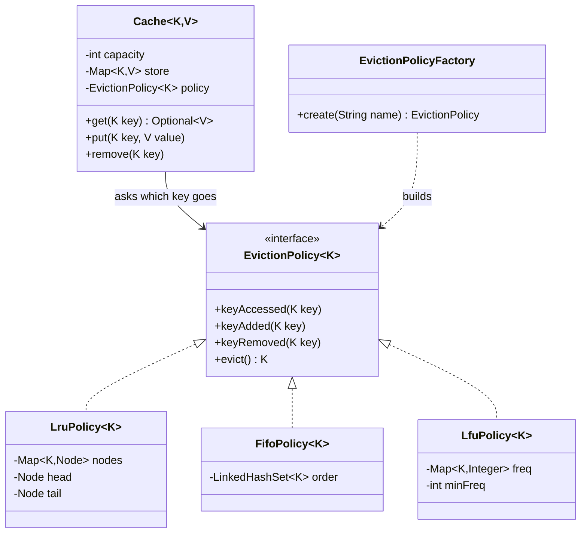
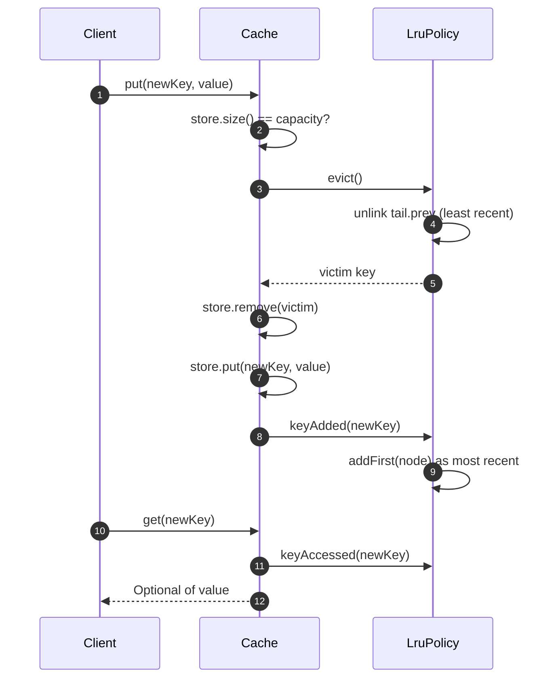

**Short answer:** Split the cache into two parts. `Cache<K,V>` stores the entries and enforces capacity. An `EvictionPolicy<K>` only tracks key usage and answers "which key goes next?". The cache calls the policy on every access (`keyAccessed`, `keyAdded`, `keyRemoved`) and asks `evict()` when it is full. LRU is a hash map from key to node in a doubly linked list, so every operation is O(1). LFU and FIFO are other implementations of the same interface. Nothing in `Cache` changes when you add them.

## Picture it





**How to read it:**
- `Cache` stores the values and enforces capacity. It only knows the `EvictionPolicy` interface, never a concrete policy.
- `LruPolicy`, `FifoPolicy` and `LfuPolicy` are interchangeable strategies. The optional factory picks one from config.
- In the flow, a `put` on a full cache asks the policy for a victim, removes it from the store, adds the new entry and tells the policy.
- Every `get` hit reports `keyAccessed`, which is how LRU moves the key to the front of its linked list.

## Requirements

- `get(key)`, `put(key, value)`, `remove(key)`, fixed `capacity`.
- When full, `put` of a new key evicts one key chosen by the configured policy.
- Policies: LRU in full. LFU and FIFO as further implementations.
- Thread-safe (state the level: correct first, high-throughput as an extension).
- Optional: eviction listener, hit and miss stats.

## Classes

- `Cache<K,V>`: the public API. Owns `Map<K,V> store`, `capacity` and a lock. Depends only on the `EvictionPolicy<K>` interface (DIP).
- `EvictionPolicy<K>`: `keyAccessed(K)`, `keyAdded(K)`, `keyRemoved(K)`, `K evict()`.
- `LruPolicy<K>`: hash map + doubly linked list. The head is the most recent, the tail the eviction victim.
- `FifoPolicy<K>`: a `LinkedHashSet<K>` in insertion order. Access does nothing.
- `LfuPolicy<K>`: `key -> freq`, `freq -> LinkedHashSet<K>`, and `minFreq`. All O(1).
- `EvictionPolicyFactory` (optional): builds a policy from config (`"LRU"` → `new LruPolicy<>()`).

## Patterns used

- **Strategy**: the eviction algorithm is a swappable object. This is exactly what the prompt asks for.
- **Factory**: build a policy from configuration, so callers do not `new` concrete classes.
- **Observer** (optional): `EvictionListener` to write evicted dirty entries back, or to count evictions.
- SOLID: SRP (storage versus policy), OCP (new policy, no edits to `Cache`), DIP (`Cache` depends on the interface).

## Code

```java
public interface EvictionPolicy<K> {
    void keyAccessed(K key);
    void keyAdded(K key);
    void keyRemoved(K key);
    K evict();                 // choose and forget a victim; null if empty
}

public final class Cache<K, V> {
    private final int capacity;
    private final Map<K, V> store = new HashMap<>();
    private final EvictionPolicy<K> policy;

    public Cache(int capacity, EvictionPolicy<K> policy) {
        if (capacity <= 0) throw new IllegalArgumentException();
        this.capacity = capacity;
        this.policy = policy;
    }

    public synchronized Optional<V> get(K key) {
        V v = store.get(key);
        if (v != null) policy.keyAccessed(key);
        return Optional.ofNullable(v);
    }

    public synchronized void put(K key, V value) {
        if (store.containsKey(key)) {
            store.put(key, value);
            policy.keyAccessed(key);
            return;
        }
        if (store.size() == capacity) {
            K victim = policy.evict();
            store.remove(victim);
        }
        store.put(key, value);
        policy.keyAdded(key);
    }

    public synchronized void remove(K key) {
        if (store.remove(key) != null) policy.keyRemoved(key);
    }
}

public final class LruPolicy<K> implements EvictionPolicy<K> {
    private static final class Node<K> {
        final K key; Node<K> prev, next;
        Node(K key) { this.key = key; }
    }
    private final Map<K, Node<K>> nodes = new HashMap<>();
    private final Node<K> head = new Node<>(null);   // sentinel: most recent after head
    private final Node<K> tail = new Node<>(null);   // sentinel: least recent before tail

    public LruPolicy() { head.next = tail; tail.prev = head; }

    public void keyAccessed(K key) {
        Node<K> n = nodes.get(key);
        if (n == null) return;
        unlink(n);
        addFirst(n);
    }
    public void keyAdded(K key) {
        Node<K> n = new Node<>(key);
        nodes.put(key, n);
        addFirst(n);
    }
    public void keyRemoved(K key) {
        Node<K> n = nodes.remove(key);
        if (n != null) unlink(n);
    }
    public K evict() {
        if (tail.prev == head) return null;
        Node<K> lru = tail.prev;
        unlink(lru);
        nodes.remove(lru.key);
        return lru.key;
    }

    private void addFirst(Node<K> n) {
        n.next = head.next; n.prev = head;
        head.next.prev = n; head.next = n;
    }
    private void unlink(Node<K> n) {
        n.prev.next = n.next; n.next.prev = n.prev;
        n.prev = n.next = null;
    }
}
```

Usage: `new Cache<String, User>(1_000, new LruPolicy<>())`. The policy is not thread-safe by itself. It is safe because the cache only calls it while holding the cache's lock. Say this out loud.

## Extensions

- **Why not `LinkedHashMap(accessOrder = true)` with `removeEldestEntry`?** That is the one-line LRU and fine in production. But it fuses storage and policy, which is the opposite of what this question tests.
- **LFU in O(1):** `keyAccessed` moves the key from bucket `f` to bucket `f+1`. If bucket `f` was `minFreq` and is now empty, increment `minFreq`. `keyAdded` sets freq 1 and `minFreq = 1`. `evict` takes the first key of bucket `minFreq`, which is LRU among ties.
- **Concurrency at scale:** one lock serialises everything, and LRU makes even `get` a write. Options: shard into N caches by `hash(key) % N`, each with its own lock and policy (approximate global LRU); a `ReadWriteLock` does not help because `get` mutates. Or record accesses into a buffer and apply them in batches, which is what Caffeine does. For real services, use Caffeine (W-TinyLFU) rather than writing your own.
- **TTL:** store `expiresAt` with the value, check it lazily on `get`, and sweep periodically. It composes with any policy.
- **Distributed cache (tag on the question):** consistent hashing across nodes, each node running this local design. Redis supports LRU and LFU approximations through `maxmemory-policy`.
- **Loader:** `get(key, Function<K,V> loader)`. Compute on a miss, guarding against a stampede with a per-key future.

Related: [E6 · LLD case studies](../academy/lessons/E6.md), [E4 · Behavioural patterns](../academy/lessons/E4.md), [B7 · Classic problems](../academy/lessons/B7.md).
