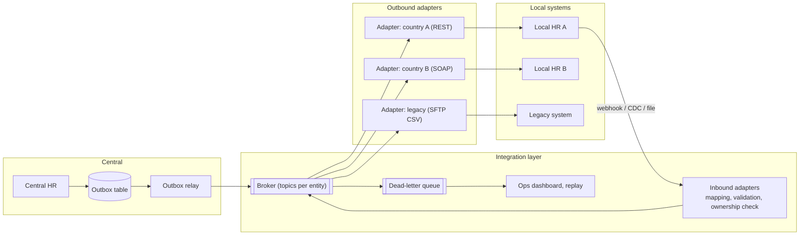
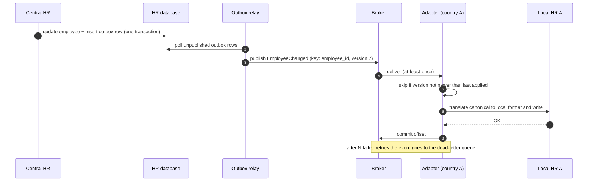

**Short answer:** Put an integration layer between the central HR system and each local system: per-system adapters translate local formats into one canonical employee model, and changes flow as events through a durable message broker using the outbox pattern. Decide ownership per field (who is the system of record), use change data capture or webhooks to detect changes, and make every consumer idempotent with versioning to handle reordering and retries. Secure every link with mutual TLS, OAuth2 client credentials and field-level protection of personal data.

## Picture it





**How to read it:**
- Step 1: the central system writes the change and an outbox row in the same database transaction, so a change can never be saved without its event.
- Steps 2–3: a relay publishes outbox rows to the broker, keyed by employee_id so one employee's events stay in order.
- Steps 4–6: each adapter is idempotent: it applies an event only if its version is newer than the last applied one, then translates it into whatever the local system speaks.
- Failures retry with backoff and then land in the dead-letter queue, where ops can see and replay them. Local changes come back through inbound adapters, which reject fields the source does not own.

## Requirements

Functional:
- Central HR holds the global employee record; local HR systems (per country or business unit) hold local data such as payroll and leave.
- Changes in either direction sync: new hire, transfer, termination, salary change.
- Bulk initial load and periodic reconciliation.

Non-functional:
- Eventual consistency within minutes is fine; correctness and auditability matter more than speed.
- Local systems differ in technology (REST, SOAP, SFTP CSV files, databases).
- Personal data is sensitive: encryption, least privilege, data residency rules.
- A local system being down must not block others.

## Estimates

- 200k employees, 30 local systems. Maybe 5-20k changes/day, bursts at month-end payroll and annual reviews. Throughput is low; complexity is in mapping and correctness.

## API

```text
Central -> integration:  event EmployeeChanged { employee_id, version, changed_fields, source }
Adapter -> local:        whatever the local system speaks (REST, SOAP, SFTP batch)
Local -> integration:    POST /v1/local/{system}/changes  (or CDC / file drop)
Admin:                   GET /v1/sync/status?employee_id=..   POST /v1/sync/replay?from=..
```

## Data model

```text
canonical_employee(global_id, version, name, email, org_unit, manager_id,
                   employment_status, country, updated_at, updated_by_system)
id_mapping(global_id, system_code, local_id)              -- cross-reference
field_ownership(field_name, owner_system)                 -- who may write what
outbox(id, aggregate_id, event_type, payload, created_at, published_at)
sync_log(event_id, system_code, status, attempts, last_error, processed_at)
```

## Architecture

The diagram in **Picture it** above shows the components.

The integration layer is a hub-and-spoke: N adapters instead of N×N point-to-point links.

## Deep dives

**Canonical model and ownership.** Each local system maps to one canonical schema, so adding a system means writing one adapter. Conflicts are avoided by design: the central system owns identity, job and org fields; local systems own local fields (bank details, local tax). An inbound change to a field the source does not own is rejected and logged. This removes most "two writers" conflicts.

**Reliable delivery.** The central system writes the change and an `outbox` row in one database transaction; a relay publishes the outbox to the broker. That avoids the dual-write problem (DB committed but message lost). Delivery is at-least-once, so adapters are idempotent: they keep the last applied `version` per employee and ignore older or duplicate events. Partition the topic by employee_id so events for one employee stay ordered.

**Failures and reconciliation.** Retries with exponential backoff, then a dead-letter queue with alerts and a replay tool. A nightly reconciliation job compares hashes of records between central and each local system and raises or fixes drift. Events alone always drift eventually; reconciliation catches it.

**Security.** mTLS between integration layer and every system, OAuth2 client-credentials tokens scoped per system, secrets in a vault, encryption at rest, field-level encryption or masking for salary and national IDs. Data residency: some countries forbid moving personal data out; the adapter sends only permitted fields. Full audit trail of who changed what.

## Trade-offs

- Event-driven gives loose coupling and buffering; batch files are simpler for legacy systems. Support both behind adapters.
- An off-the-shelf iPaaS/ESB speeds up connectors but adds cost and lock-in; custom Spring Boot adapters give control.
- Eventual consistency means a new hire may appear locally a few minutes later. Acceptable for HR; not for, say, access revocation on termination, which should also trigger a direct, synchronous path.

## Follow-ups

- **Central ERP with many local business apps?** Same pattern: canonical model per domain (customer, order, invoice), hub with adapters, outbox events, ownership per field, reconciliation. The difference is volume and more entity types, so you need schema versioning (a schema registry) and per-domain topics.
- **Schema change in central model?** Additive changes only, versioned events, adapters upgrade independently.
- **Exactly-once?** Not end to end; use at-least-once plus idempotent consumers.

Further reading: [S7B · SOA & the enterprise service bus](../academy/lessons/S7B.md), [S9 · Cloud native & event-driven systems](../academy/lessons/S9.md).
