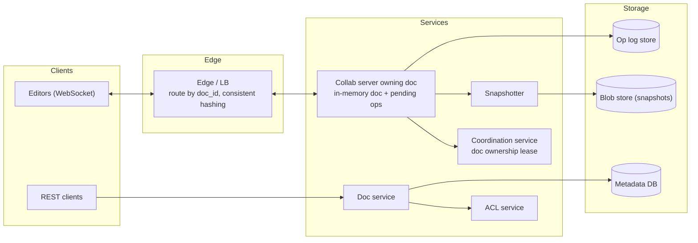
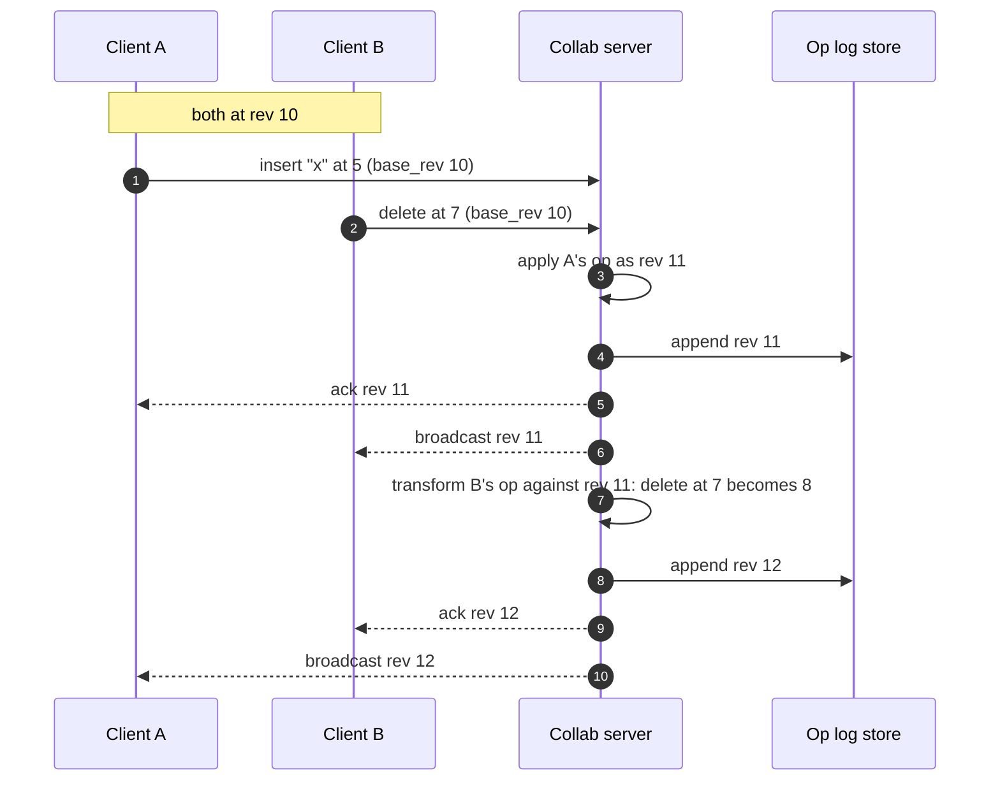

**Short answer:** Each open document is owned by one collaboration server; clients connect over WebSocket, send small operations (insert/delete at a position, with the revision they were based on), and the server orders them, transforms concurrent ones (Operational Transformation), appends them to an operation log and broadcasts them. The document is stored as a periodic snapshot plus the op log after it. CRDTs are the alternative: they converge without a central ordering server, at the cost of extra metadata per character.

## Picture it





**How to read it:**
- The edge routes every connection for one doc to the single collab server that owns it (held by a lease in the coordination service), so there is one place that orders edits.
- Steps 1–2: A and B both edit from rev 10 at the same time.
- Steps 3–6: A's op arrives first, becomes rev 11, is durably appended to the op log, then acked and broadcast.
- Steps 7–10: B's op was based on rev 10, so the server shifts it past A's insert (position 7 becomes 8), stores it as rev 12 and broadcasts it. Both clients converge to the same text.
- The snapshotter periodically writes the full doc to blob storage; recovery is "last snapshot + replay op log".

## Requirements

Functional:
- Create, open, edit documents; many users edit the same doc at once and see each other's changes and cursors in real time.
- Version history, comments, sharing with owner/editor/commenter/viewer roles.
- Offline edits merge later.

Non-functional:
- Edit latency under ~100 ms for collaborators.
- All replicas converge to the same text; no lost edits.
- Durable: an acknowledged edit survives server crash.

## Estimates

- 100 M daily users, 10 M concurrently open docs. Most docs have 1-3 editors; a few have 100+.
- Typing produces ~5 ops/s per active editor; batch keystrokes into ops every ~100 ms.
- Doc size: typically under 1 MB; op log grows fast, so snapshot every N ops.

## API

```text
REST:  POST /v1/docs   GET /v1/docs/{id}   (snapshot + rev)   POST /v1/docs/{id}/share
WS:    client -> { doc_id, base_rev, ops: [{retain 10}, {insert "abc"}, {delete 2}], client_op_id }
       server -> ack { client_op_id, rev }    broadcast { rev, ops, author }
       presence { user_id, cursor }
```

## Data model

```text
documents  (doc_id, owner_id, title, latest_snapshot_rev, created_at)
snapshots  (doc_id, rev, content_blob)               -- every ~100-1000 ops
operations (doc_id, rev, author_id, ops, created_at) -- PK (doc_id, rev), append-only
acl        (doc_id, principal_id, role)
```

In memory, the server holds the document as a structure good for edits at a position: a piece table or rope (balanced tree of string chunks), giving O(log n) insert/delete instead of copying a big string.

## Architecture

The diagram in **Picture it** above shows the components.

A coordination service (or lease in a DB) records which server owns which doc. If that server dies, another takes the lease, loads the last snapshot and replays the log.

## Deep dives

**OT in depth.** Client A and B both start at rev 10. A inserts "x" at 5, B deletes position 2. The server receives A first, applies it as rev 11. B's op was based on rev 10, so the server transforms it against A's op: positions before 5 are unchanged, so delete at 2 stays. Had B's op been at position 7, it becomes 8 after A's insert. The transformed op becomes rev 12 and is broadcast. Each client also transforms incoming ops against its own unacknowledged ops. Because the server picks one total order, only the simpler transform property (TP1) is needed; the classic Jupiter/Google Wave approach works this way. Clients send one op batch at a time and wait for the ack, which keeps transform logic manageable.

**CRDT in depth.** Each character gets a unique, ordered ID (for example (lamport counter, site id), or a position in a tree as in RGA, Logoot, or YATA used by Yjs). Inserts reference neighbour IDs, deletes mark tombstones. Operations commute, so any replica applying the same set of ops converges, in any order, without a central server. Costs: metadata per character, tombstones that need garbage collection, and harder intent preservation for rich text. Good for offline-first and peer-to-peer.

**Storage.** Snapshot + op log gives cheap appends, history ("version at rev N" = snapshot before N + replay), and recovery. Compact old ops into named versions.

**Permissions and caching.** Check ACL on WebSocket connect and cache it on the collab server; revocation pushes a disconnect. Cache snapshots for read-only viewers in a CDN-like layer.

## Trade-offs

| | OT | CRDT |
|---|---|---|
| Needs central server | Yes (simple form) | No |
| Metadata | Small | Per character, tombstones |
| Offline | Harder (long transform chains) | Natural |
| Maturity for rich text | Proven at Google Docs scale | Good libraries now (Yjs, Automerge) |

For a server-centric product like Docs, OT with one owner per doc is simpler to reason about. Single owner per doc limits a single document's throughput, which is fine because humans are slow.

## Follow-ups

- **Hot document with 1000 viewers?** Separate editors from viewers; viewers get broadcast through a fan-out tier.
- **Undo?** Undo is a new inverse op, transformed against later ops, scoped to the user's own edits.
- **Server crash between apply and persist?** Ack only after the op is durably appended; clients resend unacked ops with the same client_op_id (idempotent).

Further reading: [F5 · Case studies: chat, news feed, collaborative editor](../academy/lessons/F5.md), [F2 · CAP, consistency, consensus](../academy/lessons/F2.md).
