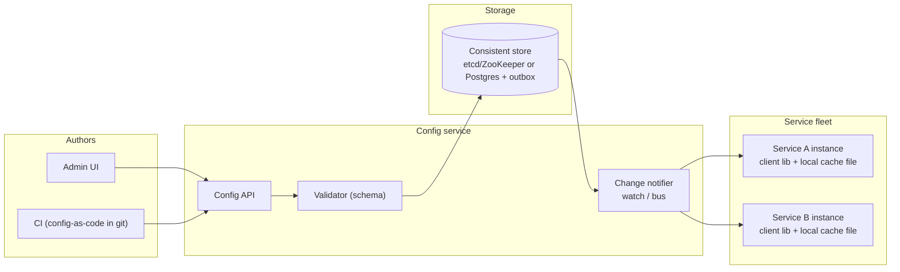
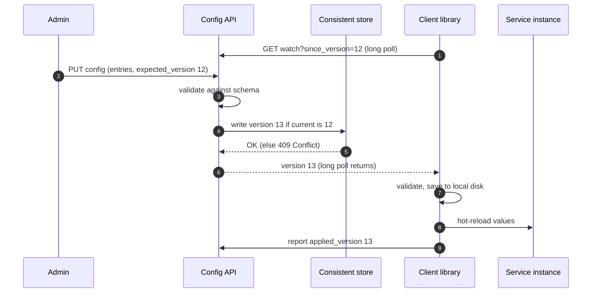
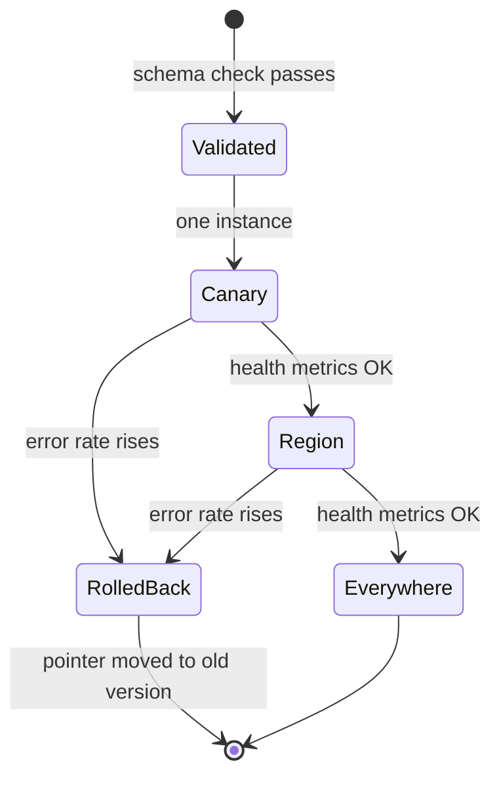

**Short answer:** Store configuration as versioned, immutable revisions in a strongly consistent store, scoped by service, environment and optionally instance or region. Services load config at startup and then get changes either pushed (watch / long poll / message bus) or pulled on an interval, always keeping a local cached copy so they keep working if the config service is down. Roll changes out gradually with validation, health checks and one-click rollback, because a bad config push is a classic cause of large outages.

## Picture it







**How to read it:**
- Step 1: each client library holds a long poll open with the version it already has, so a change reaches it in seconds.
- Steps 2–5: an admin writes a new immutable version; the schema validator runs first, and `expected_version` stops two admins from overwriting each other (409 on a stale write).
- Steps 6–9: the long poll returns, the client validates the config, saves it to local disk (so the service still starts if the config service is down), hot-reloads it and reports the applied version.
- The state picture is the safe rollout: canary, then a region, then everywhere, gated by health metrics. Rollback is just moving the active pointer back to an older version.

## Requirements

Functional:
- Create and update key-value or document config per service, environment, region; inheritance (global → service → region → instance).
- Propagate changes to n running microservices within seconds, without restart.
- Version history, diff, audit (who changed what), rollback.
- Feature flags and percentage rollouts.
- Secrets handled separately or encrypted.

Non-functional:
- Reads are hugely more frequent than writes.
- Highly available for reads; services must start even if the config service is degraded.
- Strong consistency for writes (no lost update between two admins).

## Estimates

- 1,000 services × 50 instances = 50k clients.
- Config writes: maybe hundreds per day. Config size: KBs per service.
- If clients poll every 30 s: 50k / 30 ≈ 1.7k requests/s, trivial, and cacheable. Watches or long polls reduce it further.

## API

```text
GET  /v1/config/{service}/{env}?region=..&version=..      -> { version, entries, etag }
GET  /v1/config/{service}/{env}/watch?since_version=12     (long poll, returns on change or timeout)
PUT  /v1/config/{service}/{env}  { entries, expected_version: 12 }   -> 409 if stale
POST /v1/config/{service}/{env}/rollout { version, strategy: canary, percent: 5 }
POST /v1/config/{service}/{env}/rollback { to_version }
```

## Data model

```text
config_revision (service, env, version, entries_json, schema_version, author, created_at, comment)
                PK (service, env, version)             -- immutable, append-only
config_pointer  (service, env, scope, active_version, rollout_state)
config_schema   (service, schema_json)                 -- validate before publish
audit_log       (id, actor, action, target, before, after, at)
```

## Architecture

The diagram in **Picture it** above shows the components.

## Deep dives

**Push vs pull.** Pull (poll every N seconds with ETag) is simple and self-healing but adds latency and load. Push (watch on etcd/ZooKeeper, long poll, or a Kafka/pub-sub topic) is near real time but clients must handle missed events. Best of both: long poll with `since_version`, so a reconnecting client immediately gets anything newer, plus a slow periodic full refresh as a safety net. Spring Cloud Config with Spring Cloud Bus is an example of this shape in the Spring world.

**Safe rollout.** Most damage comes from a valid-looking bad value. Defences: schema validation and type checks before publish; staged rollout (one canary instance → one region → all), with the client reporting its applied version and health metrics gating the next stage; automatic rollback on error-rate increase; immutable versions, so rollback is just moving the pointer.

**Availability.** The client library persists the last good config to local disk. If the config service is down at startup, the service starts with the cached copy (or a baked-in default) and logs a warning. The config service itself is read-replicated and cacheable behind a CDN or edge cache because content is versioned.

**Consistency of updates.** Concurrent admin edits use optimistic concurrency (`expected_version` → 409 Conflict). Within a fleet, instances may briefly run different versions; config must be designed to tolerate a mixed fleet (for example both old and new feature flag values work).

## Trade-offs

- etcd/ZooKeeper give watches and strong consistency out of the box but limited data size and operational overhead. A relational DB + notifier is simpler for a team that already runs Postgres.
- Hot reload is convenient but some settings (thread pool sizes, DB URLs) are risky to change live; mark them "restart required".
- Config-as-code in git gives review and history; a UI is faster for operators. Many teams use git as source of truth and the service as the distribution layer.

## Follow-ups

- **Secrets?** Keep them in a vault; config stores only references.
- **How do you know every instance applied the change?** Clients report `applied_version`; the dashboard shows drift.
- **Thundering herd after a change?** Jitter in client refresh and CDN-cached versioned responses.

Further reading: [F1 · Building blocks](../academy/lessons/F1.md), [S8 · Microservices](../academy/lessons/S8.md), [F2 · CAP, consistency, consensus](../academy/lessons/F2.md).
