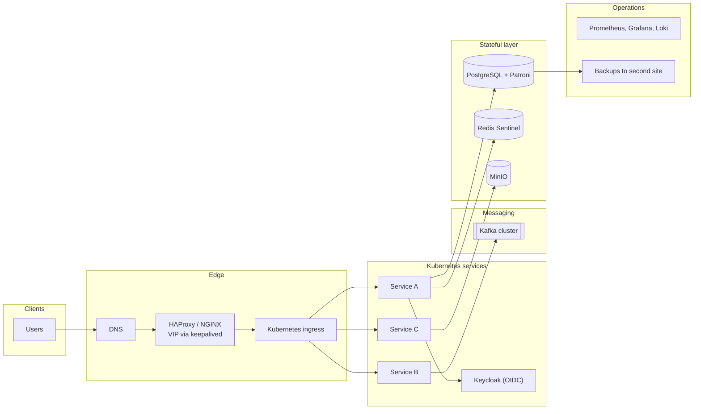
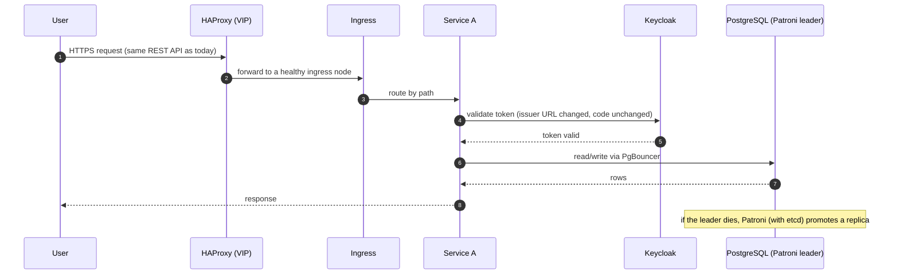

**Short answer:** List every managed cloud service the project uses, then map each to a self-hosted equivalent you can run on your own servers (Kubernetes or VMs, PostgreSQL with Patroni, Kafka or RabbitMQ, MinIO or Ceph for objects, Keycloak for identity, Prometheus/Grafana for monitoring, Vault for secrets). The architecture barely changes; what changes is that you now own capacity planning, high availability, backups, upgrades and security patching. Show the interviewer you know those costs, not just the product names.

This answer uses a generic Spring Boot microservices system. Replace the `[placeholders]` with your real project before the interview.

## Picture it

**How to read it:**
- The first picture is the same system as in the cloud, with each managed service swapped for a self-hosted one from the mapping table.
- Steps 1–3: DNS points at a virtual IP held by HAProxy/NGINX with keepalived (replaces the cloud load balancer), which forwards to the Kubernetes ingress.
- Steps 4–5: login moves to Keycloak; Spring Security only changes the issuer URL.
- Steps 6–8: the service talks to PostgreSQL as before, but you now own its failover (Patroni), its backups (to a second site) and its monitoring.

## Requirements

Functional (keep exactly what the project does today):
- `[core features of your project, e.g. order intake, processing, reporting]`.

Non-functional:
- Same or better availability (`[current SLA, e.g. 99.9%]`).
- Same latency and throughput (`[current peak RPS]`).
- Data stays on premises (often the reason for the question: regulation, cost, or air-gapped sites).
- Disaster recovery with defined RPO/RTO.

## Estimates

Use your real numbers. Shape of the reasoning:
- `[N]` services × `[M]` replicas × CPU/memory requests → number of worker nodes, plus 30-50% headroom for failover and peaks.
- Database: `[size]` GB growing `[x]` GB/month → disks for 2-3 years, ×3 for replicas and backups.
- Object storage: `[size]` TB → erasure-coded or 3× replicated raw capacity.
- At least two racks or two sites if the SLA needs survival of a site loss.

## API

Unchanged. Clients still call the same REST endpoints (`[your main APIs]`). Only DNS and the ingress in front change.

## Data model

Unchanged schemas. If the project uses a cloud-only database (DynamoDB, Cosmos DB, Aurora-specific features), pick a self-hosted equivalent (Cassandra/ScyllaDB, PostgreSQL) and plan a migration with dual-write or CDC and a cutover.

## Architecture

Mapping table (pick only rows your project actually uses):

| Cloud service | Self-hosted replacement |
|---|---|
| Managed Kubernetes / app service | Kubernetes (kubeadm, Rancher, OpenShift) or VMs + systemd |
| Load balancer | HAProxy / NGINX + keepalived (virtual IP), or MetalLB on Kubernetes |
| Managed PostgreSQL / MySQL | PostgreSQL with streaming replication + Patroni, PgBouncer, pgBackRest |
| Managed Redis | Redis with Sentinel or Redis Cluster |
| SQS/SNS, Event Hubs, MSK | Kafka (KRaft) or RabbitMQ |
| S3 / Blob storage | MinIO or Ceph (S3-compatible API, so code barely changes) |
| Cognito / Entra ID | Keycloak (OIDC); Spring Security config only changes issuer URLs |
| Secrets Manager / Key Vault | HashiCorp Vault |
| CloudWatch / App Insights | Prometheus, Grafana, Loki or ELK, OpenTelemetry collector, Jaeger |
| CI/CD | Jenkins or self-hosted GitLab, Harbor or Nexus for images and Maven artifacts |

The diagram in **Picture it** above shows the components after the mapping.

## Deep dives

**High availability without managed services.** Every stateful piece needs its own HA story: Patroni with etcd for Postgres leader election and automatic failover; three Kafka controller nodes and replication factor 3; Redis Sentinel; MinIO erasure coding. Spread replicas across racks with anti-affinity. Test failover regularly, because nobody else does it for you.

**Backups and DR.** Point-in-time recovery for Postgres (base backups + WAL archive), object storage replication to a second site, documented restore drills. Define RPO (how much data you may lose) and RTO (how long to recover) and size the design to them.

**Elasticity is gone.** No auto-provisioning of new machines. Plan capacity for peak, use Kubernetes HPA within the fixed cluster, and keep spare nodes. Procurement lead time becomes a planning input.

**Keep the code portable.** Spring Boot externalised configuration means most changes are properties (JDBC URL, S3 endpoint, OIDC issuer). Code that used a cloud SDK directly is wrapped behind an interface, so the S3-compatible MinIO client or a Kafka producer can be plugged in.

## Trade-offs

- Gains: data control, predictable cost at steady load, no vendor lock-in, works air-gapped.
- Costs: you run 24/7 operations, patching, hardware failures, and need skilled ops staff. Upfront capital cost.
- Managed features you lose: global load balancing, managed multi-region databases, serverless. Some must be rebuilt or dropped.

## Follow-ups

- **What would you keep from cloud if allowed?** Usually CDN and DNS, since they are hard to self-host globally.
- **How do you migrate with no downtime?** Replicate data first (logical replication or CDC), run both, switch traffic gradually by DNS, keep rollback ready.
- **Biggest risk?** The stateful layer: database failover and backups. Start the design there.

Further reading: [S9 · Cloud native & event-driven systems](../academy/lessons/S9.md), [S8 · Microservices](../academy/lessons/S8.md), [Q8 · Scaling databases](../academy/lessons/Q8.md).
