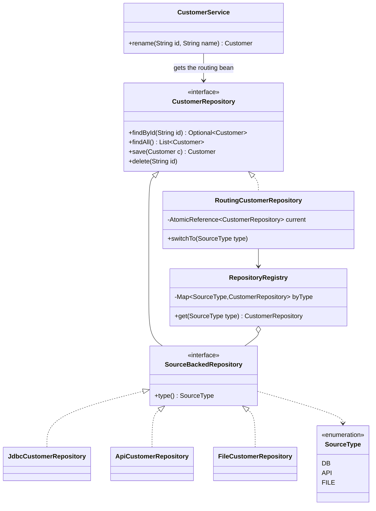
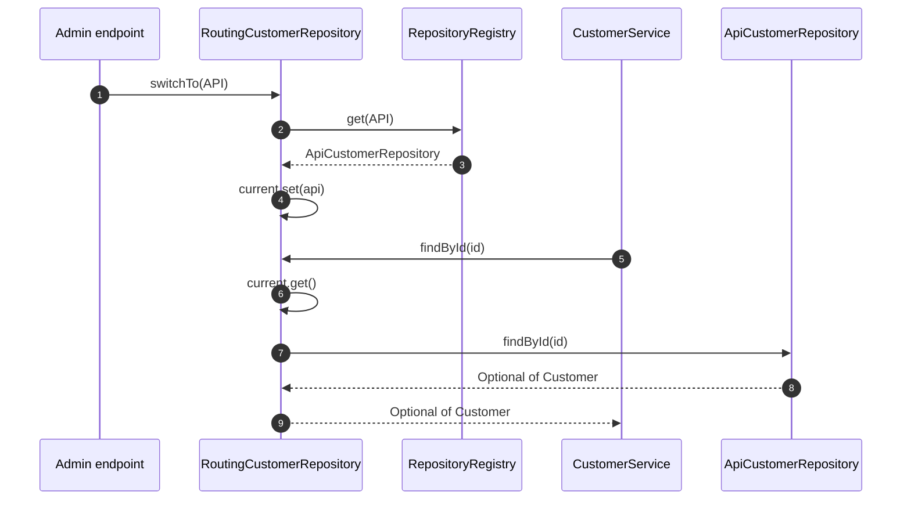

**Short answer:** Business code depends on one interface, for example `CustomerRepository`. It has one implementation per source: database, REST API, file. A routing implementation of the same interface holds the *current* source in an `AtomicReference` and delegates every call to it. Switching at runtime is one atomic swap, driven by config or an admin endpoint. DI wires all implementations into a map, and a small factory or registry resolves a `SourceType` to an implementation. The service never knows which source it is talking to.

## Picture it





**How to read it:**
- Business code (`CustomerService`) depends only on the `CustomerRepository` interface.
- Each source is an adapter (`Jdbc`, `Api`, `File`) that also reports its `SourceType`. Spring injects them all into `RepositoryRegistry`.
- `RoutingCustomerRepository` is the `@Primary` bean. It implements the same interface and forwards every call to whatever `current` points at.
- Switching source is one atomic swap of `current`. Calls already running keep the repository they read, new calls use the new one.

## Requirements

- Read and update one aggregate (say `Customer`) from a DB, an external API or a file.
- The active source can change at runtime with no restart and no change in callers.
- Adding a new source (for example, a cache or another API) adds a class and changes no existing class.
- In-flight calls finish on the source they started with. New calls use the new source.
- Optional: per-tenant or per-request source, fallback when a source is down.

## Classes

- `Customer`: a record, the domain model. Each source maps its own format (rows, JSON, CSV) to it.
- `CustomerRepository`: `findById`, `findAll`, `save`, `delete`. The port the business code depends on.
- `JdbcCustomerRepository`, `ApiCustomerRepository`, `FileCustomerRepository`: adapters, one per source.
- `SourceType`: enum `DB, API, FILE`. Each adapter reports its own type.
- `RepositoryRegistry`: `SourceType -> CustomerRepository`, built from what DI injects. It is the factory.
- `RoutingCustomerRepository`: implements `CustomerRepository`, delegates to the current one, and exposes `switchTo(SourceType)`.
- `CustomerService`: business logic, constructor-injected with `CustomerRepository` (it gets the routing one).

## Patterns used

- **Repository**: hides storage details behind a collection-like interface.
- **Strategy**: each adapter is an interchangeable way to do the same job, chosen at runtime.
- **Adapter**: each implementation turns a source's own API (JDBC, HTTP client, file I/O) into the common interface.
- **Factory / Registry**: resolve a `SourceType` to an instance without `switch` statements in business code.
- **Proxy (delegating)**: the routing repository looks like a repository but forwards calls.
- **Dependency Injection**: Spring builds the objects and injects interfaces. That gives DIP and OCP. New source = new `@Component`.

## Code

```java
public record Customer(String id, String name, String email) {}

public enum SourceType { DB, API, FILE }

public interface CustomerRepository {
    Optional<Customer> findById(String id);
    List<Customer> findAll();
    Customer save(Customer c);
    void delete(String id);
}

/** Implemented by each concrete adapter, so the registry can index it. */
public interface SourceBackedRepository extends CustomerRepository {
    SourceType type();
}

@Component
class JdbcCustomerRepository implements SourceBackedRepository {
    private final JdbcClient jdbc;
    JdbcCustomerRepository(JdbcClient jdbc) { this.jdbc = jdbc; }
    public SourceType type() { return SourceType.DB; }
    public Optional<Customer> findById(String id) {
        return jdbc.sql("select id, name, email from customer where id = ?")
                   .param(id).query(Customer.class).optional();
    }
    // findAll, save, delete ...
}
// ApiCustomerRepository (RestClient) and FileCustomerRepository (Jackson + Files) look the same.

@Component
class RepositoryRegistry {
    private final Map<SourceType, CustomerRepository> byType;
    RepositoryRegistry(List<SourceBackedRepository> all) {          // Spring injects every adapter
        this.byType = all.stream().collect(Collectors.toUnmodifiableMap(
                SourceBackedRepository::type, r -> r));
    }
    CustomerRepository get(SourceType type) {
        CustomerRepository r = byType.get(type);
        if (r == null) throw new IllegalArgumentException("No repository for " + type);
        return r;
    }
}

@Primary
@Component
public class RoutingCustomerRepository implements CustomerRepository {
    private final RepositoryRegistry registry;
    private final AtomicReference<CustomerRepository> current;

    RoutingCustomerRepository(RepositoryRegistry registry,
                              @Value("${customers.source:DB}") SourceType initial) {
        this.registry = registry;
        this.current = new AtomicReference<>(registry.get(initial));
    }

    public void switchTo(SourceType type) { current.set(registry.get(type)); }

    public Optional<Customer> findById(String id) { return current.get().findById(id); }
    public List<Customer> findAll()               { return current.get().findAll(); }
    public Customer save(Customer c)              { return current.get().save(c); }
    public void delete(String id)                 { current.get().delete(id); }
}

@Service
public class CustomerService {
    private final CustomerRepository customers;        // gets the @Primary routing bean
    public CustomerService(CustomerRepository customers) { this.customers = customers; }
    public Customer rename(String id, String name) {
        Customer c = customers.findById(id).orElseThrow();
        return customers.save(new Customer(c.id(), name, c.email()));
    }
}
```

`switchTo` can be called from an admin endpoint or from a config-refresh listener. Each call reads `current` once, so an in-flight call never mixes two sources.

## Extensions

- **Multi-call consistency:** `rename` above calls the repository twice. A switch in between would read from the API and write to the DB. If that matters, read `current.get()` once per use case: expose `CustomerRepository snapshot()` and use it for the whole operation.
- **Per-tenant or per-request routing:** replace the single `AtomicReference` with a lookup on a request-scoped value (a header resolved in a filter). Prefer passing a `SourceType` explicitly over thread-locals, because those leak across pooled threads.
- **DB-to-DB only:** Spring's `AbstractRoutingDataSource` routes at the `DataSource` level by a lookup key. It is fine when all sources are databases with the same schema, not for API or file.
- **Resilience:** a `FallbackCustomerRepository` decorator that tries the primary and falls back on failure. With Resilience4j, add a circuit breaker per source.
- **Transactions:** `@Transactional` covers only the JDBC source. An API or file write cannot join that transaction, so document it. Use an outbox or compensation if writes must span sources.
- **Testing:** the service is tested with an in-memory `CustomerRepository`. That is the main payoff of DIP.

Related: [E1 · SOLID](../academy/lessons/E1.md), [E2 · Creational patterns](../academy/lessons/E2.md), [E3 · Structural patterns](../academy/lessons/E3.md), [D2 · Spring core](../academy/lessons/D2.md), [D1 · Build your own DI container](../academy/lessons/D1.md).
