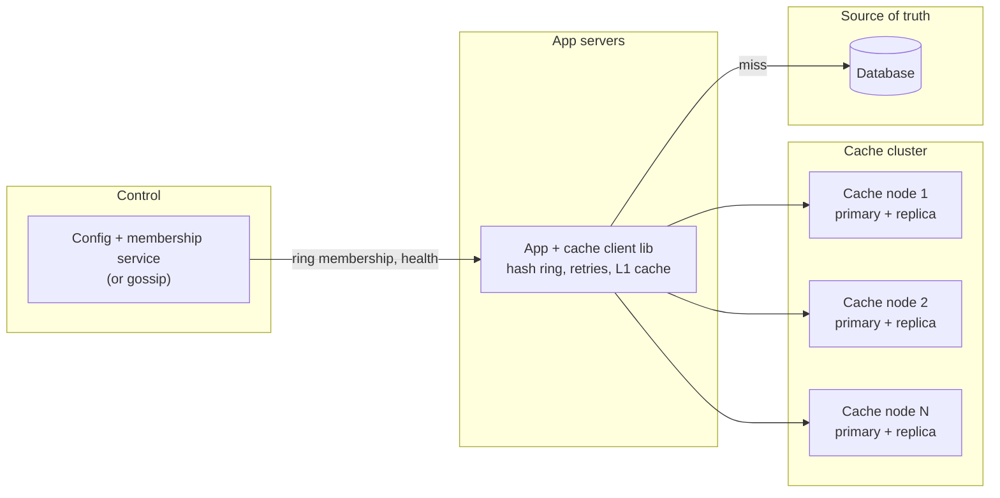
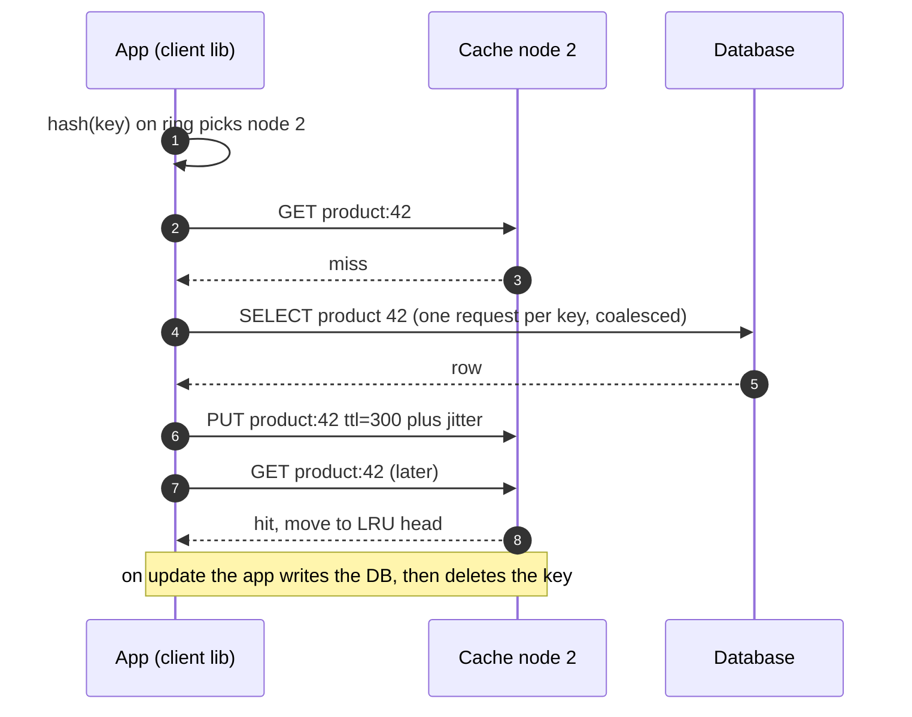
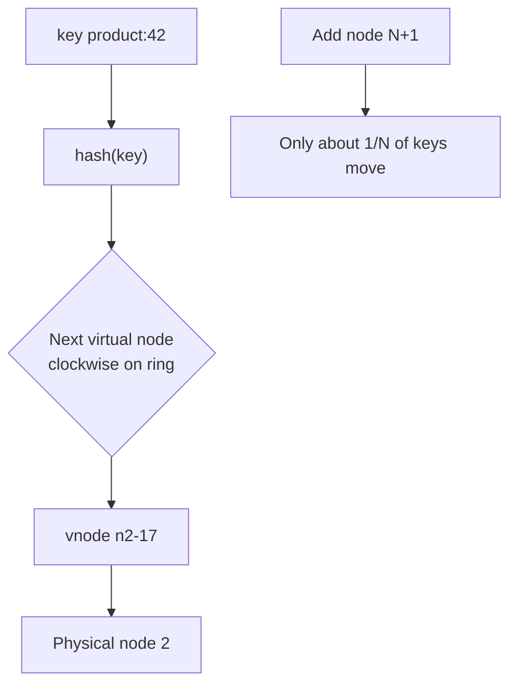

**Short answer:** Start by asking for the workload: read/write ratio, key and value sizes, key skew, consistency needs, and what happens on a miss. Then build a cluster of cache nodes, each an in-memory hash map with an eviction policy, with keys spread by consistent hashing (virtual nodes) and optionally replicated for availability. Every later choice (eviction policy, replication, write policy, hot-key handling) follows from that workload, so state each choice against it.

## Picture it







**How to read it:**
- Step 1: the client library holds the hash ring, so it sends each key straight to the right node in one hop.
- Steps 2–6: cache-aside. On a miss the app reads the database (coalescing concurrent misses for the same key) and fills the cache with a TTL plus jitter so keys do not all expire together.
- Steps 7–8: a later read hits; the node moves the entry to the head of its LRU list, and evicts from the tail when memory is full.
- The third picture: consistent hashing with virtual nodes, so adding or losing a node moves only ~1/N of keys instead of emptying the cache.

## Requirements

Ask first, because "optimised for a given task" is the whole point. Example workload used below: a product-catalogue read cache, 95% reads, values ~2 KB, Zipf-skewed popularity, stale data up to a few seconds is fine, DB behind it is expensive.

Functional:
- `get(key)`, `put(key, value, ttl)`, `delete(key)`.
- TTL expiry and eviction when memory is full.

Non-functional:
- p99 under 1-2 ms within a data centre.
- Scales horizontally; node loss does not cause a DB stampede.
- Eventual consistency with the source of truth is acceptable (for this workload).

## Estimates

- 500k reads/s, 25k writes/s.
- 200 M hot keys × 2 KB ≈ 400 GB; plus overhead ~30% → ~520 GB.
- Nodes with 64 GB usable → ~9 nodes; with one replica each, ~18. One node handling ~100k ops/s means 500k reads/s fits with headroom.

## API

```text
GET    /cache/{key}                      -> value | 404
PUT    /cache/{key}?ttl=300   body=value
DELETE /cache/{key}
```

In practice a binary protocol over TCP (like the Redis or Memcached protocol), with a smart client that knows the hash ring.

## Data model

Per node:

```text
HashMap<key, Node>  +  doubly linked list (LRU order)  +  expiry structure
Node { key, value bytes, expires_at, size }
```

LRU: get moves node to head, put inserts at head, eviction removes tail. Both O(1). TTL: lazy check on read plus a background sampler that removes expired keys.

## Architecture

The diagram in **Picture it** above shows the components.

## Deep dives

**Partitioning.** `hash(key) mod N` remaps almost every key when N changes, which empties the cache and floods the DB. Consistent hashing places nodes and keys on a ring; adding a node moves only ~1/N of keys. Use 100-200 virtual nodes per physical node to even out load. The client library holds the ring so a request goes straight to the right node (one hop).

**Replication and failure.** For a pure cache, losing a node only costs misses, so replication is optional. If the DB cannot absorb the miss burst, add a replica per shard with async replication and fail over to it. Writes go to primary; reads can go to replicas if slight staleness is OK.

**Eviction tuned to workload.** LRU suits recency-driven access. Zipf-skewed catalogues often do better with LFU or a W-TinyLFU style admission policy (as in Caffeine), which keeps one-off scans from flushing popular keys. Large scans: segmented LRU. Choose with the interviewer's workload and measure hit ratio.

**Write policy.**
- Cache-aside with delete-on-write: simple; small window of staleness. Default for read-heavy.
- Write-through: cache always current, slower writes.
- Write-behind: fast writes, risk of loss; only if data can be rebuilt.

**Hot keys and stampedes.** A celebrity product sends 50k req/s to one node. Fixes: small in-process L1 cache with a short TTL, replicate hot keys to several nodes (key suffixes), request coalescing so only one miss per key goes to the DB, and TTL jitter so keys do not expire together.

**Testing (tag says TDD).** Unit-test the LRU/TTL core with a fake clock; property tests for ring rebalancing (only ~1/N keys move); fault-injection tests for node loss.

## Trade-offs

- Replication doubles memory to protect the DB; skip it if misses are cheap.
- Consistent hashing in the client is fast but every client must agree on membership; a proxy tier (like twemproxy) centralises that at the cost of an extra hop.
- Strong consistency in a cache is expensive; if the workload needs it (inventory counts), the cache may be the wrong tool.

## Follow-ups

- **Workload is write-heavy counters?** Keep counters in the cache with atomic increments, flush to DB periodically, accept loss window or replicate.
- **Large values (1 MB)?** Network becomes the bottleneck; compress, or store in blob storage and cache only metadata.
- **Multi-region?** Cache per region, invalidations broadcast through a message bus.
- **Thread safety on a node?** Striped locks or a single-threaded event loop per core (Redis model).

Further reading: [F6 · Case studies: distributed cache, metrics & monitoring](../academy/lessons/F6.md), [B7 · Concurrent LRU](../academy/lessons/B7.md), [F1 · Building blocks](../academy/lessons/F1.md).
