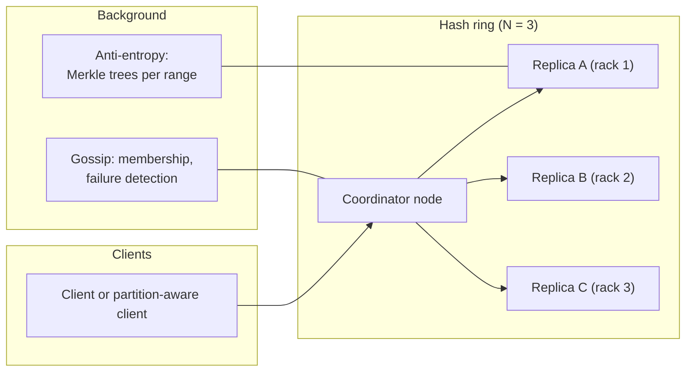
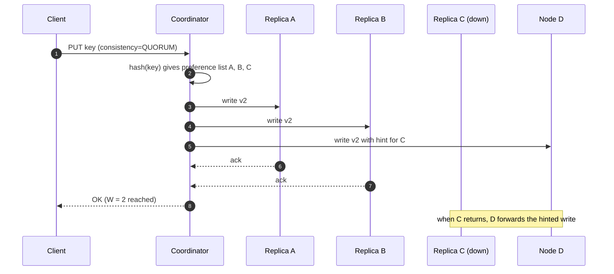
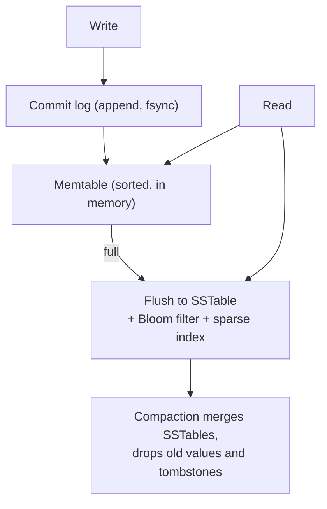

**Short answer:** Partition keys over nodes with consistent hashing (virtual nodes), replicate each key to N nodes, and make consistency tunable with quorums (R + W > N for read-your-latest-write). Each node stores data in an LSM tree (write-ahead log, memtable, SSTables, compaction). Handle failures with hinted handoff, read repair and Merkle-tree anti-entropy, and detect membership with gossip. The key alternatives to discuss are leader-based replication with consensus (Raft) versus leaderless quorums, and range versus hash partitioning.

## Picture it







**How to read it:**
- Steps 1–2: any node can coordinate; it hashes the key onto the ring and gets the N = 3 replicas, placed on different racks.
- Steps 3–8: the write goes to all replicas and succeeds after W = 2 acks. With R = 2, R + W > N, so a quorum read always overlaps the latest write.
- C is down, so node D takes the write with a hint (sloppy quorum) and hands it back when C returns. Read repair and Merkle-tree anti-entropy fix anything still stale.
- The third picture is one node's LSM storage: append to the log, buffer in the memtable, flush to immutable SSTables, compact in the background. Reads check the memtable, then SSTables newest-first, skipping files via Bloom filters.

## Requirements

Functional:
- `put(key, value)`, `get(key)`, `delete(key)`; values up to ~1 MB.
- Optional: conditional put (compare-and-set), TTL.

Non-functional:
- Petabyte scale, horizontal growth by adding nodes.
- High availability: writes accepted during node or AZ failure.
- Single-digit millisecond latency.
- Tunable consistency per request.

## Estimates

- 10 B keys × 1 KB average = 10 TB; × 3 replicas = 30 TB.
- 1 M ops/s (70% reads). At ~20k ops/s per node → ~50 nodes, plus headroom, ~80 nodes with ~1-2 TB SSD each.

## API

```text
PUT    /kv/{key}   body=value   headers: consistency=QUORUM, if-version=..
GET    /kv/{key}   consistency=ONE|QUORUM|ALL   -> value, version (vector clock or version number)
DELETE /kv/{key}   (writes a tombstone)
```

## Data model

```text
record: key, value, version (timestamp or vector clock), tombstone flag, ttl
node storage: commit log (append, fsync)  -> memtable (sorted, in memory)
              -> flushed SSTables (sorted, immutable, with Bloom filter + sparse index)
              -> background compaction merges SSTables, drops overwritten values and old tombstones
```

## Architecture

The diagram in **Picture it** above shows the components and the quorum write path.

## Deep dives

**Partitioning.** Hash partitioning with consistent hashing spreads load evenly and moves only ~1/N of data when nodes join. Virtual nodes let a bigger machine take more tokens and spread recovery load. The alternative, range partitioning (Bigtable, HBase, CockroachDB), supports range scans but needs splitting of hot ranges and a metadata service. Choose hash for pure point lookups, range if scans matter.

**Replication: leaderless vs leader-based.**
- Leaderless (Dynamo, Cassandra): any replica takes writes; quorum W and R. N=3, W=2, R=2 tolerates one node down for both reads and writes. Concurrent writes create conflicts, resolved by last-write-wins (timestamps, can lose updates) or by vector clocks returning siblings for the application to merge.
- Leader per partition with Raft/Paxos (DynamoDB's partitions use Paxos-based replication; etcd, TiKV use Raft): every write goes through the leader and a majority; linearizable reads possible; no siblings. Cost: leader election pause on failure and leader as per-partition bottleneck.
For "like DynamoDB" with strong-consistency option, leader-based per partition is a fine answer; for maximum write availability, leaderless.

**Failure handling.**
- Sloppy quorum and hinted handoff: if C is down, D accepts the write with a hint and forwards it when C returns.
- Read repair: coordinator notices a stale replica during a read and updates it.
- Anti-entropy: replicas compare Merkle trees of key ranges and sync only differing branches.
- Gossip: nodes exchange heartbeats and membership; a node is marked down after missed heartbeats (phi accrual detector).

**Storage engine.** LSM trees turn random writes into sequential appends, good for write-heavy loads. Reads check memtable then SSTables newest-first; Bloom filters skip files without the key. Compaction strategy (size-tiered vs leveled) trades write amplification against read and space amplification. A B-tree engine is the alternative when reads dominate.

## Trade-offs

- CAP: during a partition, leaderless quorums with sloppy quorum stay available (AP); Raft-based partitions refuse writes without a majority (CP). PACELC: even without partitions, stronger consistency costs latency.
- Last-write-wins is simple but silently drops concurrent updates; vector clocks are correct but push merging to clients.
- More replicas = more durability and read capacity, more write cost and storage.

## Follow-ups

- **Hot key?** Cache in front, or split the key (application-level sharding); partitioning alone cannot spread one key.
- **Adding a node?** It takes tokens; data streams from neighbours; reads still served by old owners until handover.
- **Deletes come back ("zombie" data)?** Tombstones must live longer than the max repair interval before compaction removes them.
- **Transactions across keys?** Not in the basic design; add with two-phase commit over Raft groups (Spanner-like), at a latency cost.

Further reading: [F2 · CAP, consistency, consensus](../academy/lessons/F2.md), [Q8 · Scaling databases](../academy/lessons/Q8.md), [F6 · Distributed cache](../academy/lessons/F6.md).
