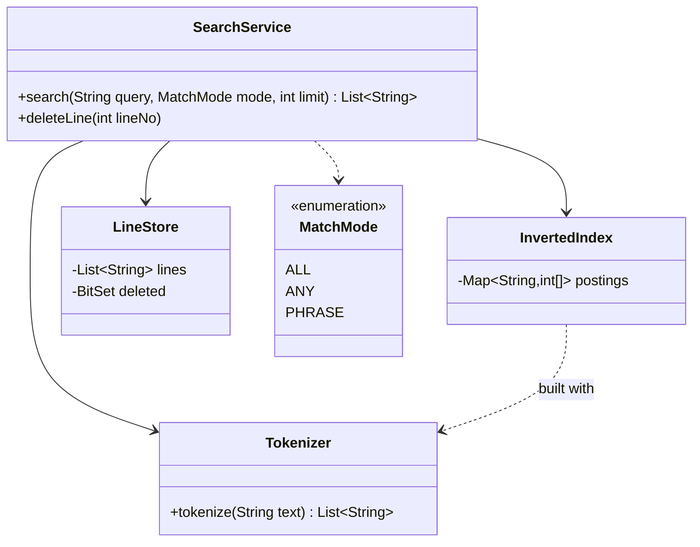
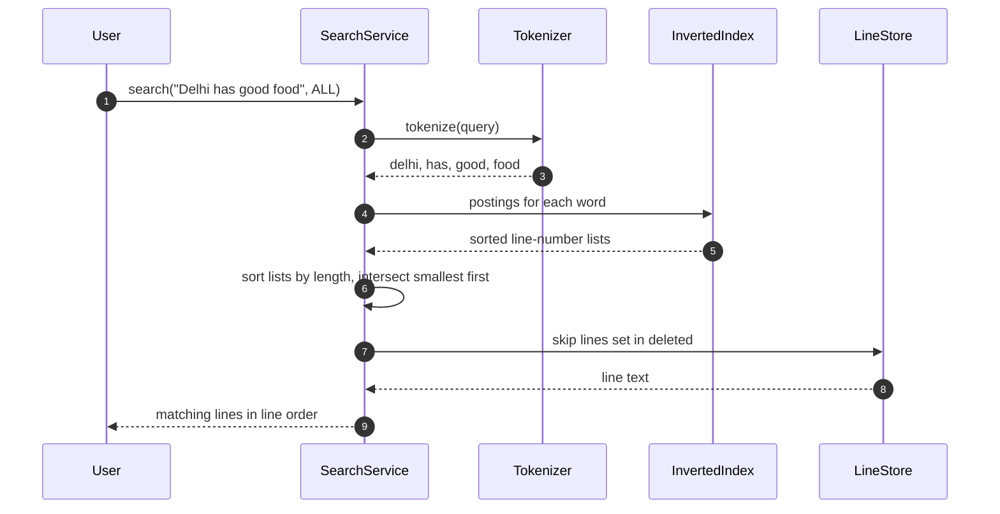

**Short answer:** Build an **inverted index** once: normalised word → sorted list of line numbers that contain it. For the query "Delhi has good food", tokenise it the same way, look up each word's postings list, and intersect them, starting with the shortest list. The result is the lines that contain all the words. For a ranked "best match" mode, count how many query words each line has instead of requiring all. Deleting a line from results is a tombstone (a `BitSet` of deleted lines) that the search filters out, so the index is not rebuilt.

## Picture it





**How to read it:**
- `SearchService` is a facade over three parts: the `Tokenizer`, the `InvertedIndex` (word to sorted line numbers) and the `LineStore` (lines plus a `deleted` bitset).
- A query is tokenised exactly like the document was, so "Delhi," and "delhi" match.
- Each word's postings list is fetched. They are intersected with two pointers, rarest word first, so the working set shrinks fast.
- Deleted lines are filtered at the end through the bitset. The `## Code` below folds these parts into one `LineSearch` class.

## Requirements

Clarify first, then state:

- Input: one document as a list of lines. It may be large (millions of lines), and searched many times.
- `search(query)`: lines containing **all** query words (AND), case-insensitive, punctuation ignored, returned in line order.
- Optional modes: `ANY` (OR, ranked by how many words matched), `PHRASE` (the words adjacent and in order).
- Follow-up: the user can delete lines, and deleted lines never appear in later results.
- Single document, in memory. Multi-document and distributed search are extensions.

## Classes

- `Tokenizer`: lowercases, splits on non-letters/digits, optionally drops stop words ("has" is a stop word in some setups; with AND semantics, dropping it changes results, so make that a choice, not a default).
- `InvertedIndex`: `Map<String, int[]>` postings, sorted ascending. Built once in O(total words).
- `LineStore`: the original lines plus a `BitSet deleted`.
- `SearchService`: the API. `search(query, mode, limit)` and `deleteLine(lineNo)`.
- `MatchMode`: enum `ALL, ANY, PHRASE`. Each mode is a small strategy over the postings.

## Patterns used

- **Strategy**: the matching mode, and the `Tokenizer` (swap in stemming, or another language).
- **Facade**: `SearchService` hides the tokenizer, index and store behind two calls.
- Data-structure choice is the real content here: an inverted index with sorted postings, and the same idea as a search engine.

## Code

```java
public final class LineSearch {
    private final List<String> lines;
    private final Map<String, int[]> postings;      // word -> sorted line numbers
    private final BitSet deleted = new BitSet();

    public LineSearch(List<String> lines) {
        this.lines = List.copyOf(lines);
        Map<String, List<Integer>> build = new HashMap<>();
        for (int i = 0; i < this.lines.size(); i++) {
            for (String w : new LinkedHashSet<>(tokenize(this.lines.get(i)))) {   // once per line
                build.computeIfAbsent(w, k -> new ArrayList<>()).add(i);
            }
        }
        this.postings = new HashMap<>();
        build.forEach((w, ids) -> postings.put(w, ids.stream().mapToInt(Integer::intValue).toArray()));
    }

    static List<String> tokenize(String text) {
        return Arrays.stream(text.toLowerCase(Locale.ROOT).split("[^\\p{L}\\p{N}]+"))
                     .filter(t -> !t.isEmpty()).toList();
    }

    /** Lines that contain every query word, in line order. */
    public List<String> searchAll(String query, int limit) {
        List<int[]> lists = new ArrayList<>();
        for (String w : new LinkedHashSet<>(tokenize(query))) {
            int[] p = postings.get(w);
            if (p == null) return List.of();          // a missing word means no line matches
            lists.add(p);
        }
        if (lists.isEmpty()) return List.of();
        lists.sort(Comparator.comparingInt(a -> a.length));   // smallest list first

        int[] acc = lists.get(0);
        for (int k = 1; k < lists.size() && acc.length > 0; k++) acc = intersect(acc, lists.get(k));

        List<String> out = new ArrayList<>();
        for (int line : acc) {
            if (deleted.get(line)) continue;
            out.add(lines.get(line));
            if (out.size() == limit) break;
        }
        return out;
    }

    private static int[] intersect(int[] a, int[] b) {     // two pointers, both sorted
        int[] out = new int[Math.min(a.length, b.length)];
        int i = 0, j = 0, n = 0;
        while (i < a.length && j < b.length) {
            if (a[i] == b[j]) { out[n++] = a[i]; i++; j++; }
            else if (a[i] < b[j]) i++;
            else j++;
        }
        return Arrays.copyOf(out, n);
    }

    public void deleteLine(int lineNo) { deleted.set(lineNo); }
}
```

**Trade-offs to discuss:**

- **Scan versus index:** a plain scan is O(total characters) per query with no extra memory. That is fine for one query on a small file. The index costs O(total words) memory and build time, then a query costs about O(sum of postings lengths). Pick the index when the same document is queried many times.
- **Intersection order:** start with the rarest word. If one list is much shorter, binary-search (galloping) into the longer one instead of the linear merge: O(m log n).
- **Return shape:** line numbers versus text versus snippets with highlights. Return line numbers plus text, paginated with `limit` and an offset or cursor.

## Extensions

- **Follow-up, deleting lines:** a tombstone `BitSet` makes delete O(1), and results skip deleted lines. When tombstones pile up (say over 20%), compact by rebuilding postings in the background and swapping the index reference atomically. If "delete" means "hide from *this user's* results", keep the set per user or session instead of global.
- **Ranking (ANY mode):** count matches per line with a `Map<Integer,Integer>` while walking each postings list, and sort by count, then line number. Weight rare words higher (TF-IDF style).
- **Phrase queries:** store positions in the postings (`word -> line -> positions`) and check `pos(w2) == pos(w1) + 1`.
- **Updates and inserts:** append a new line's id to each of its words' postings. Ids keep growing, so the lists stay sorted.
- **Concurrency:** the index is read-mostly. Build it immutable, and publish a new one through a `volatile` field or `AtomicReference`. Readers need no locks. The `BitSet` is not thread-safe, so guard deletes and reads with a `ReadWriteLock`, or use a concurrent set of deleted ids.
- **Scale:** many documents → the same index keyed by (docId, line). Beyond one machine, shard by document. This is what Lucene and Elasticsearch do.

Related: [C3 · Hidden time costs](../academy/lessons/C3.md), [E5 · The LLD interview method](../academy/lessons/E5.md).
