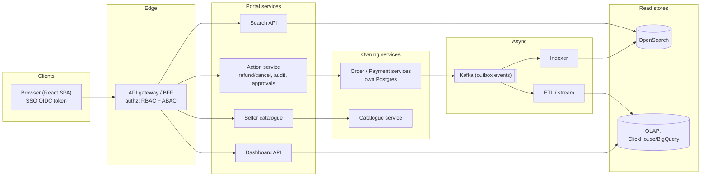
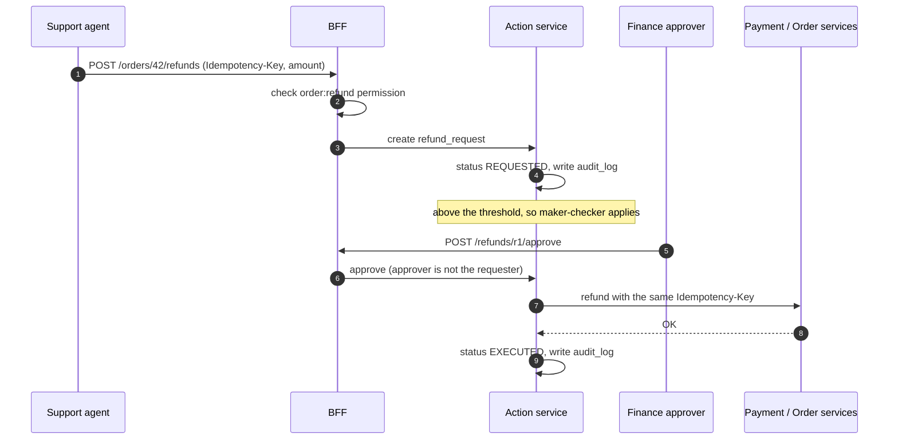
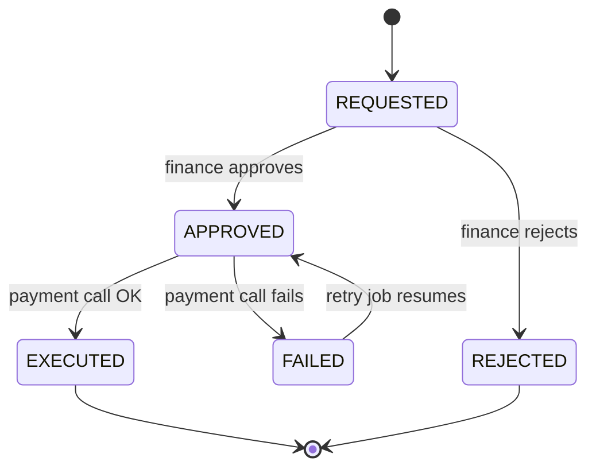

**Short answer:** The admin portal is an internal back-office app sitting on top of the existing order, catalogue, user and payment services. It does not own the core data. It adds three things: fine-grained access control per persona (admin, support, seller, finance), a search index so support can find any user or order in milliseconds, and a read-optimised analytics store for dashboards. Every write action (refund, cancel, price change) goes through the owning service's API, is idempotent, and is written to an audit log.

## Picture it







**How to read it:**
- Every request goes through the BFF, which checks the role permission and the scope (a seller only sees their own products) on the backend, never only in the UI.
- The portal does not own order data: searches hit OpenSearch, dashboards hit the OLAP store, and both are fed from Kafka events published through the outbox.
- Steps 1–4: a support agent's refund becomes a `refund_request` row with an idempotency key and an audit entry, so a double-click cannot refund twice.
- Steps 5–9: above the limit, a different finance user must approve; then the action service calls payments with the same key and records the result.
- The state picture is the refund lifecycle that the retry job uses to resume stuck refunds.

## Requirements

Functional:
- Support: search users and orders by email, phone, order ID, name; view order timeline; cancel or refund an order.
- Seller: manage own catalogue (create, edit, bulk upload), see own orders and sales.
- Finance: refunds above a threshold need approval; payouts and reconciliation reports.
- Admin: manage roles and users of the portal, everything else.
- Dashboards: GMV, orders per hour, refund rate, top sellers, filterable by date, region, category.

Non-functional:
- Strict authorisation and a complete audit trail (who refunded what, when, why).
- Search p95 under 300 ms; dashboards may be a few minutes stale.
- Writes must be safe under double-clicks and retries.
- The portal must not hurt the customer-facing site: no heavy queries on the OLTP primary.

## Estimates

- Internal users: ~5,000 support/finance staff plus ~200k sellers. Peak ~2,000 concurrent sessions.
- Search: ~50 queries/s peak. Actions (refunds, cancels): ~10/s. Tiny compared with customer traffic.
- Data to index: say 100M users and 1B orders. At ~1 KB per indexed order document, ~1 TB in the search cluster before replicas.
- The hard part is not QPS. It is correctness, permissions and keeping the index fresh.

## API

```text
GET  /admin/search?q=...&type=order|user&page=...
GET  /admin/orders/{orderId}                    -> order + timeline + payments
POST /admin/orders/{orderId}/cancel              Idempotency-Key, reason
POST /admin/orders/{orderId}/refunds             Idempotency-Key, amount, reason
POST /admin/refunds/{refundId}/approve           (finance, maker-checker)
GET  /seller/products?status=...                 (scoped to caller's sellerId)
PUT  /seller/products/{productId}                If-Match: <version>
POST /seller/products/bulk                       -> async job id
GET  /admin/dashboards/{name}?from=&to=&region=
```

## Data model

The portal owns only its own tables; order and catalogue data stay in their services.

```sql
CREATE TABLE portal_user (id BIGINT PRIMARY KEY, email TEXT UNIQUE, seller_id BIGINT NULL);
CREATE TABLE role (id INT PRIMARY KEY, name TEXT UNIQUE);           -- SUPPORT_L1, FINANCE, SELLER...
CREATE TABLE permission (id INT PRIMARY KEY, name TEXT UNIQUE);     -- order:refund, product:edit...
CREATE TABLE role_permission (role_id INT, permission_id INT, PRIMARY KEY (role_id, permission_id));
CREATE TABLE user_role (user_id BIGINT, role_id INT, PRIMARY KEY (user_id, role_id));

CREATE TABLE refund_request (
  id UUID PRIMARY KEY, order_id BIGINT, amount NUMERIC(12,2), reason TEXT,
  status TEXT,                -- REQUESTED, APPROVED, REJECTED, EXECUTED, FAILED
  requested_by BIGINT, approved_by BIGINT, idempotency_key TEXT UNIQUE, created_at TIMESTAMPTZ);

CREATE TABLE audit_log (
  id BIGSERIAL PRIMARY KEY, actor_id BIGINT, action TEXT, target_type TEXT, target_id TEXT,
  before JSONB, after JSONB, at TIMESTAMPTZ DEFAULT now());           -- append-only
```

Search index document (one per order): order ID, user email/phone (masked for some roles), seller ID, status, amounts, created date.

## Architecture

The diagram in **Picture it** above shows the components.

## Deep dives

**1. Authorisation.** Pure RBAC is not enough: a seller may edit products, but only their own. Use roles for coarse permissions (`order:refund`) and an attribute check for scope (`product.sellerId == user.sellerId`). Enforce it in the backend on every call, never only in the UI. Mask PII by role (L1 support sees the last 4 digits of the phone). Use maker-checker for risky actions: refunds above a limit go to `REQUESTED` and need a finance approver who is not the requester.

**2. Search freshness.** Order and user services publish change events via a transactional outbox to Kafka. An indexer consumes them and upserts documents, using the event's version to drop out-of-order updates. Lag is normally seconds. The order detail page always reads from the owning service, so a stale index only affects search ranking, not decisions.

**3. Safe actions.** A refund is a multi-step flow: create the refund request, call payments, update the order. Each step is idempotent with the same key, the state machine lives in `refund_request`, and a retry job resumes stuck rows. Cancel is only allowed in certain order states; the order service enforces that with optimistic locking, so a support agent and the shipping system cannot both win.

**4. Dashboards.** Never aggregate on the OLTP primary. Stream events into a columnar store with pre-aggregated rollups (per hour, region, category). Five-minute staleness is acceptable and stated in the UI.

## Trade-offs

- **Separate index vs querying service databases:** the index adds eventual consistency and another system, but lets support search across fields no single service indexes.
- **BFF calling services vs a portal database copy:** calling services keeps one source of truth; the cost is latency fan-out on the order detail page, solved with parallel calls.
- **Synchronous approval vs async:** maker-checker slows refunds but stops fraud by insiders; apply it only above a threshold.
- **Bulk upload async:** a job with per-row results instead of one big request that times out.

## Follow-ups

- *How do you stop an insider abusing refunds?* Limits per role, maker-checker, anomaly alerts on refund volume per agent, immutable audit log.
- *A seller uploads 50k products?* Upload to blob storage, async job validates and writes in batches, report per-row errors.
- *Two agents cancel and refund at once?* The order service uses a version column; the second request gets a conflict and sees the new state.

Related: [F1 · Building blocks](../academy/lessons/F1.md), [Q8 · Scaling databases](../academy/lessons/Q8.md), [S9 · Cloud native & event-driven systems](../academy/lessons/S9.md).
