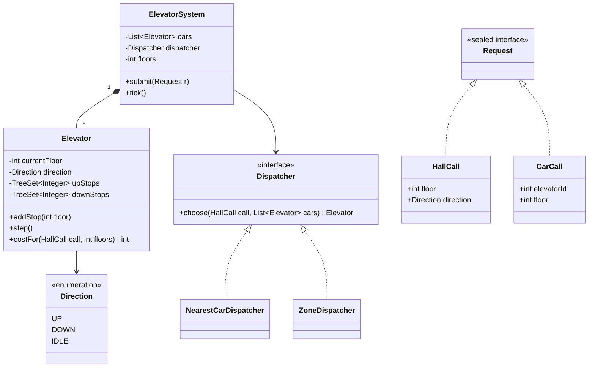
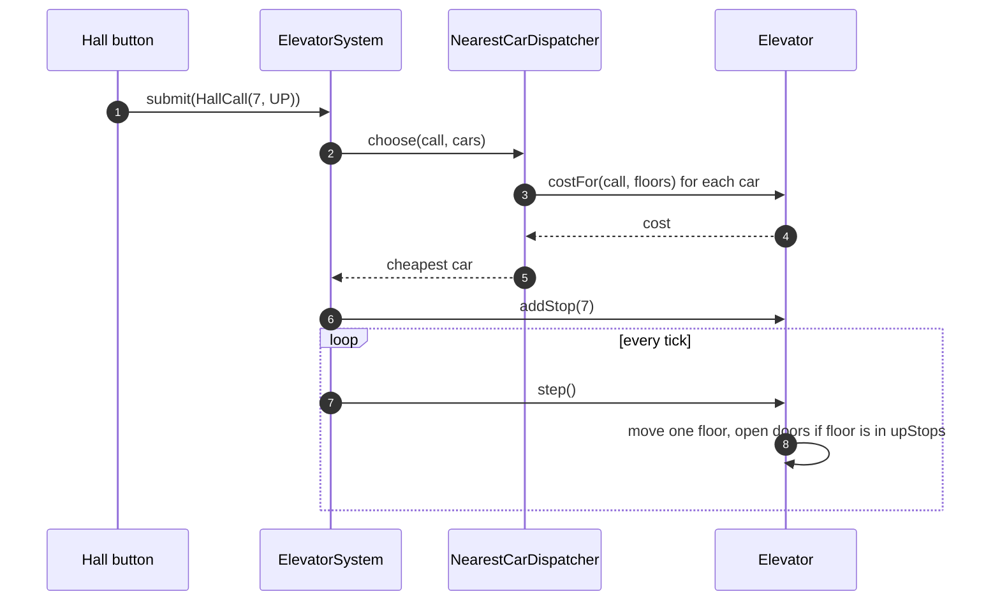

**Short answer:** Split it into three parts. `Elevator` cars move one floor per tick and serve stops with the **LOOK** algorithm: keep going in the current direction while there are stops ahead, then reverse. A `Dispatcher` strategy assigns each hall call (floor + direction) to the car with the lowest cost. An `ElevatorSystem` controller takes requests from buttons and drives the ticks. Each car keeps its pending stops in two `TreeSet`s, one for stops above it and one for stops below. That makes "next stop in this direction" O(log n).

## Picture it





**How to read it:**
- `ElevatorSystem` is the single entry point. It owns the cars and a `Dispatcher` strategy.
- A `Request` is either a `HallCall` (needs a car chosen) or a `CarCall` (goes straight to its car).
- For a hall call, the dispatcher asks every car for its `costFor` and picks the cheapest. That car gets `addStop`.
- Each `tick()` calls `step()` on every car. A car keeps moving while `upStops` or `downStops` has floors ahead (LOOK), then reverses or goes IDLE.

## Requirements

- A building with `F` floors and `N` cars.
- **Hall calls:** a person on floor `f` presses UP or DOWN. **Car calls:** a person inside presses a floor.
- The system assigns each hall call to one car. Cars serve stops efficiently, with no starvation.
- Many requests arrive concurrently while cars are moving.
- Car state: floor, direction (UP, DOWN, IDLE), door state. Capacity, maintenance mode and emergency stop are extensions.
- Simulation by ticks, so the logic is testable without real time.

## Classes

```text
ElevatorSystem 1 --- * Elevator
ElevatorSystem 1 --- 1 Dispatcher (interface)
Dispatcher <|-- NearestCarDispatcher, ZoneDispatcher
Elevator   1 --- 1 Direction (enum), DoorState (enum)
Request: HallCall(floor, Direction) | CarCall(elevatorId, floor)   (sealed)
```

- `Request`: a sealed interface. `HallCall` goes through the dispatcher. `CarCall` goes straight to its car.
- `Elevator`: owns `currentFloor`, `direction`, `upStops` and `downStops`. `addStop(floor)` and `step()` are its methods. It is thread-safe, because buttons and the tick loop touch it from different threads.
- `Dispatcher`: `Elevator choose(HallCall, List<Elevator>)`.
- `ElevatorSystem`: validates requests, routes them, and runs `tick()` for all cars, from a scheduled executor in real life or by hand in tests.

## Patterns used

- **Strategy**: `Dispatcher`. Nearest-car, zoning (cars serve floor ranges) and peak-hour policies swap without touching `Elevator`.
- **State (light)**: the `Direction` enum drives `step()`. If door open/close timing and maintenance get complex, move to state classes (`MovingUp`, `DoorsOpen`, `OutOfService`).
- **Command**: a `Request` is a value object queued, logged and routed.
- **Observer** (optional): floor displays and hall lanterns listen for `onArrived(car, floor)`.
- **Facade / controller**: `ElevatorSystem` is the single entry point for the buttons.

## Code

```java
public enum Direction { UP, DOWN, IDLE }

public sealed interface Request permits HallCall, CarCall {}
public record HallCall(int floor, Direction direction) implements Request {}
public record CarCall(int elevatorId, int floor) implements Request {}

public final class Elevator {
    private final int id;
    private int currentFloor;
    private Direction direction = Direction.IDLE;
    private final TreeSet<Integer> upStops = new TreeSet<>();    // floors above
    private final TreeSet<Integer> downStops = new TreeSet<>();  // floors below

    public Elevator(int id, int startFloor) { this.id = id; this.currentFloor = startFloor; }

    public synchronized void addStop(int floor) {
        if (floor > currentFloor) upStops.add(floor);
        else if (floor < currentFloor) downStops.add(floor);
        else { openDoors(); return; }                       // already here
        if (direction == Direction.IDLE) direction = floor > currentFloor ? Direction.UP : Direction.DOWN;
    }

    /** One tick: move one floor toward the next stop (LOOK), or reverse or idle. */
    public synchronized void step() {
        switch (direction) {
            case UP -> {
                if (upStops.isEmpty()) { direction = downStops.isEmpty() ? Direction.IDLE : Direction.DOWN; return; }
                currentFloor++;
                if (upStops.remove(currentFloor)) openDoors();
            }
            case DOWN -> {
                if (downStops.isEmpty()) { direction = upStops.isEmpty() ? Direction.IDLE : Direction.UP; return; }
                currentFloor--;
                if (downStops.remove(currentFloor)) openDoors();
            }
            case IDLE -> { }
        }
    }

    /** Cost to serve a hall call: distance, plus a penalty if the car must turn around first. */
    public synchronized int costFor(HallCall call, int floors) {
        int distance = Math.abs(currentFloor - call.floor());
        boolean onTheWay = switch (direction) {
            case IDLE -> true;
            case UP -> call.floor() >= currentFloor && call.direction() == Direction.UP;
            case DOWN -> call.floor() <= currentFloor && call.direction() == Direction.DOWN;
        };
        int load = upStops.size() + downStops.size();
        return onTheWay ? distance + load : distance + 2 * floors + load;
    }

    private void openDoors() { /* notify listeners; doors open for k ticks in a fuller model */ }
    public int id() { return id; }
}

public interface Dispatcher { Elevator choose(HallCall call, List<Elevator> cars); }

public final class NearestCarDispatcher implements Dispatcher {
    private final int floors;
    public NearestCarDispatcher(int floors) { this.floors = floors; }
    public Elevator choose(HallCall call, List<Elevator> cars) {
        return cars.stream().min(Comparator.comparingInt(c -> c.costFor(call, floors))).orElseThrow();
    }
}

public final class ElevatorSystem {
    private final List<Elevator> cars;
    private final Dispatcher dispatcher;
    private final int floors;

    // constructor omitted

    public void submit(Request r) {
        switch (r) {
            case HallCall h -> { check(h.floor()); dispatcher.choose(h, cars).addStop(h.floor()); }
            case CarCall c  -> { check(c.floor()); cars.get(c.elevatorId()).addStop(c.floor()); }
        }
    }
    public void tick() { cars.forEach(Elevator::step); }
    private void check(int f) { if (f < 0 || f >= floors) throw new IllegalArgumentException("floor " + f); }
}
```

Why two sets stay correct: a stop goes in `upStops` only if it is above the car. While the car goes down, it only gets farther below those stops. So they are still above it when the car turns around. The same holds for `downStops`.

## Extensions

- **Scheduling choices:** FCFS (simple, lots of wasted travel), SCAN (go to the end of the shaft), LOOK (reverse at the last request, used here), and destination dispatch (riders enter the floor in the lobby, and cars are grouped by destination). LOOK has no starvation, because every pending stop is reached within one sweep in each direction.
- **Direction-aware hall calls:** this model stops at a DOWN caller while the car passes going up. A stricter version keeps hall calls per direction and serves a DOWN call only on the way down.
- **Concurrency:** each car's state is guarded by its own monitor, so button presses and ticks do not race. The dispatcher reads costs car by car, and a car can move between the read and the assignment. That is acceptable, because the assignment is a heuristic. For a strict snapshot, take all car locks in id order (a fixed order prevents deadlock). In real life, use one controller thread that drains a `BlockingQueue<Request>` and owns all state (single-writer). Then no locks are needed.
- **Capacity and weight:** skip hall calls when the load is near full and reassign them to another car.
- **Failure:** an `OUT_OF_SERVICE` state. Its pending hall calls are redistributed through the dispatcher.
- **Peak modes:** morning up-peak parks idle cars at the lobby, a different `Dispatcher` chosen by time of day (Strategy again).

Related: [E5 · The LLD interview method](../academy/lessons/E5.md), [E4 · Behavioural patterns](../academy/lessons/E4.md), [B2 · Locks](../academy/lessons/B2.md).
