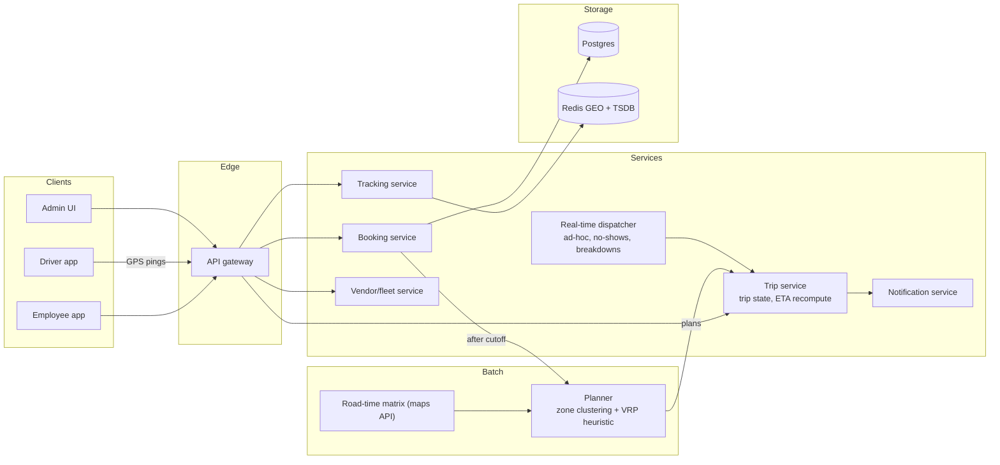
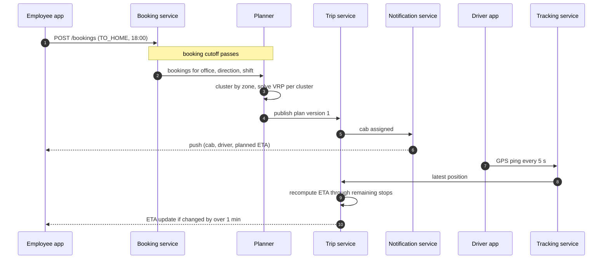
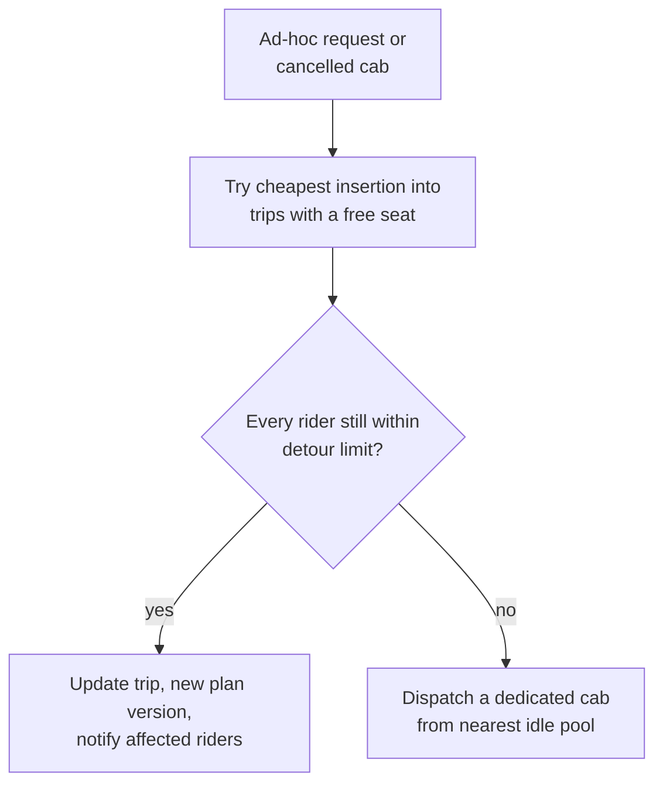

**Short answer:** Split it into a planning problem and a real-time problem. Most rides are predictable (shift start and end), so a batch planner clusters employees by drop or pickup zone and time window, solves a capacity-constrained vehicle routing problem with heuristics, and publishes routes the night before or an hour before. On the day, a real-time layer tracks cabs by GPS, recomputes ETAs, handles no-shows and ad-hoc requests by inserting them into existing routes, and falls back to a dedicated cab when no route fits.

## Picture it







**How to read it:**
- Steps 1–5: most rides are known in advance. After the booking cutoff the planner groups bookings by zone and solves a capacity- and time-window-constrained routing problem with heuristics, then publishes a versioned plan.
- Steps 6–7: the trip service tells each rider which cab, which driver and the planned ETA.
- Steps 8–11: on the day, driver apps ping GPS to the tracking service (latest position in Redis), and the trip service recomputes ETAs, pushing only meaningful changes.
- The third picture is the real-time dispatcher: an ad-hoc rider is inserted into an existing trip if no rider's detour limit breaks; otherwise a new cab goes out.

## Requirements

Functional:
- Employees book a slot (login/logout time, office, home address) or an ad-hoc ride.
- System assigns cabs and routes; employee sees cab, driver, ETA, live location.
- Drivers get an ordered stop list with navigation; mark pickup, drop, no-show.
- Admins manage vendors, fleet, shifts; see reports.
- Safety rules (for example, an escort or a rule that a woman is not the last drop at night, depending on local policy).

Non-functional:
- Cut average wait and in-cab time; hard limit on detour per rider (say total ride at most 1.5x the direct time).
- Real-time tracking updates every few seconds; plans available well before the shift.
- Availability during shift change peaks; GPS outages must not stop operations.

## Estimates

- 100k employees using the service across ~50 offices; a large campus ~10k riders per day.
- Peak: a shift change moves ~3,000 people from one office in a 30-minute window. Cabs seat 4 to 6, so ~600 to 800 trips.
- GPS: 5,000 active cabs sending a ping every 5 s = 1,000 writes/s. Small.
- Planning: per office per shift, a VRP with a few thousand stops. Heuristics solve this in seconds to minutes; exact solutions do not scale.

## API

```text
POST /bookings          {employeeId, officeId, direction: TO_OFFICE|TO_HOME, shiftTime, address}
DELETE /bookings/{id}   (cutoff N hours before)
GET  /trips/{tripId}    -> cab, driver, stops, live ETA
POST /trips/{tripId}/events  {type: PICKED_UP|NO_SHOW|DROPPED, stopId, ts}   (driver app)
WS   /trips/{tripId}/live    -> location + ETA stream
POST /adhoc             {from, to, earliest, latest}
```

## Data model

```sql
employee(id, office_id, home_lat, home_lng, home_zone, gender, needs_escort)
booking(id, employee_id, office_id, direction, shift_time, status, created_at)
vehicle(id, vendor_id, capacity, type, status)
driver(id, vendor_id, phone, rating)
trip(id, vehicle_id, driver_id, office_id, direction, planned_start, status, plan_version)
trip_stop(trip_id, seq, booking_id, lat, lng, planned_eta, actual_ts, status)
vehicle_location(vehicle_id, ts, lat, lng)      -- time-series, short retention, latest in Redis
```

## Architecture

The diagram in **Picture it** above shows the components.

## Deep dives

**1. The planner.** After the booking cutoff for a shift, group bookings by office, direction and shift time. Pre-cluster by geography (zones or k-means on home locations) so each cluster fits a few cabs. Then solve a capacitated VRP with time windows inside each cluster: start with a savings or nearest-neighbour heuristic, improve with local search (2-opt, swap stops between routes). The objective weighs number of cabs (cost) against total and maximum rider time. Travel times come from a precomputed road-time matrix by time of day, not straight-line distance. Constraints such as the night-safety rule are hard constraints in the solver. Output is a versioned plan; later changes create a new version and only notify affected riders.

**2. Real-time changes.** Late bookings and cancellations happen. For an ad-hoc rider, try cheapest insertion into existing trips that have a free seat and still meet every rider's detour limit; if none fits, dispatch a new cab from the nearest idle pool. No-show: the driver waits a fixed time, marks it, the trip continues and the employee is notified. Cab breakdown: the dispatcher reassigns remaining stops to nearby cabs, again by insertion.

**3. Tracking and ETAs.** Driver apps send pings to the tracking service, which keeps the latest position in Redis (with geo commands to find nearby cabs) and appends to a time-series store for audits. ETA = maps routing time from current position through remaining stops. Push updates to riders over WebSocket only when the ETA changes by more than a minute, which keeps the fan-out small. If GPS drops, keep the last known ETA and flag it as stale.

## Trade-offs

- **Batch plan vs fully dynamic dispatch:** batch gives far better pooling for predictable shifts; dynamic is needed for the ad-hoc tail. Use both.
- **Optimal vs heuristic routing:** VRP is NP-hard; heuristics give good-enough routes in seconds and can be re-run.
- **Fewer cabs vs shorter rides:** a tunable weight; the detour cap protects riders from being the sacrifice.
- **Third-party maps API vs own routing engine:** buy at first; cache the time matrix per zone pair and hour to control cost.

## Follow-ups

- *How do you know the plan is good?* Track average wait, in-cab time vs direct time, seat utilisation, cost per rider; A/B test solver settings per office.
- *Peak at 6 pm with 3,000 riders?* Plans are precomputed; only tracking and notifications scale with load, and both are cheap.
- *Rider safety?* Hard constraints in the planner, OTP at pickup, live trip sharing, SOS that pages security.

Related: [F3 · The system design method and estimation](../academy/lessons/F3.md), [F7 · Workflow orchestration and schedulers](../academy/lessons/F7.md).
