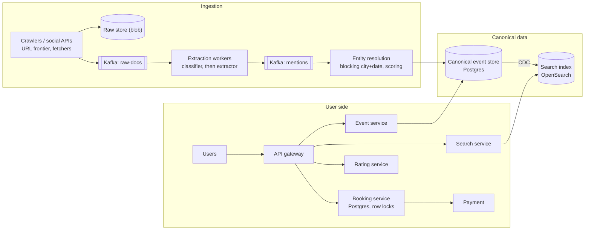
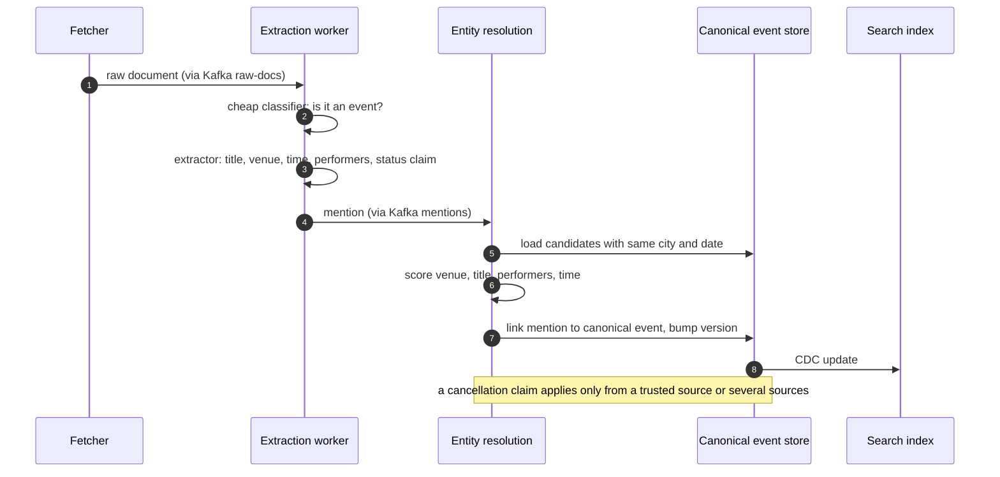
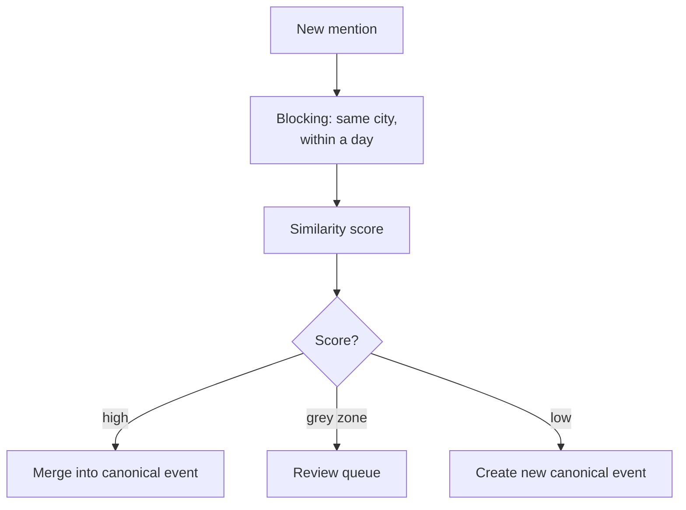

**Short answer:** Two systems joined by a canonical event store. The ingestion side crawls news and social sources, extracts structured events (name, venue, time, performers) with an extraction model, resolves duplicates into one canonical event, and keeps updating it as new articles arrive. The user side indexes canonical events for search, sells tickets with strong consistency on inventory, and collects ratings. Each canonical event keeps provenance (which sources said what) and a confidence score, which drives both deduplication and correctness checks.

## Picture it







**How to read it:**
- Steps 1–3: crawled documents go through a cheap classifier first; only the few that describe an event reach the expensive extractor, which returns structured fields.
- Steps 4–7: entity resolution compares the mention only with events in the same city and date window, scores the match and links it to one canonical event (or creates one). Mentions are never deleted, so a bad merge can be split later.
- Step 8: changes flow to the search index by CDC, so search is eventually consistent while booking always reads Postgres.
- The third picture is the merge decision: high scores merge, a grey zone goes to human review, low scores create a new event.
- Booking (not drawn step by step) uses an atomic `UPDATE ... WHERE sold + qty <= total` hold, then an idempotent payment, so it never oversells.

## Requirements

Functional:
- Ingest events from news sites, social posts and organiser pages.
- Users search by text, city, date, category; view event details.
- Book tickets (where we are the seller or have an organiser integration); rate events after they happen.
- Event status updates (postponed, cancelled, venue changed) from later news.

Non-functional:
- Search p95 under 200 ms; booking must never oversell.
- Freshness: a new event appears within an hour; a cancellation within minutes for popular events.
- Ingestion is high volume and noisy; user-facing reads are much higher QPS than writes.

## Estimates

- Sources: ~10M documents/day crawled (articles, posts). Most are not events; say 2% contain one, ~200k mentions/day, collapsing to ~20k new canonical events/day.
- Active events at any time: ~2M. At 5 KB each, ~10 GB: fits comfortably in a search cluster.
- Search: 10M DAU x 5 searches = 50M/day, ~600/s average, ~3k/s peak.
- Bookings: ~1M/day, but spikes of thousands per second on hot events.

## API

```text
GET  /events/search?q=&city=&from=&to=&category=&page=
GET  /events/{eventId}
POST /events/{eventId}/holds        {tierId, qty}            -> holdId, expiresAt
POST /bookings                      {holdId, paymentToken} Idempotency-Key
POST /events/{eventId}/ratings      {stars, text}            (only after event, only bookers)
```

## Data model

```sql
raw_document(id, source, url, fetched_at, content_hash, blob_ref)           -- object storage + index
event_mention(id, document_id, title, venue_text, city, start_ts, performers JSONB,
              status_claim, extractor_confidence, canonical_event_id)
canonical_event(id, title, venue_id, city, start_ts, end_ts, category, status,
                confidence, version, updated_at)
venue(id, name, lat, lng, city)
ticket_tier(id, event_id, name, price, total, sold, version)
hold(id, tier_id, user_id, qty, expires_at, status)
booking(id, user_id, tier_id, qty, payment_id, status, idempotency_key UNIQUE)
rating(event_id, user_id, stars, text, created_at, PRIMARY KEY(event_id, user_id))
```

## Architecture

The diagram in **Picture it** above shows the components.

## Deep dives

**1. Unstructured to structured at scale (follow-up 1).** A cheap classifier filters documents that mention an event. Only those go to the expensive extractor (an NER pipeline or an LLM with a fixed output schema) that returns title, venue, date-time, city, performers, price hints and a status claim. Normalise: geocode the venue to a `venue_id`, parse relative dates against the article date and time zone. Workers are stateless consumers of Kafka, so they scale horizontally; reprocessing is possible because raw documents are kept.

**2. Same event from two sources (follow-up 2).** Use blocking then matching. Blocking: only compare mentions in the same city and within a day of each other (key `city + date`). Matching: score pairs on venue match, title similarity (token overlap or text embeddings), performer overlap and time difference. Above a high threshold, merge; in a grey zone, send to a review queue. Store the link `mention -> canonical_event_id`, never delete mentions, so a bad merge can be split later.

**3. Status updates from later news (follow-up 3).** A new mention that resolves to an existing event and carries a status claim (cancelled, postponed, moved) becomes a proposed change. Apply it if the source is trusted (the organiser or venue) or if several independent sources agree; otherwise hold it. Each change bumps `version` and publishes an event so the index updates and ticket holders get notified. Cancelling an event with sold tickets triggers the refund workflow, never a silent update.

**4. Judging correctness (follow-up 4).** Confidence combines source reliability (learned from past accuracy), number of independent corroborating sources, extractor confidence and consistency checks (venue exists, date in the future, no clash with another event in the same small venue). Low-confidence events are shown with a "reported" label or hidden. Ticket sales are enabled only for events confirmed by an organiser integration, because we cannot sell seats we do not control.

**5. Booking without overselling.** Hold-then-pay: `UPDATE ticket_tier SET sold = sold + :qty WHERE id = :id AND sold + :qty <= total` in one statement creates the hold atomically. A sweeper releases expired holds. The booking call is idempotent on the key so retries after a timeout do not double charge.

## Trade-offs

- **LLM extraction vs rules:** far better recall on messy text, but costly and slower; gate it behind a classifier and cache by content hash.
- **Aggressive vs conservative merging:** a false merge hides a real event; a missed merge shows duplicates. Prefer conservative, plus review.
- **Search index vs DB queries:** the index is eventually consistent; the booking path always reads Postgres.
- **Ratings:** restrict to verified attendees to resist spam, at the cost of fewer ratings.

## Follow-ups

- *Respecting sources?* Obey robots.txt and rate limits, prefer official APIs and organiser feeds.
- *Hot event on sale?* Virtual waiting room in front of holds; partition inventory per tier.

Related: [F1 · Building blocks](../academy/lessons/F1.md), [Q6 · Transactions, isolation, locking and MVCC](../academy/lessons/Q6.md), [S9 · Cloud native & event-driven systems](../academy/lessons/S9.md).
