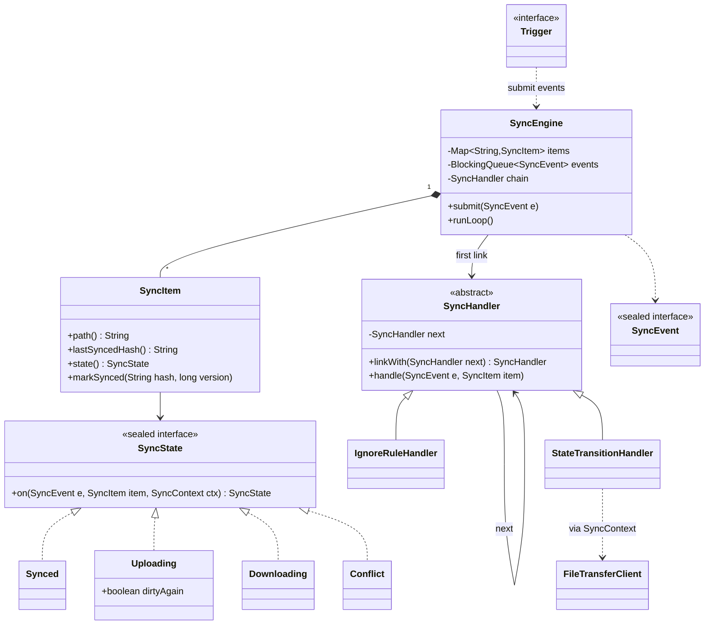
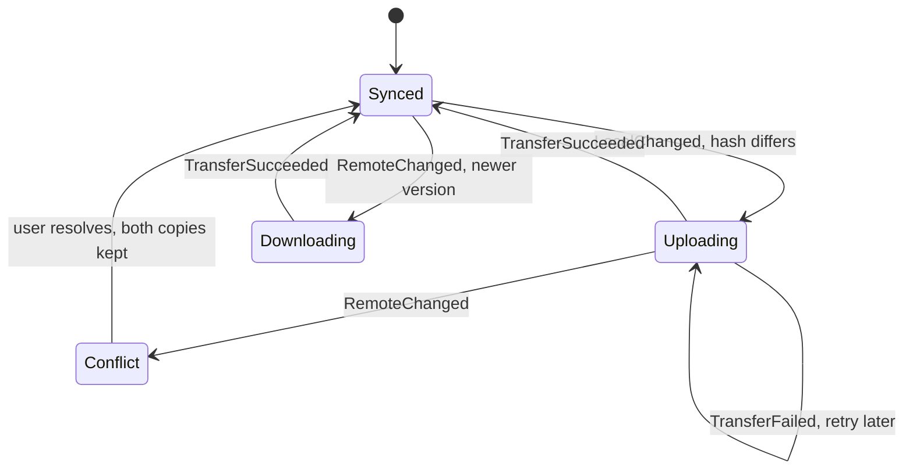

**Short answer:** Model each tracked file as a `SyncItem` with a small state machine (Synced, LocalModified, RemoteModified, Uploading, Downloading, Conflict, Failed). Triggers (a local file watcher, a periodic remote poll, a manual "sync now") produce `SyncEvent`s. Each event goes through a chain of handlers: ignore rules, conflict check, size/quota check, then the action. The action calls the existing upload/download APIs, and the item's current state decides which transitions are legal.

## Picture it





**How to read it:**
- Triggers (file watcher, remote poll, manual) only `submit` events. One `SyncEngine` thread takes them from a queue, so each file's events run in order without locks.
- Every event passes through a chain of `SyncHandler`s (ignore rules, quota, conflict). Any link can stop it. The last link is `StateTransitionHandler`.
- The last link asks the item's current `SyncState` what to do. The state starts the upload or download and returns the next state.
- The state diagram shows the legal moves. A local edit during an upload just marks it dirty, so another upload follows. A remote change during an upload means both sides moved: Conflict.

## Requirements

- Upload and download APIs already exist: `upload(path, bytes)`, `download(path)`, `listRemote()` with a version or hash per file.
- Keep a local folder and a remote folder in sync, both directions.
- Triggers: local change (watcher), remote change (poll), manual sync.
- Detect conflicts (both sides changed since the last sync). Do not lose data.
- Retry failed transfers. Out of scope: partial-chunk resume, sharing, permissions.

## Classes

- `SyncItem`: path, last synced hash, local hash, remote version, current `SyncState`. One per file.
- `SyncState` (sealed interface): each state handles events and returns the next state. This is where the rules live.
- `SyncEvent` (sealed): `LocalChanged`, `RemoteChanged`, `TransferSucceeded`, `TransferFailed`, `ManualSync`.
- `SyncHandler` (abstract): a link in the chain. `IgnoreRuleHandler` (.tmp, .git), `QuotaHandler`, `ConflictHandler`, `TransferHandler`.
- `Trigger` implementations: `LocalWatcherTrigger` (Java `WatchService`), `RemotePollTrigger` (scheduled), `ManualTrigger`. All push events into the `SyncEngine`.
- `SyncEngine`: owns the map of `SyncItem`s and a single event queue, so events for one file are processed in order.
- `FileTransferClient`: wraps the given upload/download APIs (adapter), so tests can fake it.
- `SyncStore`: persists the last synced hash per path, so a restart knows what changed.

Relationships: Engine has many `SyncItem`s; each item has one `SyncState`; the engine runs every event through the handler chain; `TransferHandler` uses `FileTransferClient`.

## Patterns used

- **State**: the legal transitions differ by state (a `LocalChanged` while Uploading means "upload again after this one", while Synced means "start upload"). Putting that in state classes beats one big `switch` on two enums.
- **Chain of Responsibility**: cross-cutting checks (ignore, quota, conflict) are independent and ordered. Each handler can stop the chain. New checks (virus scan, bandwidth limit) are new links, so the engine stays closed for modification.
- **Observer**: triggers notify the engine; the engine can notify a UI listener of state changes.
- **Adapter**: `FileTransferClient` over the existing APIs.

## Code

```java
sealed interface SyncEvent permits LocalChanged, RemoteChanged, TransferSucceeded, TransferFailed {}
record LocalChanged(String path, String hash) implements SyncEvent {}
record RemoteChanged(String path, long version) implements SyncEvent {}
record TransferSucceeded(String path, String hash, long version) implements SyncEvent {}
record TransferFailed(String path, Exception error) implements SyncEvent {}

sealed interface SyncState permits Synced, Uploading, Downloading, Conflict {
    SyncState on(SyncEvent e, SyncItem item, SyncContext ctx);
}

record Synced() implements SyncState {
    public SyncState on(SyncEvent e, SyncItem item, SyncContext ctx) {
        return switch (e) {
            case LocalChanged lc when !lc.hash().equals(item.lastSyncedHash()) -> {
                ctx.startUpload(item.path());
                yield new Uploading(false);
            }
            case RemoteChanged rc when rc.version() > item.remoteVersion() -> {
                ctx.startDownload(item.path());
                yield new Downloading();
            }
            default -> this;
        };
    }
}

record Uploading(boolean dirtyAgain) implements SyncState {
    public SyncState on(SyncEvent e, SyncItem item, SyncContext ctx) {
        return switch (e) {
            case LocalChanged lc -> new Uploading(true);            // upload again when this one ends
            case RemoteChanged rc -> new Conflict();               // both sides moved
            case TransferSucceeded ok -> {
                item.markSynced(ok.hash(), ok.version());
                if (dirtyAgain) { ctx.startUpload(item.path()); yield new Uploading(false); }
                yield new Synced();
            }
            case TransferFailed f -> { ctx.retryLater(item.path()); yield this; }
        };
    }
}
// Downloading and Conflict follow the same shape. Conflict keeps both copies
// ("report (conflict copy).docx") and waits for the user.

abstract class SyncHandler {
    private SyncHandler next;
    SyncHandler linkWith(SyncHandler next) { this.next = next; return next; }
    void handle(SyncEvent e, SyncItem item) {
        if (next != null) next.handle(e, item);
    }
}

final class IgnoreRuleHandler extends SyncHandler {
    private final List<PathMatcher> ignored;
    IgnoreRuleHandler(List<PathMatcher> ignored) { this.ignored = ignored; }
    @Override void handle(SyncEvent e, SyncItem item) {
        if (ignored.stream().anyMatch(m -> m.matches(Path.of(item.path())))) return; // stop
        super.handle(e, item);
    }
}

final class StateTransitionHandler extends SyncHandler {   // last link
    private final SyncContext ctx;
    StateTransitionHandler(SyncContext ctx) { this.ctx = ctx; }
    @Override void handle(SyncEvent e, SyncItem item) {
        item.setState(item.state().on(e, item, ctx));
    }
}

final class SyncEngine {
    private final Map<String, SyncItem> items = new HashMap<>();
    private final BlockingQueue<SyncEvent> events = new LinkedBlockingQueue<>();
    private final SyncHandler chain;

    SyncEngine(SyncHandler chain) { this.chain = chain; }

    void submit(SyncEvent e) { events.add(e); }          // called by triggers and transfer callbacks

    void runLoop() throws InterruptedException {        // one thread: no locking on items
        while (!Thread.currentThread().isInterrupted()) {
            SyncEvent e = events.take();
            String path = switch (e) {
                case LocalChanged x -> x.path(); case RemoteChanged x -> x.path();
                case TransferSucceeded x -> x.path(); case TransferFailed x -> x.path();
            };
            chain.handle(e, items.computeIfAbsent(path, SyncItem::new));
        }
    }
}
```

The transfers themselves run on an executor. When one finishes, it submits `TransferSucceeded` or `TransferFailed` back to the queue. So the state logic runs on one thread, and only the slow I/O is parallel.

**Sequence (upload)**

```text
WatchService -> LocalWatcherTrigger : file modified
LocalWatcherTrigger -> SyncEngine   : submit(LocalChanged)
SyncEngine -> IgnoreRuleHandler -> QuotaHandler -> ConflictHandler -> StateTransitionHandler
StateTransitionHandler -> Synced.on : returns Uploading, ctx.startUpload
executor -> FileTransferClient      : upload(path, bytes)
FileTransferClient -> SyncEngine    : submit(TransferSucceeded)
Uploading.on                        : markSynced, returns Synced
```

## Extensions

- **Concurrency:** a single event loop keeps per-file state race-free. To scale, shard events by `hash(path) % N` onto N loops, so one file is always handled by the same thread.
- **Editor save storms:** debounce local events (for example 500 ms) before upload.
- **Large files:** chunked upload with a resumable session id; add a `ChunkUploading` state.
- **Retries:** exponential backoff in `retryLater`; after N failures move to a `Failed` state that the UI shows.
- **Conflict policy:** make it a Strategy (keep both, last-writer-wins, ask user).
- **Restart safety:** `SyncStore` persists last synced hash and version; on startup, scan both sides and replay differences as events.

Related: [E4 · Behavioural patterns](../academy/lessons/E4.md), [E5 · The LLD interview method](../academy/lessons/E5.md).
