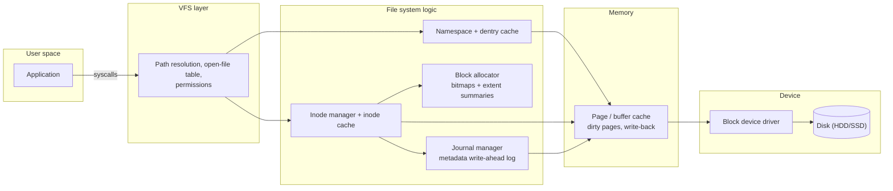
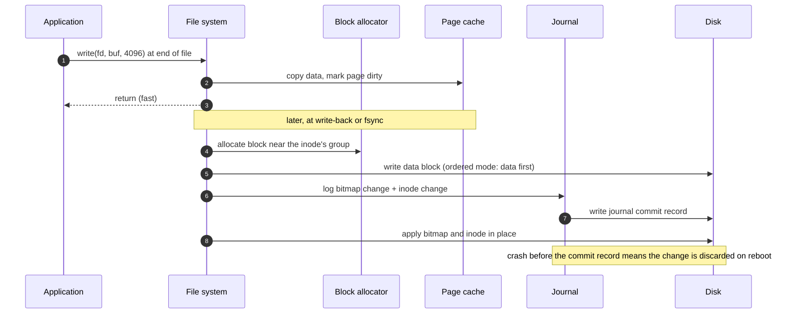
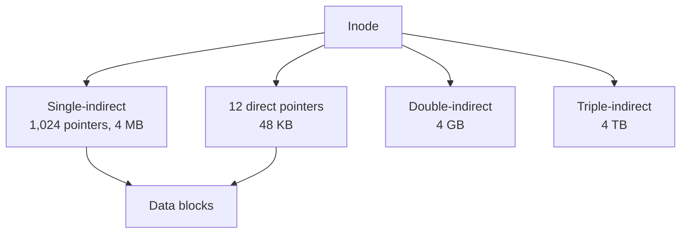

**Short answer:** A disk is an array of fixed-size blocks (say 4 KB). A file system keeps three kinds of metadata on it: a superblock describing the layout, a per-file record (an inode) holding size, permissions and pointers to the file's data blocks, and a free-space structure, usually a bitmap with one bit per block. Directories are just files whose content maps names to inode numbers. Modern designs allocate in extents (start block plus length) instead of single blocks, and use a journal so a crash in the middle of an update does not corrupt the metadata.

## Picture it







**How to read it:**
- The first picture is the stack a `write()` goes through: VFS, then the file system's namespace, inode, allocator and journal parts, then the page cache and the disk.
- Steps 1–3: `write()` only copies into the page cache and returns; that is why it is fast and why `fsync` exists.
- Steps 4–8: at write-back the allocator picks a free block near the file's other blocks, the data block is written first, and the bitmap and inode changes are logged and committed in the journal before being applied in place.
- After a crash, committed journal transactions are replayed and incomplete ones dropped, so no block is leaked or owned twice.
- The third picture is the classic inode pointer tree: small files use only direct pointers; large files walk indirect blocks (or use extents instead).

## Requirements

Functional:
- Create, open, read, write, append, truncate, delete files; create and list directories; rename.
- Track which blocks are free and allocate new ones quickly.

Non-functional:
- Crash consistency: after power loss, metadata is valid (no block owned by two files, no leaked blocks).
- Good sequential read/write throughput (contiguous allocation) and acceptable small-file overhead.
- Scale to large disks (TBs) and large files (GBs or more).

## Estimates

- 4 TB disk, 4 KB blocks = 2^42 / 2^12 = 2^30 blocks (~1 billion).
- Free bitmap: 2^30 bits = 128 MB. Fine on disk; scanned in pieces, with per-group summaries in memory.
- Inode of 256 bytes; 10M files = 2.5 GB of inodes.
- A 1 GB file = 262,144 blocks. Listing each block individually costs 1 MB of 4-byte pointers; a handful of extents costs bytes. That is the argument for extents.

## API

The interface is the POSIX-like call set:

```text
fd = open(path, flags)         read(fd, buf, n)        write(fd, buf, n)
lseek(fd, off)                 fsync(fd)               close(fd)
mkdir(path)  readdir(path)     unlink(path)            rename(old, new)
```

Internally: `allocate(n_blocks, hint)`, `free(extent)`, `lookup(dir_inode, name)`.

## Data model

```text
Disk layout:
| boot | superblock | group descriptors | per group: [block bitmap][inode bitmap][inode table][data blocks] | journal |

Superblock: block size, total blocks, total inodes, free counts, group size, journal location.

Inode:
  mode/permissions, owner, size, timestamps, link count
  12 direct block pointers
  1 single-indirect  -> block of pointers
  1 double-indirect  -> block of blocks of pointers
  1 triple-indirect
  (or, extent-based: a small tree of {logical_block, physical_start, length})

Directory entry (data of a directory file): {inode_number, name_length, name}
Open-file table (in memory): fd -> {inode, offset, flags}
```

With 4 KB blocks and 4-byte pointers, one indirect block holds 1,024 pointers: direct blocks cover 48 KB, single-indirect 4 MB, double-indirect 4 GB, triple-indirect 4 TB. Small files stay cheap; large files need extra reads to walk pointers, which the page cache mostly absorbs.

## Architecture

The diagram in **Picture it** above shows the layers.

## Deep dives

**1. Free-space tracking.** Options:
- *Bitmap:* one bit per block. Compact, easy to find runs of free blocks, easy to check consistency. Searching a huge bitmap is slow, so split the disk into block groups, each with its own bitmap and a free count; pick a group with space, near the file's other blocks.
- *Free list:* linked list of free blocks. Simple, but finding contiguous space is hard and it fragments.
- *Free-extent tree:* a B-tree of free ranges keyed by start and by size. Fast "find 100 contiguous blocks", more complex to keep consistent.
Use bitmaps on disk for simplicity and robustness, plus in-memory summaries per group to avoid scanning.

**2. Allocation and fragmentation.** Contiguous allocation gives the best throughput but fragments as files grow. Linked allocation (each block points to the next, like FAT) has no external fragmentation but random access is O(n). Indexed allocation (inodes) gives random access. Extents combine the best: indexed, but each entry describes a contiguous run. Tactics to keep runs long: delayed allocation (decide blocks at write-back, when the final size is better known), preallocation for growing files, and placing a file's blocks in the same group as its inode and directory.

**3. Crash consistency.** Appending a block touches three structures: the bitmap, the inode and the data block. A crash between them leaves leaked blocks or, worse, an inode pointing to a block marked free. Solutions:
- *fsck:* scan everything after a crash and repair. Correct but takes very long on large disks.
- *Journaling:* write the intended metadata changes to a log, commit, then apply them in place. On reboot, replay committed transactions and discard incomplete ones. Ordered mode writes data blocks before committing the metadata that points at them, so you never see garbage.
- *Copy-on-write:* never overwrite in place; write new blocks and atomically switch the root pointer. Also gives cheap snapshots.

**4. Write path.** `write()` copies into the page cache and marks pages dirty; the call returns fast. Write-back flushes later. `fsync()` forces data and the journal commit to stable storage. That is why databases call `fsync` on their WAL.

## Trade-offs

- **Block size:** large blocks waste space on small files (internal fragmentation) but need less metadata and fewer I/Os; 4 KB matches the memory page size.
- **Bitmap vs extent tree for free space:** bitmap is simple and robust; tree is faster for big contiguous requests.
- **Journal metadata only vs data too:** full data journaling writes everything twice; metadata-only plus ordered writes is the usual default.
- **In-place vs copy-on-write:** CoW gives snapshots and atomic updates but can fragment files that are rewritten randomly.

## Follow-ups

- *How does delete work?* Remove the directory entry, decrement the link count; at zero (and no open handles), free the inode and its blocks in the bitmap, inside one journal transaction.
- *How is a path like /a/b/c resolved?* Start at the root inode, read the directory, find `a`'s inode, repeat. A directory-entry cache avoids disk reads.
- *How does this scale to a distributed store (Azure Blob, GFS-style)?* The same ideas move up a level: a metadata service maps files to chunks (the inode), chunk servers store data (blocks), and a log plus replication give crash safety.
- *SSDs?* No seek penalty, but write amplification and wear matter; TRIM tells the device which blocks are free.

Related: [F1 · Building blocks](../academy/lessons/F1.md), [F2 · Distributed theory](../academy/lessons/F2.md).
