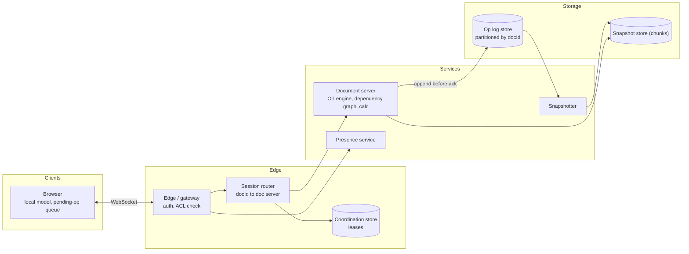
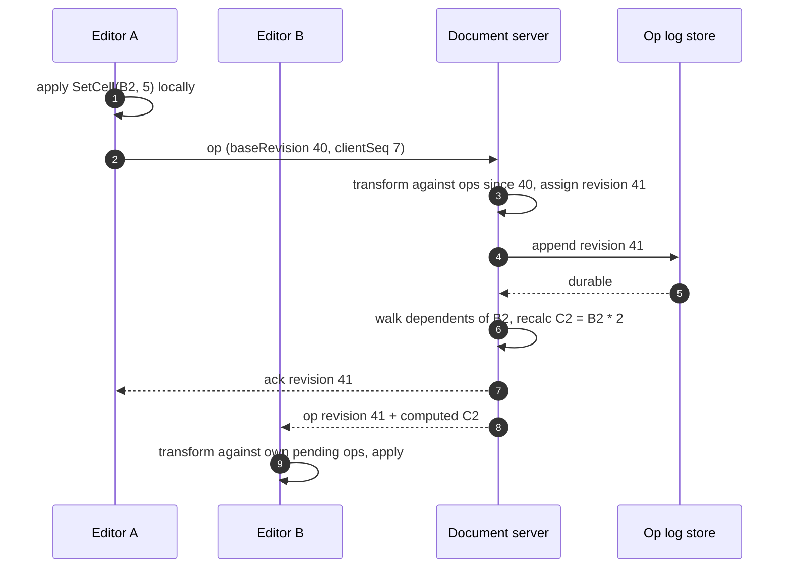
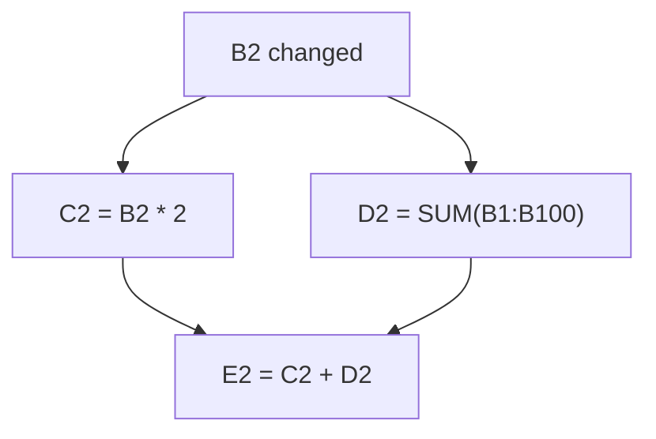

**Short answer:** Each spreadsheet is owned by one document server at a time that receives cell-level operations from all editors over WebSockets, orders them with a per-document sequence number, transforms concurrent ones against each other, applies them, recalculates dependent formulas, and broadcasts the result. The durable state is an append-only operation log plus periodic snapshots, stored as sparse cells grouped into chunks. Formulas live in a dependency graph so a change only recalculates the cells that depend on it.

## Picture it







**How to read it:**
- The session router sends every editor of one spreadsheet to the one document server holding its lease, so that server can put all edits in a single order.
- Steps 1–2: the editor applies its change locally at once (typing feels instant) and sends the op with the revision it was based on.
- Steps 3–5: the server transforms the op past anything committed since then, gives it the next revision and appends it to the op log before acking, so an acked edit survives a server crash.
- Steps 6–9: the server recalculates only the cells that depend on B2, then broadcasts the op and computed values; other editors transform it against their own pending ops.
- The third picture is the dependency graph: recalculation walks dependents in topological order (C2 and D2 before E2), and a range like `B1:B100` is one node, not 100 edges.

## Requirements

Functional:
- Create sheets, edit cells (values, formulas, formatting), insert/delete rows and columns.
- Multiple users edit at once and see each other's changes and cursors within ~100 ms.
- Formulas recalculate; version history; sharing with view/comment/edit permissions; offline edits sync later.

Non-functional:
- Never lose an acknowledged edit; all clients converge to the same state.
- Low latency for local typing (optimistic local apply).
- Large sheets: up to millions of cells (Google Sheets documents a 10 million cell limit per spreadsheet).

## Estimates

- 100M DAU, 10% editing at peak, typically 1 to 5 editors per doc; a handful of docs have 100+ viewers.
- Edit rate: ~1 op/s per active editor, so ~10M ops/s globally at peak, spread across millions of documents. Each document sees only a few ops/s, so one server per document is enough.
- Storage: a sheet with 100k filled cells at ~50 bytes = 5 MB snapshot; the op log grows faster and is compacted into snapshots.

## API

```text
GET  /sheets/{id}?range=A1:Z200          -> snapshot chunk + revision
WS   /sheets/{id}/collab
  client -> {op, baseRevision, clientId, clientSeq}
  server -> {ack, revision} | {op, revision, author} | {presence}
GET  /sheets/{id}/history?from=&to=
POST /sheets/{id}/permissions {principal, role}
```

Operation types: `SetCell(sheet, row, col, value|formula)`, `InsertRows(sheet, at, n)`, `DeleteRows`, `InsertCols`, `DeleteCols`, `Format(range, style)`.

## Data model

```text
document(id, owner, title, created_at, latest_revision, snapshot_revision)
op_log(doc_id, revision, author, op_payload, ts)          PK (doc_id, revision)   -- Bigtable/Spanner-style
snapshot(doc_id, revision, chunk_id, cells_blob)           -- chunk = block of e.g. 1000 rows x 26 cols
cell (inside chunk): {row_id, col_id, raw, computed_value, format_id}
row/col index: ordered list of stable row_ids and col_ids
acl(doc_id, principal, role)
```

Key idea: cells reference **stable row and column IDs**, not positions. Inserting a row only changes the position list, not every cell below it. Formulas store references to IDs internally and render as A1 notation.

## Architecture

The diagram in **Picture it** above shows the components.

## Deep dives

**1. Concurrency: OT with a central sequencer.** Each client sends ops with the revision it was based on. The document server is the single ordering point. If the client's base is behind, the server transforms the op against every op committed since. Transform rules in a grid are simpler than in text:
- Two `SetCell` on different cells: no conflict.
- Same cell: last writer by server order wins (it is a register, not mergeable text).
- `SetCell` on a row that a concurrent `DeleteRows` removed: the set is dropped.
- `InsertRows` vs `SetCell`: with stable row IDs, no transform is needed at all, which is why stable IDs matter.
The client keeps unacknowledged ops locally and transforms incoming server ops against them, so typing stays instant. Justification: a central server per document gives a total order cheaply; CRDTs are worth it only if you need peer-to-peer or long offline editing.

**2. Formula recalculation.** Maintain a dependency graph: for each cell, which cells it reads (precedents) and which read it (dependents). On a change, walk dependents, topologically sort, recalculate in order. Detect cycles and show an error. Range references like `SUM(A1:A100000)` are stored as range nodes, not 100k edges. Volatile functions (`NOW()`, `RAND()`) recalc on a timer. Very heavy sheets recalc on the server and stream computed values; the client recalcs only what is visible.

**3. Ownership and failover.** A document is assigned to one server via a lease in a coordination service (ZooKeeper/etcd style). Ops are acked only after they are durably appended to the log, so if the server dies, a new owner loads the latest snapshot, replays the log tail and continues. Clients reconnect and resend unacked ops with their client sequence numbers, which the server dedups.

**4. Loading big sheets.** Load the chunks for the visible range first, then lazily fetch the rest. Snapshots every N ops keep load time bounded.

## Trade-offs

- **OT vs CRDT:** OT with a server is simpler to reason about for a grid and keeps storage small; CRDTs carry metadata per element and shine offline. We have a server anyway.
- **Server-side vs client-side calc:** client calc is fast for small sheets; server calc is consistent and handles huge sheets. Do both, server is authoritative.
- **One owner per doc:** simple ordering, but a single hot doc is limited by one machine; acceptable because per-doc edit rates are low. Viewers fan out through a broadcast tier.
- **Op log + snapshot vs storing only state:** the log gives history and recovery; costs storage and needs compaction.

## Follow-ups

- *Justify each design choice (follow-up).* Covered above: stable IDs avoid mass rewrites on insert; a central sequencer gives a total order without vector clocks; log-before-ack gives durability; chunked snapshots bound load time; the dependency graph bounds recalculation work.
- *Offline editing?* Queue ops with the base revision; on reconnect, the server transforms them. Long offline sessions may produce surprising last-writer-wins results on the same cell; show a notice.
- *Permissions mid-session?* ACL changes are pushed to the doc server, which drops or downgrades the session.

Related: [F5 · Case studies: chat, news feed, collaborative editor](../academy/lessons/F5.md), [F2 · Distributed theory](../academy/lessons/F2.md).
