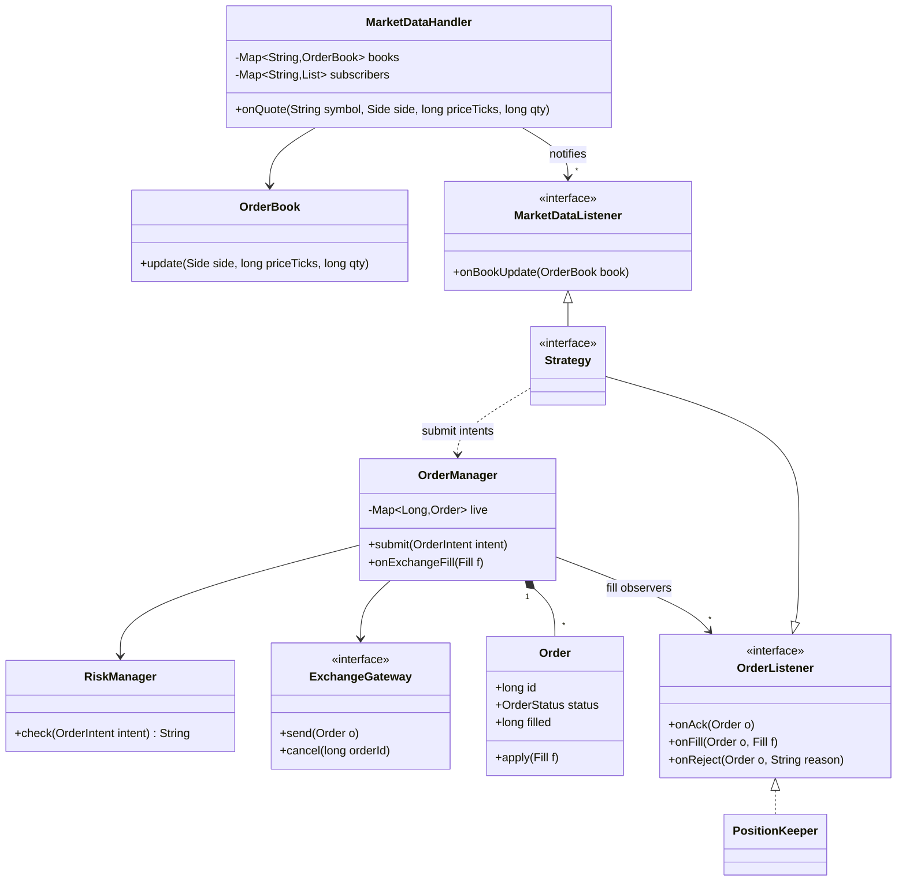
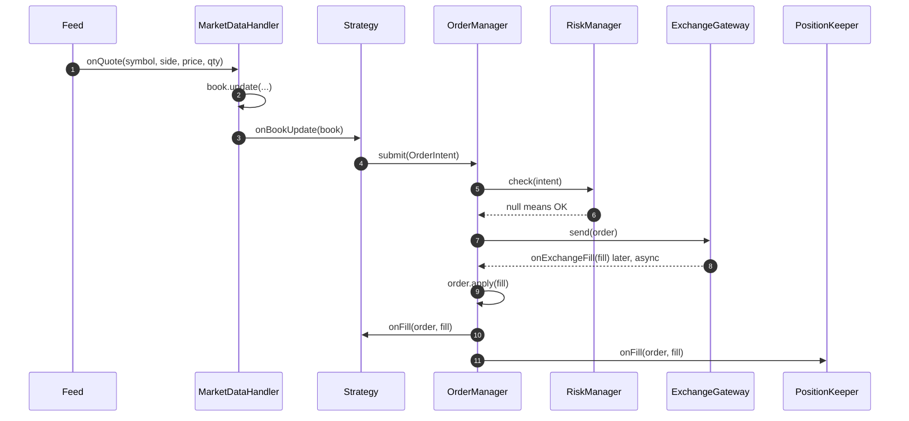

**Short answer:** Split the system into a pipeline: market data feed handler, order book per instrument, strategies, risk check, order manager and exchange gateway. Components talk through narrow listener interfaces (Observer): the feed publishes book updates to strategies, strategies emit order intents, and the gateway calls back with acks, fills and rejects. On the hot path, keep each instrument on one thread, avoid locks and allocation, and keep callbacks short and non-blocking.

## Picture it





**How to read it:**
- Data flows one way: feed into `MarketDataHandler`, which updates the `OrderBook` and notifies the `MarketDataListener`s (the strategies).
- A `Strategy` is both a market-data listener and an order listener. It never holds the gateway. It hands an `OrderIntent` to `OrderManager`.
- `OrderManager` runs the synchronous `RiskManager.check` and only then calls `ExchangeGateway.send`. So risk cannot be bypassed.
- Fills come back asynchronously. `OrderManager` updates the `Order` state and fans the fill out to the owning strategy and to observers such as `PositionKeeper`.

## Requirements

- Receive market data (quotes, trades) for many instruments and keep a local order book.
- Run several strategies; each reacts to book changes and may send, cancel or modify orders.
- Pre-trade risk checks (max position, max order size, price bands, kill switch).
- Send orders to the exchange and handle async callbacks: ack, partial fill, fill, reject, cancel-ack.
- Track positions and PnL. Low and predictable latency. Out of scope: the exchange protocol details, back-office.

## Classes

- `MarketDataHandler`: decodes feed messages, updates the `OrderBook` for that instrument, then notifies `MarketDataListener`s.
- `OrderBook`: bids and asks per price level for one instrument. Exposes best bid/ask and depth.
- `MarketDataListener` (interface): `onBookUpdate(BookView)`, `onTrade(Trade)`.
- `Strategy` (interface, extends `MarketDataListener` and `OrderListener`): decides; never talks to the gateway directly.
- `OrderManager`: creates `Order`s, assigns client order ids, keeps the live-order map, routes exchange callbacks to the owning strategy.
- `RiskManager`: synchronous check before any order leaves. Has a kill switch.
- `ExchangeGateway` (interface): `send`, `cancel`, `replace`. One implementation per venue (Adapter).
- `OrderListener` (interface): `onAck`, `onFill`, `onReject`, `onCancelled`.
- `PositionKeeper`: listens to fills, updates position and PnL; `RiskManager` reads it.
- Value types: `Order`, `Fill`, `Quote`, `Side`, `OrderStatus`.

## Patterns used

- **Observer**: market data fans out to many strategies; fills fan out to strategy, position keeper and logger. Listeners are interfaces, so a new strategy needs no change in the feed code.
- **Strategy**: each trading algorithm is a `Strategy` implementation, swappable per instrument.
- **Adapter**: `ExchangeGateway` hides each venue's protocol.
- **State**: `Order` moves New → Acked → PartiallyFilled → Filled / Cancelled / Rejected; illegal transitions are bugs, so check them.
- **Mediator-like `OrderManager`**: strategies never hold gateway references, so risk cannot be bypassed.

## Code

```java
enum Side { BUY, SELL }
enum OrderStatus { NEW, ACKED, PARTIALLY_FILLED, FILLED, CANCELLED, REJECTED }

record OrderIntent(String symbol, Side side, long priceTicks, long qty, Strategy owner) {}
record Fill(long orderId, long priceTicks, long qty) {}

interface MarketDataListener { void onBookUpdate(OrderBook book); }
interface OrderListener {
    void onAck(Order o);
    void onFill(Order o, Fill f);
    void onReject(Order o, String reason);
}
interface Strategy extends MarketDataListener, OrderListener {}

interface ExchangeGateway {
    void send(Order o);              // async: result comes back through OrderCallbacks
    void cancel(long orderId);
}

final class Order {
    final long id; final OrderIntent intent;
    OrderStatus status = OrderStatus.NEW;
    long filled;
    Order(long id, OrderIntent intent) { this.id = id; this.intent = intent; }

    void apply(Fill f) {
        if (status != OrderStatus.ACKED && status != OrderStatus.PARTIALLY_FILLED)
            throw new IllegalStateException("fill in state " + status);
        filled += f.qty();
        status = filled == intent.qty() ? OrderStatus.FILLED : OrderStatus.PARTIALLY_FILLED;
    }
}

final class OrderManager {
    private final Map<Long, Order> live = new HashMap<>();   // touched only by the engine thread
    private final List<OrderListener> fillObservers;         // PositionKeeper, audit log
    private final RiskManager risk;
    private final ExchangeGateway gateway;
    private long nextId = 1;

    OrderManager(RiskManager risk, ExchangeGateway gateway, List<OrderListener> fillObservers) {
        this.risk = risk; this.gateway = gateway; this.fillObservers = fillObservers;
    }

    void submit(OrderIntent intent) {
        Order o = new Order(nextId++, intent);
        String reason = risk.check(intent);
        if (reason != null) { intent.owner().onReject(o, reason); return; }
        live.put(o.id, o);
        gateway.send(o);
    }

    // Exchange callbacks, delivered on the engine thread
    void onExchangeFill(Fill f) {
        Order o = live.get(f.orderId());
        if (o == null) return;                       // late fill for unknown order: log and alert
        o.apply(f);
        o.intent().owner().onFill(o, f);
        for (OrderListener l : fillObservers) l.onFill(o, f);
        if (o.status == OrderStatus.FILLED) live.remove(o.id);
    }
}

final class MarketDataHandler {
    private final Map<String, OrderBook> books;
    private final Map<String, List<MarketDataListener>> subscribers;

    MarketDataHandler(Map<String, OrderBook> books, Map<String, List<MarketDataListener>> subs) {
        this.books = books; this.subscribers = subs;
    }

    void onQuote(String symbol, Side side, long priceTicks, long qty) {
        OrderBook book = books.get(symbol);
        book.update(side, priceTicks, qty);
        for (MarketDataListener l : subscribers.getOrDefault(symbol, List.of())) {
            l.onBookUpdate(book);                    // must return fast; no I/O inside
        }
    }
}
```

Prices are `long` ticks, not `double`, to avoid rounding errors. `OrderIntent` is a record, but in a real hot path you would reuse mutable objects from a pool to avoid GC pauses.

**Threading model**

```text
feed thread(s) --> [ring buffer per instrument group] --> engine thread
                                                         |  book update -> strategies -> OrderManager -> risk -> gateway
gateway I/O thread --> [ring buffer] --------------------+  acks/fills -> OrderManager -> strategy, PositionKeeper
engine thread --> [async queue] --> logger / persistence (never on the hot path)
```

Single-writer per instrument means no locks on the book or live-order map. Hand-offs between threads use lock-free queues (for example a ring buffer in the LMAX Disruptor style).

## Extensions

- **Slow listener:** a callback that blocks stalls every other strategy. Enforce "no I/O in callbacks" and push logging to an async queue.
- **Kill switch:** an `AtomicBoolean` checked in `RiskManager.check`; on trip, cancel all live orders.
- **Throttling:** per-venue order-rate limiter inside the gateway (exchanges enforce message limits).
- **Recovery:** on reconnect, request open orders from the exchange and reconcile with `live`.
- **Back-testing:** replay recorded market data through the same `MarketDataHandler` with a simulated `ExchangeGateway`. Same strategy code, which is the main payoff of the interfaces.
- **C++ note:** this sighting was for a C++ role. The same design holds; callbacks there are often templates or `std::function`, and the interviewer may ask about avoiding virtual calls on the hot path.

Related: [E4 · Behavioural patterns](../academy/lessons/E4.md), [B3 · Atomics, CAS and concurrent collections](../academy/lessons/B3.md), [A4 · Garbage collection](../academy/lessons/A4.md).
