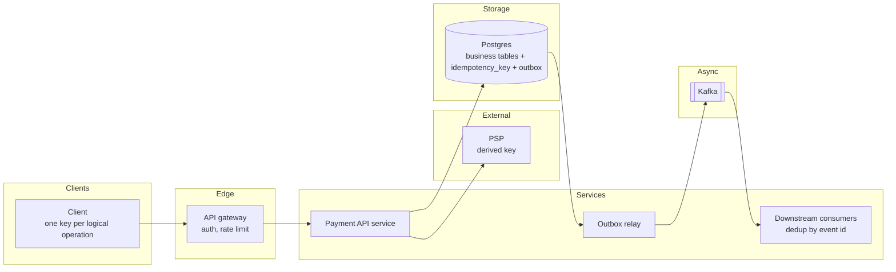
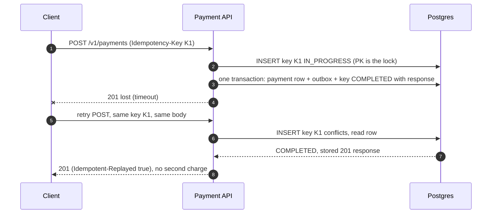
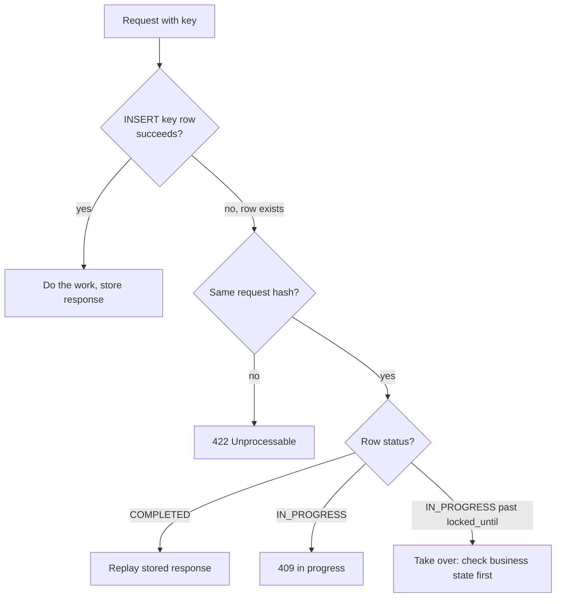

**Short answer:** The client sends a unique `Idempotency-Key` with every unsafe request. The server stores the key with a hash of the request and the final response, in the same database transaction as the business change. A retry with the same key returns the stored response instead of doing the work again; the same key with a different body is rejected; a retry that arrives while the first is still running gets a 409 "in progress". Keys expire after a retention window (for example 24 hours), and downstream calls reuse derived keys so the whole chain is idempotent.

## Picture it







**How to read it:**
- Steps 1–3: the first request claims the key by inserting it; the unique primary key is the lock, so two concurrent identical requests cannot both run. The business change, the outbox event and the stored response commit together.
- Step 4: the response is lost on the way back, which is exactly the case idempotency protects.
- Steps 5–8: the retry carries the same key; the insert conflicts, the server reads the stored row and replays the original 201 without charging again.
- The decision picture covers every other case: different body gives 422, still running gives 409, and a stale `IN_PROGRESS` row (crashed server) can be taken over after checking what already happened.
- Calls to the PSP use a derived key, and Kafka consumers dedup by event id, so the whole chain stays idempotent.

## Requirements

Functional:
- `POST /payments` (or any create/charge action) runs at most once per key, even under client retries, timeouts, load-balancer replays or double-clicks.
- A retry returns the same status and body as the original.
- Clear errors for misuse: same key, different payload.

Non-functional:
- Correct under concurrency (two identical requests at the same instant).
- Small latency overhead (one indexed lookup).
- Survives server crashes mid-request.

## Estimates

- 5k write requests/s peak. Each key record ~1 KB (hash + response). 24 h retention = 5k x 86,400 = ~430M rows, ~430 GB at peak rates. Realistically average load is lower; partition the table by day and drop old partitions instead of deleting rows.
- One extra primary-key insert per request: well under a millisecond on Postgres.

## API

```text
POST /v1/payments
Idempotency-Key: 6f1c...-uuid
{ "amount": 500, "currency": "INR", "to": "acct_42" }

201 Created            first time (and on every replay, with Idempotent-Replayed: true)
409 Conflict           same key still in progress
422 Unprocessable      same key, different request body
```

GET, PUT and DELETE are idempotent by HTTP semantics if implemented that way (PUT sets full state, DELETE of a missing resource returns the same outcome). POST is the one that needs keys.

## Data model

```sql
CREATE TABLE idempotency_key (
  client_id      TEXT        NOT NULL,
  key            TEXT        NOT NULL,
  request_hash   TEXT        NOT NULL,
  status         TEXT        NOT NULL,     -- IN_PROGRESS, COMPLETED, FAILED_RETRYABLE
  response_code  INT,
  response_body  JSONB,
  resource_id    UUID,
  locked_until   TIMESTAMPTZ,
  created_at     TIMESTAMPTZ NOT NULL DEFAULT now(),
  PRIMARY KEY (client_id, key)
);
```

Scope keys by client so two clients cannot collide.

## Architecture

The diagrams in **Picture it** above show the components, the retry path and the decision taken when a key already exists.

## Deep dives

**1. The race.** Check-then-insert is wrong: two requests both see "no key" and both run. Use the database's unique constraint as the lock: `INSERT ... ON CONFLICT DO NOTHING` and check the affected row count. Only the winner proceeds. In Postgres the loser's insert waits for the winner's transaction if it is uncommitted, then sees the conflict.

**2. Lifecycle of the transaction (follow-up).**
1. *Received:* validate, compute the request hash.
2. *Key claimed:* insert row `IN_PROGRESS` with `locked_until = now() + 30s`.
3. *Local work:* in one transaction, write the business rows, an outbox event, and mark the key `COMPLETED` with the response. Commit. Either all of it exists or none of it.
4. *External side effects:* if a third party must be called (card network, PSP), you cannot put it in your transaction. Record a state machine: `CREATED -> PENDING_PSP -> SUCCEEDED | FAILED`. Call the PSP with a derived idempotency key so a retry does not charge twice. Store the result, then complete the key.
5. *Crash recovery:* if the process dies after step 2, the row stays `IN_PROGRESS` past `locked_until`. A retry may then take it over, and must check the business state (or ask the PSP by key) before redoing anything. A reconciliation job does the same for abandoned rows.
6. *Completed:* replays return the stored response until expiry.
7. *Expired:* rows are dropped after the retention window; document that keys are only honoured for that long.

**3. Which failures are cached.** Cache final outcomes, including business failures like "insufficient funds", so a retry gets the same answer. Do not cache transient failures (timeouts to the database, 503s); mark the key retryable or delete it so the client can try again.

**4. Downstream consumers.** Kafka gives at-least-once delivery. Consumers keep a `processed_event(event_id)` table and insert into it in the same transaction as their own change, so duplicates are no-ops.

## Trade-offs

- **Postgres vs Redis for keys:** keeping keys in the same database as the business data gives atomicity with one commit. Redis is faster but a crash between "work done" and "key saved" breaks the guarantee; fine for low-stakes dedup, not for money.
- **Client-generated vs server-generated keys:** the client must generate them, because only the client knows two requests are the same logical attempt.
- **Retention window:** longer is safer but costs storage; 24 hours to a few days covers realistic retries.
- **Natural keys:** sometimes a business key already exists (order ID for "pay order X"); a unique constraint on it gives idempotency for free.

## Follow-ups

- *What if the client loses the response and retries a week later?* The key has expired; rely on a natural unique constraint (one payment per order) as a second line.
- *Same key, different body?* 422, because silently returning the old result hides a client bug.
- *Is idempotency the same as exactly-once?* No. Delivery is at-least-once; idempotent processing makes the effect happen once.

Related: [Q6 · Transactions, isolation, locking and MVCC](../academy/lessons/Q6.md), [S9 · Cloud native & event-driven systems](../academy/lessons/S9.md), [F4 · Case studies](../academy/lessons/F4.md).
