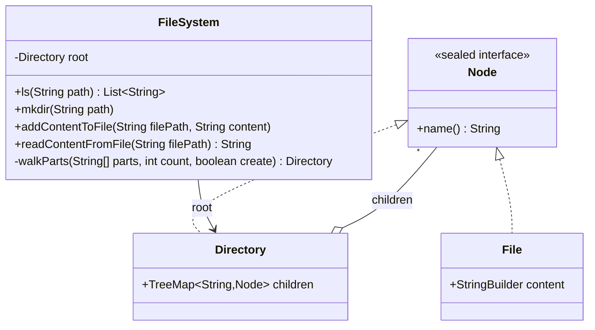
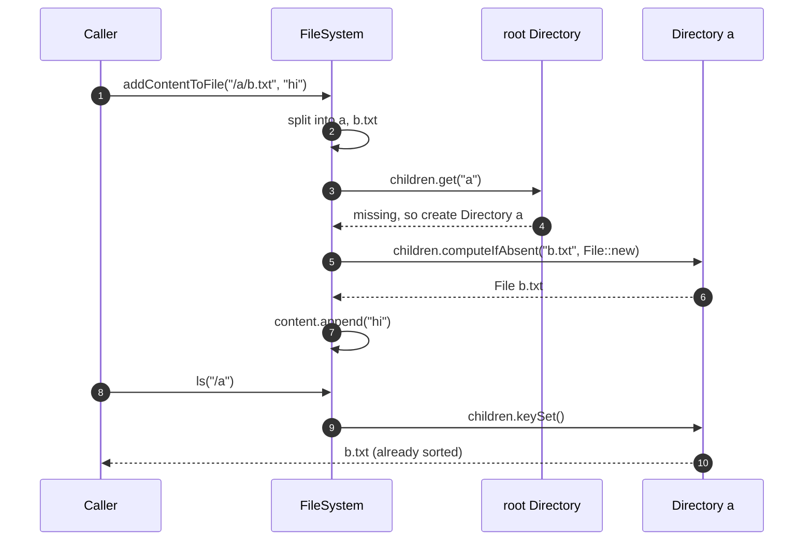

**Short answer:** Model the file system as a tree (a trie keyed by path segment). Each node is either a directory with a sorted map of children, or a file with a content buffer. Every operation splits the path on `/` and walks from the root; `mkdir` and `addContentToFile` create missing nodes on the way. Using a `TreeMap` for children makes `ls` return names in sorted order with no extra sort.

## Picture it





**How to read it:**
- `Node` is a sealed interface with exactly two kinds: `Directory` and `File` (Composite).
- A `Directory` holds its children in a `TreeMap`, so the tree is a trie over path segments and `ls` comes out sorted.
- Every call splits the path on `/` and walks from `root` with `walkParts`. Writes create missing directories on the way.
- `addContentToFile` creates the file in the parent directory if needed and appends to its `StringBuilder`.

## Requirements

From the LeetCode version (588):

- `ls(path)`: if `path` is a file, return a list with just its name; if a directory, return its children's names in lexicographic order.
- `mkdir(path)`: create the directory and any missing parents.
- `addContentToFile(filePath, content)`: create the file if missing, otherwise append.
- `readContentFromFile(filePath)`: return the content.
- Paths are absolute and valid. Out of scope: delete, move, permissions (good extensions).

## Classes

- `Node` (sealed interface): common parent of `Directory` and `File`. Has a name.
- `Directory`: `TreeMap<String, Node> children`.
- `File`: `StringBuilder content`.
- `FileSystem`: holds the root and does path resolution.

A sealed interface lets the compiler check every `switch` covers both node kinds, instead of one `Node` class with an `isFile` flag and unused fields.

## Patterns used

- **Composite**: a directory contains nodes, which are files or directories, and `ls` treats them uniformly. This is the textbook Composite case.
- The tree itself is a **trie** over path segments: lookup cost depends on path depth, not on the total number of files.

## Code

```java
import java.util.*;

sealed interface Node permits Directory, File {
    String name();
}

final class Directory implements Node {
    private final String name;
    final TreeMap<String, Node> children = new TreeMap<>();
    Directory(String name) { this.name = name; }
    public String name() { return name; }
}

final class File implements Node {
    private final String name;
    final StringBuilder content = new StringBuilder();
    File(String name) { this.name = name; }
    public String name() { return name; }
}

public class FileSystem {
    private final Directory root = new Directory("");

    public List<String> ls(String path) {
        Node node = resolve(path);
        return switch (node) {
            case File f -> List.of(f.name());
            case Directory d -> new ArrayList<>(d.children.keySet());   // already sorted
        };
    }

    public void mkdir(String path) {
        walk(path, true);
    }

    public void addContentToFile(String filePath, String content) {
        String[] parts = split(filePath);
        Directory parent = walkParts(parts, parts.length - 1, true);
        String name = parts[parts.length - 1];
        Node node = parent.children.computeIfAbsent(name, File::new);
        if (!(node instanceof File f)) throw new IllegalArgumentException(filePath + " is a directory");
        f.content.append(content);
    }

    public String readContentFromFile(String filePath) {
        if (resolve(filePath) instanceof File f) return f.content.toString();
        throw new IllegalArgumentException(filePath + " is not a file");
    }

    // --- path helpers ---

    private Node resolve(String path) {
        String[] parts = split(path);
        if (parts.length == 0) return root;
        Directory parent = walkParts(parts, parts.length - 1, false);
        Node node = parent.children.get(parts[parts.length - 1]);
        if (node == null) throw new NoSuchElementException(path);
        return node;
    }

    private Directory walk(String path, boolean create) {
        String[] parts = split(path);
        return walkParts(parts, parts.length, create);
    }

    /** Walks the first {@code count} segments, which must all be directories. */
    private Directory walkParts(String[] parts, int count, boolean create) {
        Directory cur = root;
        for (int i = 0; i < count; i++) {
            Node next = cur.children.get(parts[i]);
            if (next == null) {
                if (!create) throw new NoSuchElementException(parts[i]);
                next = new Directory(parts[i]);
                cur.children.put(parts[i], next);
            }
            if (!(next instanceof Directory d)) throw new IllegalArgumentException(parts[i] + " is a file");
            cur = d;
        }
        return cur;
    }

    private static String[] split(String path) {
        return Arrays.stream(path.split("/")).filter(s -> !s.isEmpty()).toArray(String[]::new);
    }
}
```

**Complexity**

Let `d` be path depth, `k` the number of children in a directory, `c` the content length.

- `mkdir`, `addContentToFile`, `readContentFromFile`: O(d log k) for the walk (TreeMap lookups), plus O(c) to append or copy content.
- `ls` on a directory: O(d log k + k) to copy the sorted names.
- Space: one node per file or directory, plus content.

A `HashMap` gives O(1) lookups but then `ls` must sort, O(k log k). `TreeMap` fits the stated API because `ls` must be sorted.

## Extensions

- **Concurrency:** simplest correct option is a `ReentrantReadWriteLock` on the whole tree: reads (`ls`, `read`) share, writes (`mkdir`, `add`) are exclusive. Finer-grained: lock per directory, acquired top-down along the path (hand-over-hand), which avoids deadlock because every thread locks in the same order. Content appends need the file's own lock.
- **delete / rm -r:** remove the child from its parent's map; the subtree becomes garbage.
- **move / rename:** detach from one parent, attach to another. With per-directory locks, lock both parents in a fixed order (for example by path string) to avoid deadlock.
- **Metadata:** add size, created and modified times to `Node`; size of a directory can be computed lazily or cached and updated up the path on writes.
- **Relative paths, `.` and `..`:** handle in `split` by keeping a stack of segments.
- **Large files:** replace `StringBuilder` with a list of fixed-size chunks so appends do not copy.

Related: [E3 · Structural patterns](../academy/lessons/E3.md), [B2 · Locks](../academy/lessons/B2.md).
