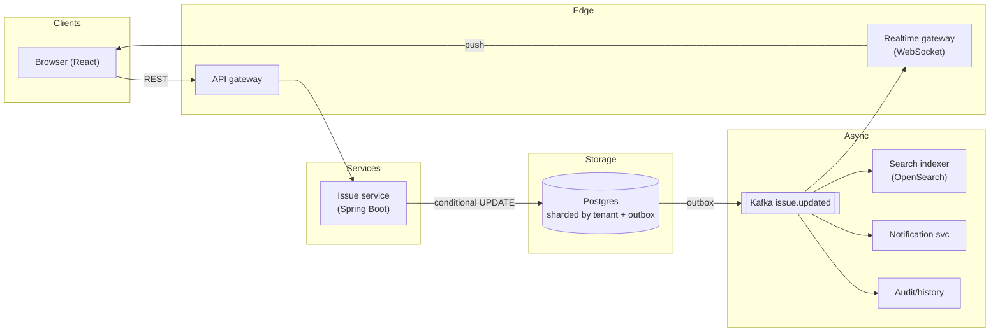
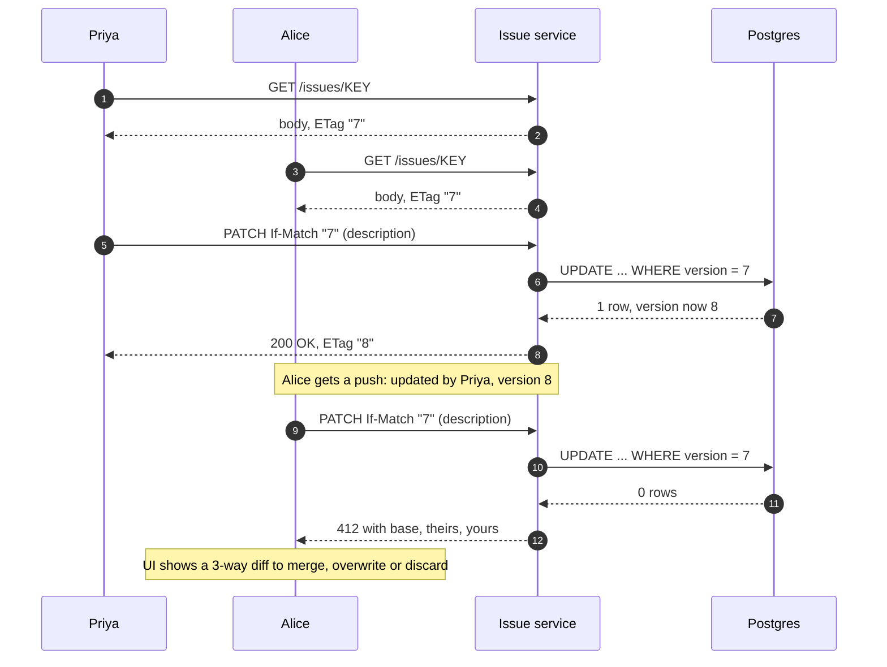
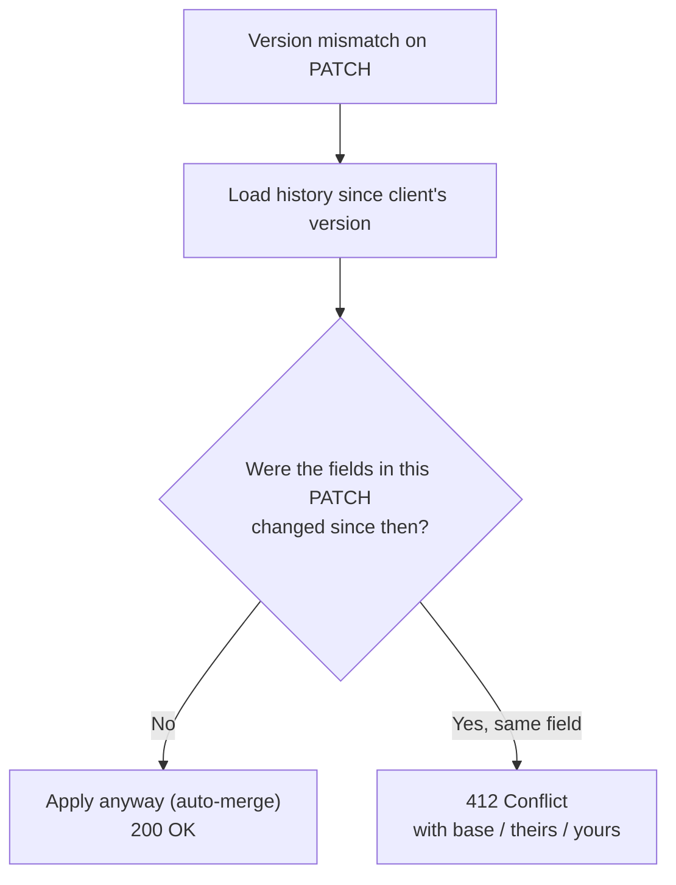

**Short answer:** Use optimistic concurrency control. Every issue (or each editable field) carries a version number. The client loads the issue with its version and sends it back on save (`If-Match: "v7"` or a `version` field). The server updates only if the stored version still matches; if someone saved first, the update touches zero rows and the API returns `412 Precondition Failed` (or 409) with the current version, the other user's change and who made it. The UI then shows a conflict dialog with a diff so the second user can merge, overwrite or discard. Real-time push tells them earlier that someone else is editing.

## Picture it







**How to read it:**
- Steps 1–4: both users load the issue at version 7.
- Steps 5–8: Priya saves first; the conditional `UPDATE ... WHERE version = 7` hits one row and the version becomes 8. The outbox event goes through Kafka to the realtime gateway, so Alice sees a "updated by Priya" banner.
- Steps 9–12: Alice saves with the old version; zero rows change, so she gets 412 with the three versions and resolves it in a diff dialog. Nothing is silently overwritten.
- The last picture is field-level granularity: a mismatch only becomes a conflict when both edits touched the same field.

## Requirements

Functional:
- Projects, issues (title, description, status, assignee, priority, comments, history), workflows, search, notifications.
- Focus: two people editing the same issue's description must not silently overwrite each other; the second learns about the conflict.

Non-functional:
- No lost updates. Low latency for issue views and saves (p95 under 200 ms).
- Full audit history of field changes.
- Multi-tenant (many companies), each with its own projects.

## Estimates

- 10M users, 1M daily active, 20 issue edits per user/day = 20M edits/day, ~230/s average, ~1k/s peak.
- Reads 10x writes: ~10k/s peak, mostly cacheable.
- Concurrent edits on the same field of the same issue are rare (well under 1%), which is exactly the case where optimistic locking is the right fit.
- 1B issues x ~5 KB = 5 TB; shard by tenant.

## API

```text
GET   /issues/{key}                -> body + ETag: "7"
PATCH /issues/{key}                If-Match: "7"
      {"description": "...new text..."}
  200 OK         ETag: "8"
  412 Precondition Failed
      {"currentVersion": 8, "changedBy": "priya", "changedAt": "...",
       "fields": {"description": {"yours": "...", "theirs": "...", "base": "..."}}}
WS    /issues/{key}/events         -> {type: "UPDATED", version: 8, by: "priya", fields:["description"]}
```

## Data model

```sql
CREATE TABLE issue (
  id BIGINT PRIMARY KEY, tenant_id BIGINT, project_id BIGINT, issue_key TEXT,
  title TEXT, description TEXT, status TEXT, assignee_id BIGINT, priority TEXT,
  version BIGINT NOT NULL DEFAULT 0, updated_by BIGINT, updated_at TIMESTAMPTZ,
  UNIQUE (tenant_id, issue_key));

CREATE TABLE issue_change (            -- history, also the base for 3-way merge
  id BIGSERIAL PRIMARY KEY, issue_id BIGINT, version BIGINT, field TEXT,
  old_value TEXT, new_value TEXT, actor_id BIGINT, at TIMESTAMPTZ);

CREATE TABLE comment (id BIGINT PRIMARY KEY, issue_id BIGINT, author_id BIGINT, body TEXT, created_at TIMESTAMPTZ);
```

## Architecture

The diagram in **Picture it** above shows the components: a stateless Issue service doing conditional updates on Postgres (sharded by tenant, with an outbox), and Kafka `issue.updated` events feeding the realtime gateway, search indexer (OpenSearch for JQL-like queries), notifications (email/watchers) and audit history.

## Deep dives

**1. Detecting the conflict.** The save is one statement:

```sql
UPDATE issue
SET description = :desc, version = version + 1, updated_by = :me, updated_at = now()
WHERE id = :id AND version = :expectedVersion;
```

Zero rows updated means someone else saved first. The service then loads the current row and the history since `expectedVersion` and returns 412 with the details. In Spring Data JPA, `@Version` on the entity does the same and throws `OptimisticLockingFailureException`, which a controller advice maps to 412/409. The same transaction writes the `issue_change` rows and an outbox event.

**2. Field-level granularity.** A whole-issue version produces false conflicts: Alice edits the description while Bob changes the assignee. Better: the PATCH sends only the changed fields plus the version the client saw. On a version mismatch, the server checks the history: if none of the changed fields were touched since the client's version, apply the patch anyway (an automatic merge). Only real overlaps (both changed `description`) return a conflict. Simple fields (status, assignee) can even be last-writer-wins with history, since the history shows what happened.

**3. Telling the second user, nicely.**
- *Before saving:* when Alice opens the editor, the realtime channel shows "Priya is editing" (presence). When Priya saves, Alice gets a push "description updated by Priya, version 8" and a banner to reload.
- *On save:* the 412 response contains base, theirs and yours, so the UI shows a 3-way diff. For long text, the server can attempt a 3-way text merge and only ask when chunks overlap.
- Never silently overwrite.

**4. Why not pessimistic locks or real-time co-editing.** Locking the issue while editing blocks others and needs lock expiry when a user walks away. Google Docs-style OT/CRDT co-editing is possible for the description, but it is heavy for a field that is rarely edited concurrently. Optimistic locking plus presence fits the conflict rate.

## Trade-offs

- **Optimistic vs pessimistic:** optimistic has no lock management and scales; the cost is an occasional conflict dialog. Pessimistic suits long, high-contention edits.
- **Issue-level vs field-level versions:** field-level means fewer false conflicts but more logic.
- **412 vs 409:** 412 is the HTTP-standard answer when an `If-Match` precondition fails; 409 is common when the version is in the body. Either is fine if consistent.
- **Merge on server vs ask the user:** auto-merge non-overlapping changes; ask only for true overlaps.

## Follow-ups

- *Two status transitions at once (To Do -> In Progress and To Do -> Done)?* The workflow check runs inside the conditional update (`WHERE status = 'TO_DO'`), so only one wins; the other gets a conflict.
- *Many tenants, one huge one?* Shard by tenant; give very large tenants their own shard.
- *Search after an edit?* The index updates from events within seconds; the issue page always reads the database.

Related: [Q6 · Transactions, isolation, locking and MVCC](../academy/lessons/Q6.md), [F5 · Case studies: chat, news feed, collaborative editor](../academy/lessons/F5.md).
