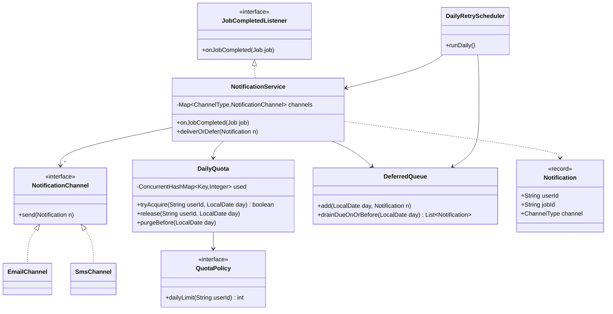
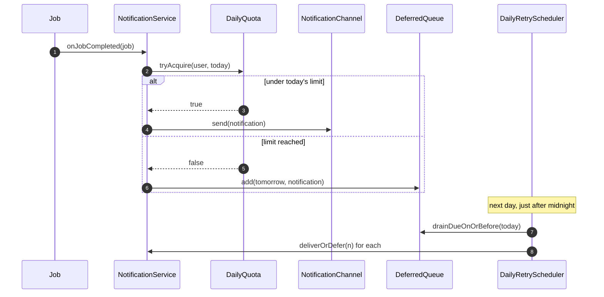

**Short answer:** When a job completes, it publishes a `JobCompleted` event. A `NotificationService` listens, builds a `Notification` for the job's user, and asks a `DailyQuota` whether the user still has budget today. If yes, it sends through the user's preferred `NotificationChannel` (email or SMS). If not, it parks the notification in a deferred queue keyed by date, and a daily scheduler drains that queue the next day, still respecting the limit. The limit is a config value, not a constant.

## Picture it





**How to read it:**
- Jobs only publish a completion event. `NotificationService` is the listener, so jobs know nothing about email or SMS.
- Before every send the service asks `DailyQuota.tryAcquire`, which atomically counts a slot for that user and day against `QuotaPolicy`'s limit.
- Under the limit, the notification goes out on the user's preferred `NotificationChannel`. Over it, it waits in `DeferredQueue` for tomorrow.
- Each day `DailyRetryScheduler` drains due items through the same `deliverOrDefer`, so overflow keeps rolling forward without breaking the limit.

## Requirements

- N jobs, each owned by one user. On completion, notify that user.
- Channel per user: email or SMS (more later: push, Teams).
- At most `limit` notifications per user per day (initially 2), configurable.
- Overflow is not dropped: it is retried the next day (and keeps rolling over if the next day is also full).
- "Day" means the user's or the system's calendar day; I assume a single configured time zone.
- Out of scope: the job runner itself, delivery receipts.

## Classes

- `Job`: id, userId, status. Calls `JobEventPublisher.completed(job)` when done.
- `JobCompletedListener` (interface) and `NotificationService` (implements it): the entry point.
- `Notification`: record of userId, jobId, message, channel type, createdAt.
- `NotificationChannel` (interface): `send(User, Notification)`. `EmailChannel`, `SmsChannel` implement it.
- `ChannelResolver`: picks the channel from user preferences (map of `ChannelType` to channel).
- `DailyQuota`: per-user counter for a given date; `tryAcquire(userId, date)` returns true if under the limit and counts it.
- `QuotaPolicy`: supplies the limit (could differ per user tier later).
- `DeferredQueue`: notifications waiting for a future date, FIFO per user.
- `DailyRetryScheduler`: at the start of each day, drains deferred notifications through the same quota.
- `Clock`: injected, so tests can move time.

## Patterns used

- **Observer**: jobs do not know about notifications; they publish a completion event. Adding a "webhook on completion" is another listener.
- **Strategy**: `NotificationChannel` implementations are interchangeable; adding WhatsApp is a new class plus a map entry (Open/Closed).
- **Policy object**: `QuotaPolicy` keeps the limit rule out of the send logic (Single Responsibility).
- Dependency injection of `Clock` and the channels, so every rule is testable.

## Code

```java
enum ChannelType { EMAIL, SMS }

record Notification(String userId, String jobId, String message, ChannelType channel) {}

interface NotificationChannel { void send(Notification n); }

interface QuotaPolicy { int dailyLimit(String userId); }

final class DailyQuota {
    private record Key(String userId, LocalDate day) {}
    private final ConcurrentHashMap<Key, Integer> used = new ConcurrentHashMap<>();
    private final QuotaPolicy policy;

    DailyQuota(QuotaPolicy policy) { this.policy = policy; }

    /** Atomically counts one send if the user is under today's limit. */
    boolean tryAcquire(String userId, LocalDate day) {
        int limit = policy.dailyLimit(userId);
        boolean[] granted = {false};
        used.compute(new Key(userId, day), (k, count) -> {
            int c = count == null ? 0 : count;
            if (c < limit) { granted[0] = true; return c + 1; }
            return c;
        });
        return granted[0];
    }

    void release(String userId, LocalDate day) {   // if the send failed, give the slot back
        used.computeIfPresent(new Key(userId, day), (k, c) -> c > 1 ? c - 1 : null);
    }

    void purgeBefore(LocalDate day) { used.keySet().removeIf(k -> k.day().isBefore(day)); }
}

final class NotificationService implements JobCompletedListener {
    private final Map<ChannelType, NotificationChannel> channels;
    private final UserDirectory users;
    private final DailyQuota quota;
    private final DeferredQueue deferred;
    private final Clock clock;

    NotificationService(Map<ChannelType, NotificationChannel> channels, UserDirectory users,
                        DailyQuota quota, DeferredQueue deferred, Clock clock) {
        this.channels = channels; this.users = users; this.quota = quota;
        this.deferred = deferred; this.clock = clock;
    }

    @Override public void onJobCompleted(Job job) {
        User user = users.find(job.userId());
        var n = new Notification(user.id(), job.id(), "Job " + job.id() + " finished",
                                 user.preferredChannel());
        deliverOrDefer(n);
    }

    void deliverOrDefer(Notification n) {
        LocalDate today = LocalDate.now(clock);
        if (!quota.tryAcquire(n.userId(), today)) {
            deferred.add(today.plusDays(1), n);
            return;
        }
        try {
            channels.get(n.channel()).send(n);
        } catch (RuntimeException e) {
            quota.release(n.userId(), today);
            deferred.add(today, n);             // retry later today, not counted
        }
    }
}

final class DailyRetryScheduler {
    private final DeferredQueue deferred;
    private final NotificationService service;
    private final DailyQuota quota;
    private final Clock clock;

    DailyRetryScheduler(DeferredQueue d, NotificationService s, DailyQuota q, Clock c) {
        deferred = d; service = s; quota = q; clock = c;
    }

    /** Runs just after midnight. */
    void runDaily() {
        LocalDate today = LocalDate.now(clock);
        quota.purgeBefore(today);
        for (Notification n : deferred.drainDueOnOrBefore(today)) {
            service.deliverOrDefer(n);          // over the limit again -> rolls to tomorrow
        }
    }
}
```

`compute` on `ConcurrentHashMap` is atomic per key, so two jobs finishing at once for the same user cannot both take the last slot. Day-keyed counters mean no reset job is needed; old keys are just purged.

Ordering detail: drain deferred items before today's new events if old notifications should go first. In practice, run `runDaily` at 00:00 before traffic, or have `deliverOrDefer` check whether the user has older deferred items and queue behind them.

## Extensions

- **Per-channel limits** (2 SMS, 10 email): key the quota by `(userId, channel, day)`.
- **Batching instead of deferring:** when a user is over the limit, merge overflow into one digest ("5 jobs finished") the next day. A digest builder fits as another strategy.
- **Persistence:** in production the deferred queue and counters live in a DB table or Redis (`INCR` with expiry at end of day) so a restart loses nothing and many instances share counts.
- **Multiple instances:** the in-memory quota is per process; use Redis `INCR` + `EXPIRE`, or a DB row with `UPDATE ... SET used = used + 1 WHERE used < limit` and check the row count.
- **Time zones:** compute `today` in the user's zone if the limit is "per user's day".
- **Retries on failure:** exponential backoff with a max-attempts cap, then a dead-letter list.

Related: [E4 · Behavioural patterns](../academy/lessons/E4.md), [E6 · LLD case studies](../academy/lessons/E6.md), [B3 · Atomics, CAS and concurrent collections](../academy/lessons/B3.md).
