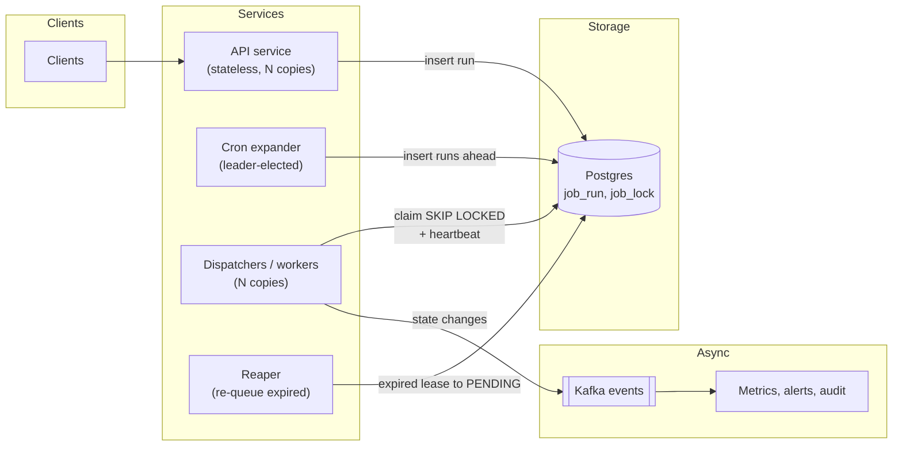
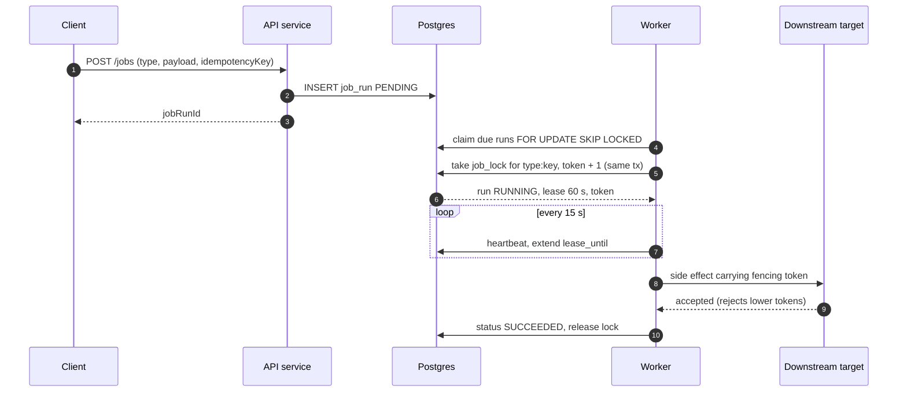
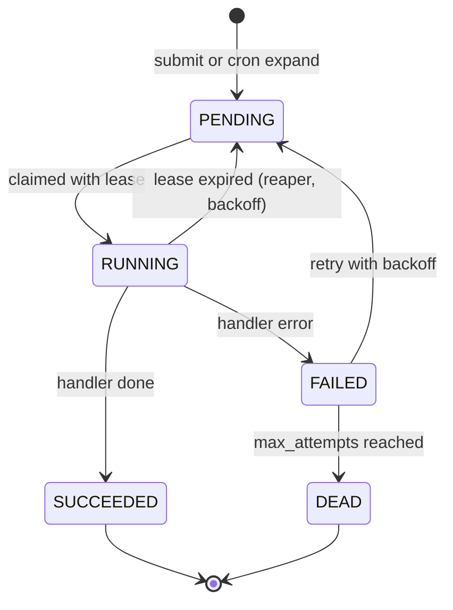

**Short answer:** Every request gets a `jobRunId` from an append-only `job_run` table, which is the source of truth. Stateless dispatchers claim due runs from that table with `SELECT ... FOR UPDATE SKIP LOCKED`, so many dispatchers can run in parallel without a single leader. "Must never run concurrently" job types are enforced by a per-type lease (a DB row or a Redis lock with a TTL and a fencing token), not by hoping only one worker picks the job. Workers send heartbeats, a reaper re-queues runs whose lease expired, and every state change emits metrics and events for alerting.

## Picture it







**How to read it:**
- Steps 1–3: the API stores the run in `job_run` and returns its `jobRunId`; a retried submit with the same `idempotencyKey` gets the same id.
- Steps 4–6: any worker claims due rows with `SKIP LOCKED`, so many workers share the queue with no leader. For an exclusive type it also takes the `job_lock` row and a new fencing token in the same transaction.
- Steps 7–9: the worker heartbeats to keep its lease, and every side effect carries the token, so a worker that woke up after a GC pause is rejected.
- Step 10, and the state picture: success ends the run; if the worker dies, the reaper sees the expired lease and puts the run back to PENDING, or DEAD after `max_attempts`. Handlers are idempotent because a run can execute twice.

## Requirements

Functional:
- Register `n` job types (handler, timeout, retry policy, concurrency rule).
- Submit a job (now, delayed or cron); get back a unique `jobRunId`.
- Some types are **exclusive**: at most one run of that type at a time (or per key, e.g. per tenant).
- Other types run in parallel up to a limit.
- Query status, cancel, retry, view history and logs.

Non-functional:
- No single point of failure; survive loss of any node.
- At-least-once execution, with idempotent handlers so duplicates are harmless.
- Exclusive types must never overlap, even during network partitions.
- Observability: latency from due-time to start, failure rate, queue depth, stuck runs.

## Estimates

- Assume 10M runs/day ≈ 115/s average, peaks ~1,000/s (cron storms at the top of the hour).
- Run row ~500 bytes → 5 GB/day; keep 30 days hot (~150 GB), archive older runs.
- Postgres handles 1k claims/s with a good partial index; beyond that, partition the queue by job type.

## API

```text
POST /job-types                  {name, exclusive: true|false, exclusiveKey?, maxParallel, timeoutSec, retry}
POST /jobs                       {type, payload, runAt?|cron?, idempotencyKey}  -> {jobRunId}
GET  /jobs/{jobRunId}            -> {status, attempts, startedAt, worker, error}
POST /jobs/{jobRunId}/cancel
GET  /jobs?type=&status=&from=
```

`idempotencyKey` on submit means a client retry returns the same `jobRunId` instead of a second run.

## Data model

```sql
CREATE TABLE job_type (
  name text PRIMARY KEY, exclusive boolean, max_parallel int,
  timeout_sec int, max_attempts int, backoff_sec int);

CREATE TABLE job_run (
  job_run_id uuid PRIMARY KEY,            -- or a Snowflake-style long
  type text REFERENCES job_type,
  exclusive_key text,                     -- e.g. tenant id; null = whole type
  idempotency_key text UNIQUE,
  status text,                            -- PENDING, RUNNING, SUCCEEDED, FAILED, DEAD
  run_at timestamptz, attempts int,
  lease_owner text, lease_until timestamptz, fencing_token bigint,
  payload jsonb, last_error text, created_at timestamptz);

CREATE INDEX job_due ON job_run (run_at) WHERE status = 'PENDING';

CREATE TABLE job_lock (                   -- one row per exclusive type/key
  lock_key text PRIMARY KEY, owner_run uuid, lease_until timestamptz, token bigint);
```

## Architecture

The diagram in **Picture it** above shows the components (Postgres runs as primary + sync replica; workers autoscale per job type).

- **API** validates and inserts runs.
- **Cron expander** turns cron definitions into concrete `job_run` rows a little ahead of time. It is the only part that needs a leader (one expander, else duplicate runs). Use a Postgres advisory lock, a Kubernetes Lease, or ZooKeeper/etcd for election; the unique `(type, scheduled_time)` constraint makes a double expansion harmless anyway.
- **Workers** pull work; there is no central dispatcher to lose.

## Deep dives

**1. Claiming without a leader.** Each worker runs:

```sql
WITH next AS (
  SELECT job_run_id FROM job_run
  WHERE status = 'PENDING' AND run_at <= now() AND type = ANY(:myTypes)
  ORDER BY run_at LIMIT 10
  FOR UPDATE SKIP LOCKED)
UPDATE job_run r SET status = 'RUNNING', lease_owner = :me,
       lease_until = now() + interval '60 seconds', attempts = attempts + 1
FROM next WHERE r.job_run_id = next.job_run_id
RETURNING r.*;
```

`SKIP LOCKED` lets workers take different rows with no contention. Postgres becomes the coordinator, which is fine to a few thousand claims/s. Beyond that, move the ready queue to Kafka (partitioned by type) and keep Postgres as the state store.

**2. Exclusive job types.** Before running, the worker acquires the lock row for `type:exclusiveKey` in the same transaction as the claim (insert or update only if `lease_until < now()`), and increments `token`. If it fails, the run stays PENDING with a short backoff. Why a fencing token: a worker paused by GC can wake after its lease expired while another worker holds the lock. Every side effect (a DB write, a downstream call) carries the token and the target rejects lower tokens. A plain Redis `SET key value NX PX 30000` lock works for efficiency, but on its own it is not safe for correctness under process pauses or failover. Say this explicitly; it is what the "Redis locks" part of the question is testing.

**3. Failure handling.** Workers heartbeat every 15 s to extend `lease_until`. The reaper (any worker can run it; it is idempotent) finds `RUNNING` rows whose lease expired, sets them back to PENDING with backoff, or DEAD after `max_attempts`. Because a run can execute twice (worker did the work but died before marking success), handlers must be idempotent, keyed by `jobRunId`.

## Trade-offs

- **DB-as-queue vs broker:** Postgres gives transactions, easy querying and exactly one source of truth; a broker scales further but makes "status of run X" and exclusivity harder.
- **Pull vs push:** pull gives natural back-pressure and no dispatcher SPOF; push gives lower latency.
- **Lock in DB vs Redis:** DB lock shares the transaction with the claim (simpler, consistent); Redis is faster but needs fencing.
- **At-least-once vs exactly-once:** exactly-once is not achievable end to end; at-least-once plus idempotency is the practical answer.

## Follow-ups

- *Observability?* Metrics per type: `queue_depth`, `schedule_lag_seconds` (start − run_at), `duration`, `failures_total`, `stuck_runs`. Alert on lag p99, DEAD count and a heartbeat gap. Trace id = `jobRunId` in every log line.
- *Thundering herd at 00:00?* Expand cron early and add small jitter for non-exclusive types.
- *DAG dependencies?* Add a `depends_on` table; a run becomes PENDING only when parents succeed. See [F7 · DAGs: workflow orchestration and schedulers](../academy/lessons/F7.md).
- *Priority?* Add a `priority` column to the claim's `ORDER BY`, or separate queues per priority.

Deeper reading: [F2 · Distributed theory: CAP, consistency, consensus](../academy/lessons/F2.md), [Q6 · Transactions, isolation, locking and MVCC](../academy/lessons/Q6.md).
