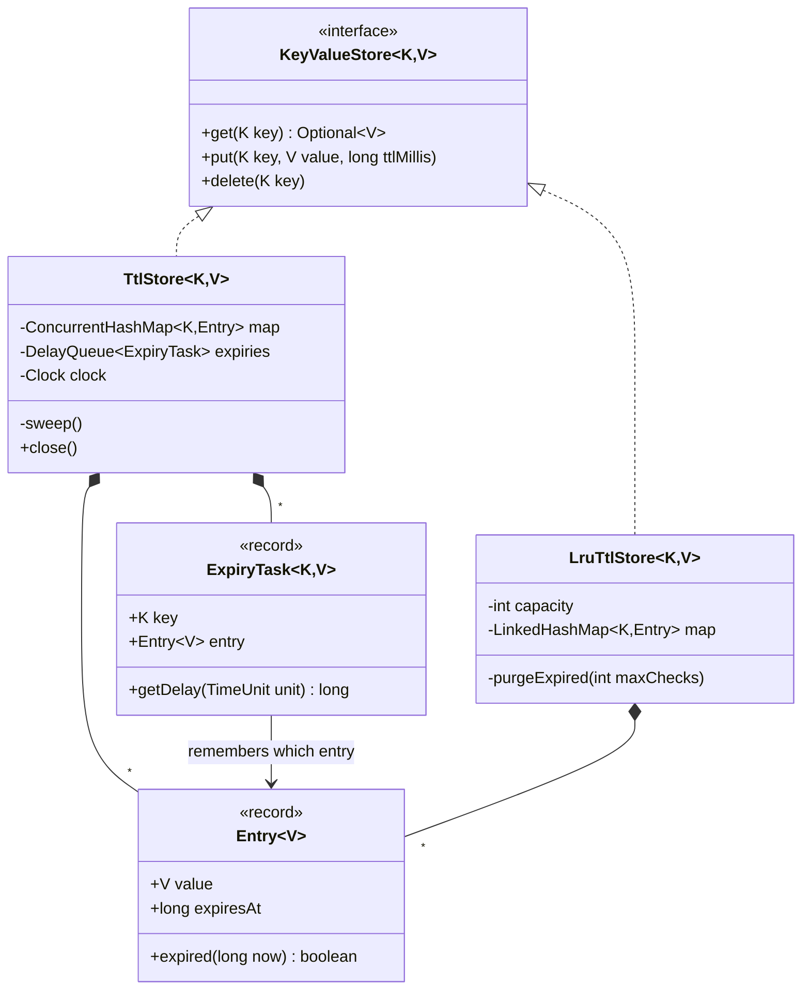
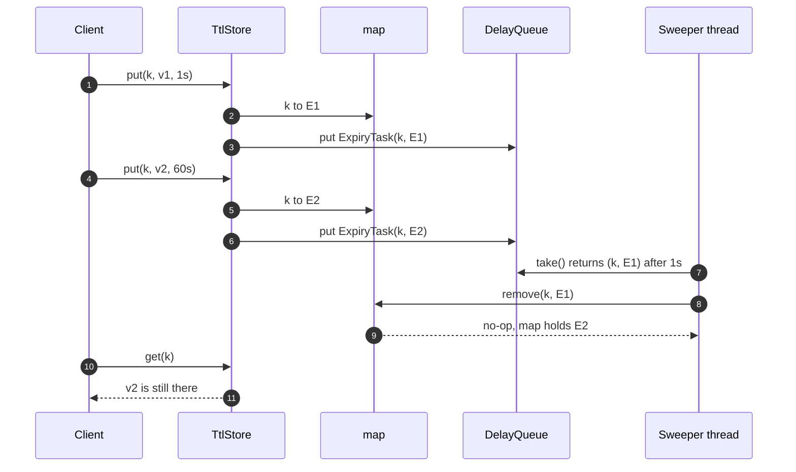

**Short answer:** Start with a `ConcurrentHashMap<K, Entry<V>>` where each entry stores the value and an absolute `expiresAt`. Expire in two ways: lazily on `get` (an expired entry is treated as absent and removed), and actively with a background sweeper using a delay queue of `(key, expiresAt)`. The race to avoid is "sweeper deletes a key that was just re-put with a new TTL"; fix it by removing only if the map still holds the exact same entry (`map.remove(key, entry)`). For LRU plus expiry, use a `LinkedHashMap` in access order behind one lock, and check expiry on every read.

## Picture it





**How to read it:**
- Both stores implement one `KeyValueStore` interface, so each stage is a drop-in replacement.
- `TtlStore` keeps an immutable `Entry` (value plus absolute `expiresAt`) per key. Every TTL put also queues an `ExpiryTask` that remembers that exact entry.
- The sweeper thread blocks on the `DelayQueue` and calls `map.remove(key, entry)`. If the key was re-put meanwhile, the entries differ and nothing is removed.
- `get` also expires lazily with the same conditional remove. `LruTtlStore` adds capacity with an access-ordered `LinkedHashMap` behind one lock.

## Requirements

The interview went in stages; the answer follows them.

1. `put(k, v)`, `get(k)`, `delete(k)`.
2. `put(k, v, ttl)`: a key disappears after its TTL.
3. Thread-safe, with no race between expiry and concurrent writes.
4. Bounded capacity with LRU eviction, still honouring expiry.

Assumptions: in-memory, single process, keys and values are any objects, time from an injectable `Clock`.

## Classes

- `Entry<V>` (record): value, `expiresAtMillis` (or `Long.MAX_VALUE` for no TTL). Immutable, so it can be compared by identity.
- `KeyValueStore<K, V>` (interface): get, put, delete.
- `TtlStore<K, V>`: the concurrent implementation with lazy and active expiry.
- `ExpiryTask<K, V>`: `Delayed` element in a `DelayQueue` that remembers which entry it was created for.
- `LruTtlStore<K, V>`: stage 4, capacity-bound.

## Patterns used

- Programming to an interface (`KeyValueStore`) so the stage-1, stage-3 and stage-4 versions are drop-in replacements.
- **Strategy** for the clock (system vs fake) to make tests deterministic.
- The `DelayQueue` sweeper is a **producer-consumer** pattern: `put` produces expiry tasks, the sweeper thread consumes them when due.

## Code

```java
import java.time.Clock;
import java.util.*;
import java.util.concurrent.*;

interface KeyValueStore<K, V> {
    Optional<V> get(K key);
    void put(K key, V value, long ttlMillis);
    void delete(K key);
}

record Entry<V>(V value, long expiresAt) {
    boolean expired(long now) { return now >= expiresAt; }
}

final class TtlStore<K, V> implements KeyValueStore<K, V>, AutoCloseable {
    private final ConcurrentHashMap<K, Entry<V>> map = new ConcurrentHashMap<>();
    private final DelayQueue<ExpiryTask<K, V>> expiries = new DelayQueue<>();
    private final Clock clock;
    private final Thread sweeper;

    TtlStore(Clock clock) {
        this.clock = clock;
        this.sweeper = Thread.ofVirtual().start(this::sweep);
    }

    public void put(K key, V value, long ttlMillis) {
        long expiresAt = ttlMillis <= 0 ? Long.MAX_VALUE : clock.millis() + ttlMillis;
        Entry<V> entry = new Entry<>(value, expiresAt);
        map.put(key, entry);
        if (expiresAt != Long.MAX_VALUE) expiries.put(new ExpiryTask<>(key, entry));
    }

    public Optional<V> get(K key) {
        Entry<V> e = map.get(key);
        if (e == null) return Optional.empty();
        if (e.expired(clock.millis())) {
            map.remove(key, e);               // only if still this entry
            return Optional.empty();
        }
        return Optional.of(e.value());
    }

    public void delete(K key) { map.remove(key); }

    private void sweep() {
        try {
            while (!Thread.currentThread().isInterrupted()) {
                ExpiryTask<K, V> t = expiries.take();          // blocks until one is due
                map.remove(t.key(), t.entry());                // no-op if key was re-put
            }
        } catch (InterruptedException ie) {
            Thread.currentThread().interrupt();
        }
    }

    public void close() { sweeper.interrupt(); }

    record ExpiryTask<K, V>(K key, Entry<V> entry) implements Delayed {
        public long getDelay(TimeUnit unit) {
            return unit.convert(entry.expiresAt() - System.currentTimeMillis(), TimeUnit.MILLISECONDS);
        }
        public int compareTo(Delayed o) {
            return Long.compare(entry.expiresAt(), ((ExpiryTask<?, ?>) o).entry.expiresAt());
        }
    }
}
```

`DelayQueue` uses wall-clock delays, so the sweeper uses system time while `get` uses the injected clock; with a fake clock in tests, lazy expiry still makes reads correct.

### The expiry race, step by step

```text
t0  put(k, v1, ttl=1s)         map: k -> E1      queue: (k, E1, t0+1s)
t1  put(k, v2, ttl=60s)        map: k -> E2      queue: (k, E1), (k, E2)
t0+1s sweeper takes (k, E1)
    naive  map.remove(k)        -> deletes v2 (bug: fresh value lost)
    fixed  map.remove(k, E1)    -> E1 != E2, nothing removed
```

`ConcurrentHashMap.remove(key, value)` is atomic and compares with `equals`. `Entry` is a record, so `equals` is value-based; two puts of the same value with the same `expiresAt` are interchangeable anyway, so that is safe. The same conditional remove protects the lazy path in `get`.

### Stage 4: LRU with expiry

```java
final class LruTtlStore<K, V> implements KeyValueStore<K, V> {
    private final int capacity;
    private final Clock clock;
    private final LinkedHashMap<K, Entry<V>> map;

    LruTtlStore(int capacity, Clock clock) {
        this.capacity = capacity; this.clock = clock;
        this.map = new LinkedHashMap<>(16, 0.75f, true) {     // access order
            @Override protected boolean removeEldestEntry(Map.Entry<K, Entry<V>> eldest) {
                return size() > LruTtlStore.this.capacity;
            }
        };
    }

    public synchronized Optional<V> get(K key) {
        Entry<V> e = map.get(key);                 // moves key to most-recent
        if (e == null) return Optional.empty();
        if (e.expired(clock.millis())) { map.remove(key); return Optional.empty(); }
        return Optional.of(e.value());
    }

    public synchronized void put(K key, V value, long ttlMillis) {
        long exp = ttlMillis <= 0 ? Long.MAX_VALUE : clock.millis() + ttlMillis;
        purgeExpired(4);                           // free slots held by dead entries first
        map.put(key, new Entry<>(value, exp));
    }

    public synchronized void delete(K key) { map.remove(key); }

    /** Cheap partial purge from the LRU end: dead entries there would otherwise push out live ones. */
    private void purgeExpired(int maxChecks) {
        long now = clock.millis();
        Iterator<Map.Entry<K, Entry<V>>> it = map.entrySet().iterator();
        for (int i = 0; i < maxChecks && it.hasNext(); i++) {
            if (it.next().getValue().expired(now)) it.remove();
        }
    }
}
```

`LinkedHashMap` in access order mutates its links on `get`, so even reads need the lock; that is why every method is `synchronized`. For high concurrency, shard: N independent `LruTtlStore`s chosen by `hash(key) % N`, which gives approximate global LRU with N times less contention.

## Extensions

- **Memory from stale queue tasks:** each re-put adds a task. Bounded by the number of puts within the TTL window; acceptable, or cancel by keeping a per-key task and removing it (O(n) in `DelayQueue`), or switch to a hashed timing wheel.
- **Redis does the same thing:** lazy expiry on access plus periodic sampling of keys with a TTL. Worth mentioning as a sanity check of the design.
- **`ttl(k)` / `persist(k)`:** read or replace the entry with a new `expiresAt`, using `map.compute` so it is atomic.
- **Expiry listeners:** the sweeper calls an `onExpire(key, value)` callback after a successful conditional remove.
- **AI-assisted round:** the logic to own is the conditional remove and why `LinkedHashMap` needs a lock even for reads; the boilerplate can be generated.

Related: [B3 · Atomics, CAS and concurrent collections](../academy/lessons/B3.md), [B7 · Classic problems](../academy/lessons/B7.md), [E6 · LLD case studies](../academy/lessons/E6.md).
