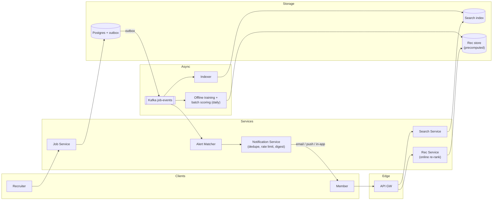
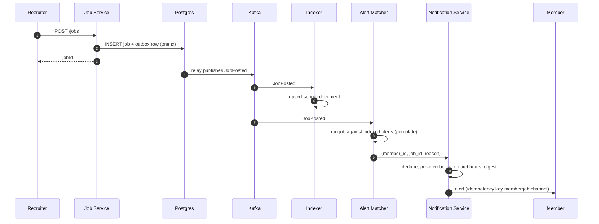
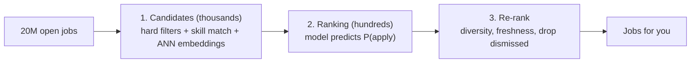

**Short answer:** Split it into three paths. Job posting is a normal transactional write (Postgres) that publishes a `JobPosted` event. Recommendations are a two-stage pipeline: cheap candidate retrieval (search index filters plus embedding similarity) followed by a ranking model, with results precomputed offline for most users and refreshed online. Notifications are an async fan-out consumer that matches new jobs to saved searches and recommended members, then rate-limits and batches before sending email, push or in-app alerts.

## Picture it







**How to read it:**
- Steps 1–3: posting is a plain transactional write; the job and an outbox row commit together.
- Steps 4–6: a relay publishes `JobPosted` to Kafka and the indexer makes the job searchable within about a minute.
- Steps 7–11: the Alert Matcher runs the new job against saved searches (the reverse of search), and the Notification Service dedupes, rate-limits and batches before anything reaches the member.
- The last picture is the recommendation funnel: cheap retrieval narrows 20M jobs to thousands, a model ranks them, business rules re-rank. Most members read the precomputed list from the Rec store.

## Requirements

Functional:
- Recruiters create, edit, close job posts (title, company, location, remote, skills, seniority, salary).
- Members search jobs with filters, and see a "Jobs for you" list.
- Members get notified about matching new jobs (saved searches, job alerts, "you're a top applicant").
- Apply, save, dismiss; these signals feed recommendations.

Non-functional:
- Search p99 < 300 ms; recommendations page < 200 ms (served from precomputed lists).
- New jobs searchable within about a minute; alerts within minutes (or daily digest).
- Highly available reads; posting can tolerate a short delay.

## Estimates

- Assume 20M open jobs, ~1M new jobs/day ≈ 12 writes/s (trivial).
- 100M daily active members; maybe 50M view jobs pages → ~600 reads/s average, a few thousand at peak.
- Job doc ~5 KB → 100 GB for open jobs: fits a sharded search cluster easily.
- Precomputed recs: 200M members × 200 job ids × 8 bytes ≈ 320 GB in a KV store.

## API

```text
POST /jobs                         {title, companyId, location, skills[], ...} -> {jobId}
PATCH /jobs/{id}  | POST /jobs/{id}/close
GET  /jobs/search?q=&location=&remote=&seniority=&cursor=
GET  /members/{id}/job-recommendations?cursor=
POST /members/{id}/job-alerts      {query, filters, frequency: INSTANT|DAILY}
POST /jobs/{id}/events             {type: VIEW|SAVE|APPLY|DISMISS}
```

## Data model

- **Postgres (source of truth):** `job(id, company_id, title, description, location_id, remote, seniority, salary_min, salary_max, status, posted_at, expires_at)`, `job_skill(job_id, skill_id)`, `job_alert(id, member_id, query, filters jsonb, frequency)`, `application(member_id, job_id, status, applied_at)`.
- **Search index (Elasticsearch/OpenSearch):** denormalised job document, sharded by job id.
- **Feature store / KV:** member features (skills, title, location, seniority, embedding), job features (embedding, popularity, applicant count).
- **Rec store (KV, e.g. Cassandra/Redis):** `member_id -> [(job_id, score)]`.
- **Event log (Kafka):** views, applies, dismissals, for training and real-time signals.

## Architecture

The diagram in **Picture it** above shows the components.

## Deep dives

**1. Recommendations.** Stage 1, candidate generation (thousands from 20M): filter by hard constraints (location or remote, seniority band, not applied, not expired) and retrieve by skill/title match plus approximate nearest neighbour on member and job embeddings. Stage 2, ranking (top hundreds): a model predicts P(apply) using member-job features (skill overlap, seniority fit, distance, company follow, job freshness, applicant count). Stage 3, re-rank for business rules: diversity of companies, freshness boost, remove jobs the member dismissed. Most members are served from the nightly precomputed list; a new job or new member activity triggers incremental recompute for affected members. Cold start: new members get rules-based results from profile title and location; new jobs get a freshness boost.

**2. Notifications fan-out.** On `JobPosted`, the Alert Matcher must find saved searches that match. Matching every job against every alert is the reverse of search, so use a percolator-style approach: index the alerts, then run each new job against them, or bucket alerts by (location, normalised title) and only test the bucket. Output `(member_id, job_id, reason)` to a notification queue. The Notification Service then dedupes (same job from two alerts), applies per-member caps (e.g. max N per day), honours quiet hours and preferences, and batches DAILY alerts into a digest. Idempotency key `member:job:channel` prevents duplicate sends on retry.

**3. Keeping index fresh.** Write job in Postgres plus an outbox row in one transaction; a relay publishes to Kafka; the indexer upserts the document. Closing or expiring a job must remove it from search and recommendation results quickly, so the rec service also filters candidates against a "closed jobs" set at read time.

## Trade-offs

- **Precomputed vs on-the-fly recs:** precomputed is cheap and fast but stale; online ranking is fresh but costly. Hybrid: precompute candidates, re-rank online with fresh signals.
- **Instant vs digest alerts:** instant drives engagement but risks spam; caps and digests protect the member.
- **Search index as read model:** eventual consistency (seconds) in exchange for rich filtering and relevance.

## Follow-ups

- *How do you measure recommendation quality?* Offline: precision/recall on held-out applies. Online: A/B test on apply rate per impression, not clicks alone.
- *Spam or fake jobs?* Moderation pipeline on post (classifier plus manual review), recruiter verification.
- *Scaling search?* Shard by job id, replicate shards for read throughput, route by region.

See [F5 · Case studies: chat, news feed, collaborative editor](../academy/lessons/F5.md) for feed fan-out and [F4 · Case studies: URL shortener, rate limiter, notification system](../academy/lessons/F4.md) for the notification pipeline.
