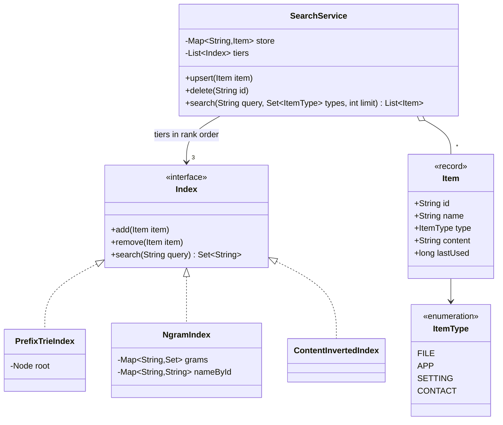
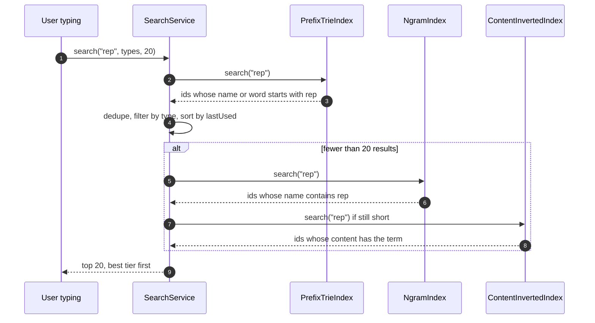

**Short answer:** Build three indexes and query them in rank order. A trie over item names (and name tokens) answers prefix matches fast. An n-gram (trigram) index over names finds substring matches. An inverted index over content tokens finds content matches. A query runs the cheapest, highest-ranked index first and stops once it has enough results, then filters by type. Every index supports `add` and `remove` per item, so an update is "remove old version, add new version", never a full rebuild.

## Picture it





**How to read it:**
- Every tier is an `Index` with the same three methods. `SearchService` holds them as an ordered list: prefix trie, then trigram substring, then content.
- A search asks the tiers in order. Each tier's hits are deduped (an item keeps its best tier), filtered by type and sorted by recency.
- As soon as the result list is full, the lower tiers are skipped. That early stop keeps typing-as-you-search instant.
- `upsert` removes the old version of an item from every index and adds the new one, so edits never need a full rebuild.

## Requirements

- Items are local objects (files, apps, settings, contacts) with id, name, type and content.
- Instant search as the user types; return top N (say 20).
- Ranking tiers: (1) name starts with the query, (2) name contains the query, (3) content contains the query terms. Within a tier, order by a secondary score (recency, frequency of use, shorter name).
- Filter by type (only files, only apps).
- Items are added, renamed, edited and deleted; the index updates incrementally.
- Case-insensitive. Out of scope: typo tolerance (extension), remote search.

## Classes

- `Item` (record): id, name, type, content, lastUsed.
- `ItemType` (enum).
- `ItemStore`: id → current `Item` (source of truth).
- `Index` (interface): `add(Item)`, `remove(Item)`, `search(String query, int limit)` returning ids.
- `PrefixTrieIndex`: trie of lower-cased name and name words; each node keeps the set of item ids under it (bounded).
- `NgramIndex`: trigram → set of ids; candidates are the intersection, then verified with `contains`.
- `ContentInvertedIndex`: token → set of ids.
- `Ranker`: applies tier order, then secondary score.
- `SearchService`: orchestrates indexes, filter and dedupe across tiers.
- `IndexUpdater`: listens to item change events and applies remove-then-add.

## Patterns used

- **Strategy / common interface** for indexes: each tier is an `Index`, and the tier list is just an ordered `List<Index>`. A new tier (fuzzy match) is a new class.
- **Observer**: the store publishes `ItemChanged`; the updater keeps indexes in sync.
- **Chain-like tiered evaluation**: stop once the result list is full, which is what makes it "instant".

## Code

```java
import java.util.*;

enum ItemType { FILE, APP, SETTING, CONTACT }
record Item(String id, String name, ItemType type, String content, long lastUsed) {}

interface Index {
    void add(Item item);
    void remove(Item item);
    Set<String> search(String query);
}

final class PrefixTrieIndex implements Index {
    private static final class Node {
        final Map<Character, Node> next = new HashMap<>();
        final Set<String> ids = new HashSet<>();     // every item whose key passes through here
    }
    private final Node root = new Node();

    // Index the full name and each word so "report" matches "Q3 Report.docx".
    private static List<String> keys(Item item) {
        String n = item.name().toLowerCase(Locale.ROOT);
        List<String> keys = new ArrayList<>(List.of(n));
        keys.addAll(Arrays.asList(n.split("[\\s._-]+")));
        return keys;
    }

    public void add(Item item) {
        for (String key : keys(item)) {
            Node cur = root;
            for (char c : key.toCharArray()) {
                cur = cur.next.computeIfAbsent(c, x -> new Node());
                cur.ids.add(item.id());
            }
        }
    }

    public void remove(Item item) {
        for (String key : keys(item)) {
            Node cur = root;
            for (char c : key.toCharArray()) {
                cur = cur.next.get(c);
                if (cur == null) break;
                cur.ids.remove(item.id());
            }
        }
    }

    public Set<String> search(String query) {
        Node cur = root;
        for (char c : query.toLowerCase(Locale.ROOT).toCharArray()) {
            cur = cur.next.get(c);
            if (cur == null) return Set.of();
        }
        return cur.ids;
    }
}

final class NgramIndex implements Index {
    private final Map<String, Set<String>> grams = new HashMap<>();
    private final Map<String, String> nameById = new HashMap<>();

    private static Set<String> trigrams(String s) {
        Set<String> out = new HashSet<>();
        for (int i = 0; i + 3 <= s.length(); i++) out.add(s.substring(i, i + 3));
        return out;
    }

    public void add(Item item) {
        String n = item.name().toLowerCase(Locale.ROOT);
        nameById.put(item.id(), n);
        for (String g : trigrams(n)) grams.computeIfAbsent(g, k -> new HashSet<>()).add(item.id());
    }

    public void remove(Item item) {
        String n = nameById.remove(item.id());
        if (n == null) return;
        for (String g : trigrams(n)) {
            Set<String> ids = grams.get(g);
            if (ids != null && ids.remove(item.id()) && ids.isEmpty()) grams.remove(g);
        }
    }

    public Set<String> search(String query) {
        String q = query.toLowerCase(Locale.ROOT);
        if (q.length() < 3) {                         // too short for trigrams: scan names
            Set<String> out = new HashSet<>();
            nameById.forEach((id, n) -> { if (n.contains(q)) out.add(id); });
            return out;
        }
        Set<String> candidates = null;
        for (String g : trigrams(q)) {
            Set<String> ids = grams.getOrDefault(g, Set.of());
            if (candidates == null) candidates = new HashSet<>(ids); else candidates.retainAll(ids);
            if (candidates.isEmpty()) return Set.of();
        }
        candidates.removeIf(id -> !nameById.get(id).contains(q));   // verify: grams can false-match
        return candidates;
    }
}

final class SearchService {
    private final Map<String, Item> store = new HashMap<>();
    private final List<Index> tiers;                  // [prefix, substring, content] in rank order

    SearchService(List<Index> tiers) { this.tiers = tiers; }

    public synchronized void upsert(Item item) {
        Item old = store.put(item.id(), item);
        for (Index ix : tiers) {
            if (old != null) ix.remove(old);
            ix.add(item);
        }
    }

    public synchronized void delete(String id) {
        Item old = store.remove(id);
        if (old != null) tiers.forEach(ix -> ix.remove(old));
    }

    public synchronized List<Item> search(String query, Set<ItemType> types, int limit) {
        LinkedHashSet<String> seen = new LinkedHashSet<>();
        List<Item> results = new ArrayList<>();
        for (Index tier : tiers) {
            tier.search(query).stream()
                .filter(seen::add)                                    // keep best tier only
                .map(store::get)
                .filter(it -> types.isEmpty() || types.contains(it.type()))
                .sorted(Comparator.comparingLong(Item::lastUsed).reversed()
                        .thenComparingInt(it -> it.name().length()))
                .forEach(results::add);
            if (results.size() >= limit) break;                      // lower tiers not needed
        }
        return results.size() > limit ? results.subList(0, limit) : results;
    }
}
```

`ContentInvertedIndex` is the same shape as `NgramIndex` but keyed by whole tokens from `content`, intersecting the posting sets for multi-word queries.

**Complexity**

- Prefix lookup: O(L) to walk the trie, plus the size of the result set.
- Substring: O(L) trigrams, intersection bounded by the smallest posting set, then verification.
- Update: O(name length × words) for trie and trigrams, O(content tokens) for content.
- Memory: the trie stores ids on every node, which is the main cost. Cap each node's set to the best M ids (by `lastUsed`) if memory matters; then very long result lists come from lower nodes.

## Extensions

- **Concurrency:** `synchronized` on the service is correct and simple. For many readers, use a `ReentrantReadWriteLock`, or build updates on a copy and swap an immutable snapshot via `volatile` reference (readers never block).
- **Type filter at scale:** keep one set of indexes per `ItemType`, or store `(id, type)` in postings so the filter is applied before sorting.
- **Typo tolerance:** add a fuzzy tier (edit distance 1 over trie paths) below substring.
- **Debounce keystrokes** (for example 50 ms) and reuse the previous prefix's trie node when the user appends one character.
- **Persistence:** index on a background thread at startup; serve partial results while it fills.
- **Ranking signals:** combine tier with a score (frequency of use, recency decay) as `tier * BIG + score` if the interviewer wants one sort instead of tier-by-tier.

Related: [E5 · The LLD interview method](../academy/lessons/E5.md), [B2 · Locks](../academy/lessons/B2.md).
