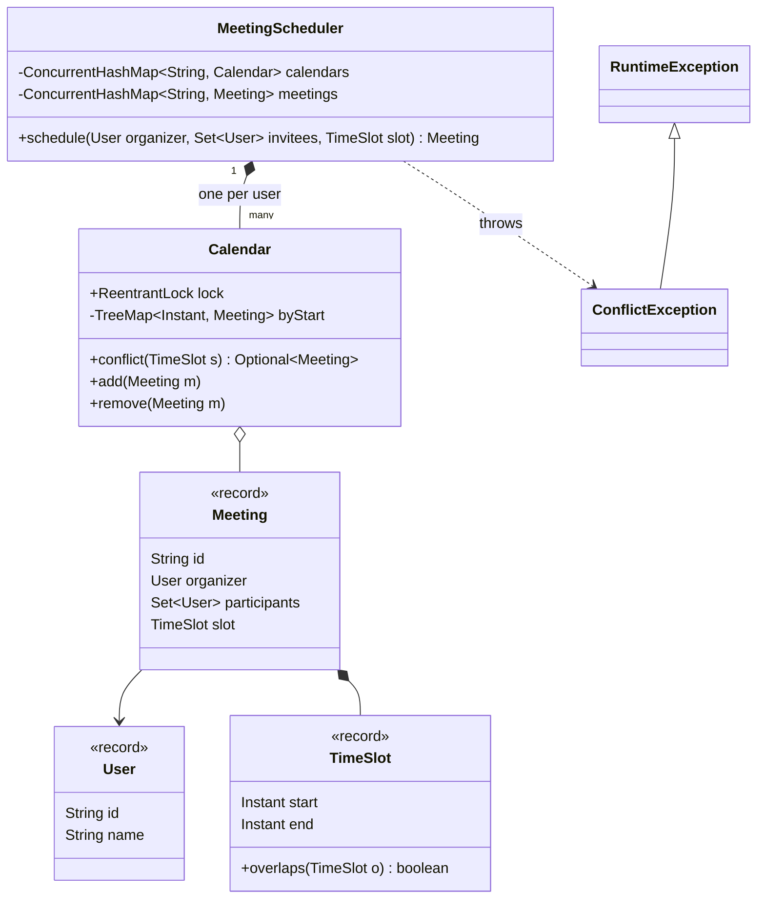
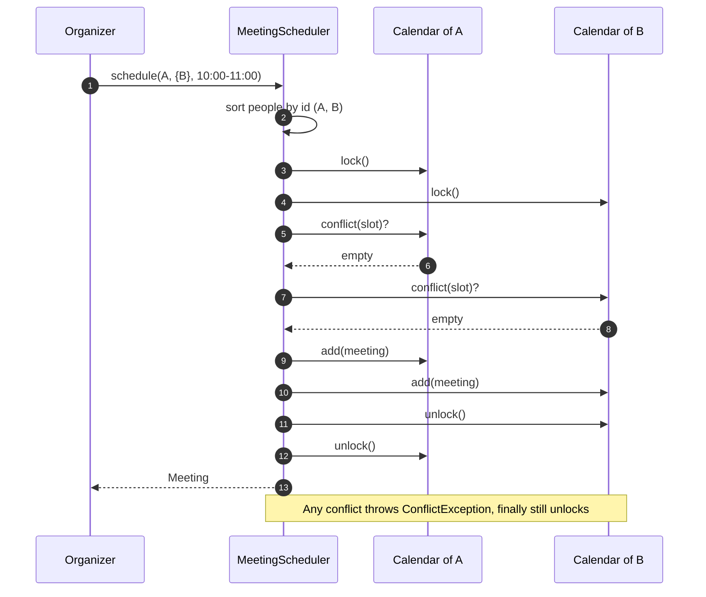

**Short answer:** Keep one calendar per participant, stored as a `TreeMap<start, Meeting>` so the overlap check is two O(log n) lookups (the meeting just before and just after the new start). A new meeting is accepted only if no participant's calendar overlaps it. For thread safety, lock every participant's calendar in a fixed order (sorted by user id), check all, then book all, so two concurrent bookings cannot both pass and there is no deadlock.

## Picture it





**How to read it:**
- Each user has one `Calendar`: a `TreeMap` of meetings by start time plus its own lock.
- The scheduler locks every participant's calendar in sorted id order, so two bookings can never deadlock.
- With all locks held it asks each calendar for a conflict; only the meeting just before and just after the start can overlap.
- If no one is busy, the meeting is added to every calendar, then the locks are released in reverse order.

## Requirements

- `schedule(organizer, participants, start, end)` creates a meeting or rejects it with the conflict reason.
- Conflict = time ranges overlap **and** at least one participant is shared. Half-open intervals `[start, end)`, so a 10:00–11:00 meeting and an 11:00–12:00 meeting do not clash.
- `cancel(meetingId)`, `meetingsFor(user, from, to)`.
- Many users booking at the same time; correctness under concurrency matters.
- Out of scope for the core: rooms, recurrence, time zones (listed under Extensions).

## Classes

- `User` (record: id, name).
- `TimeSlot` (record: start, end) with `overlaps(other)`.
- `Meeting` (record: id, organizer, participants, slot).
- `Calendar`: one per user, a `TreeMap<Instant, Meeting>` plus a `ReentrantLock`. Knows how to check and insert for that user only.
- `MeetingScheduler`: the service. Validates input, locks calendars in order, checks, books.
- `ConflictException` carrying the user and the clashing meeting.

## Patterns used

- No heavy pattern is needed; this is mostly a data-structure and locking question. Saying that honestly is better than forcing one.
- **Repository** style: `Calendar` stores, `MeetingScheduler` holds the booking rule (SRP).
- **Observer** is a natural extension for sending invites after a successful booking, kept outside the lock.

## Code

```java
record User(String id, String name) {}

record TimeSlot(Instant start, Instant end) {
    TimeSlot {
        if (!start.isBefore(end)) throw new IllegalArgumentException("start must be before end");
    }
    boolean overlaps(TimeSlot o) { return start.isBefore(o.end) && o.start.isBefore(end); }
}

record Meeting(String id, User organizer, Set<User> participants, TimeSlot slot) {}

final class Calendar {
    final ReentrantLock lock = new ReentrantLock();
    private final TreeMap<Instant, Meeting> byStart = new TreeMap<>();

    /** Caller must hold lock. Only neighbours can overlap because a user's meetings never overlap each other. */
    Optional<Meeting> conflict(TimeSlot s) {
        var before = byStart.floorEntry(s.start());
        if (before != null && before.getValue().slot().overlaps(s)) return Optional.of(before.getValue());
        var after = byStart.ceilingEntry(s.start());
        if (after != null && after.getValue().slot().overlaps(s)) return Optional.of(after.getValue());
        return Optional.empty();
    }
    void add(Meeting m)    { byStart.put(m.slot().start(), m); }
    void remove(Meeting m) { byStart.remove(m.slot().start(), m); }
}

final class MeetingScheduler {
    private final ConcurrentHashMap<String, Calendar> calendars = new ConcurrentHashMap<>();
    private final ConcurrentHashMap<String, Meeting> meetings = new ConcurrentHashMap<>();

    Meeting schedule(User organizer, Set<User> invitees, TimeSlot slot) {
        var people = new TreeSet<User>(Comparator.comparing(User::id)); // fixed lock order
        people.addAll(invitees);
        people.add(organizer);

        List<Calendar> locked = new ArrayList<>();
        try {
            for (User u : people) {
                Calendar c = calendars.computeIfAbsent(u.id(), k -> new Calendar());
                c.lock.lock();
                locked.add(c);
            }
            for (User u : people) {
                calendars.get(u.id()).conflict(slot).ifPresent(m -> {
                    throw new ConflictException(u, m);
                });
            }
            var meeting = new Meeting(UUID.randomUUID().toString(), organizer, Set.copyOf(people), slot);
            locked.forEach(c -> c.add(meeting));
            meetings.put(meeting.id(), meeting);
            return meeting;
        } finally {
            for (int i = locked.size() - 1; i >= 0; i--) locked.get(i).lock.unlock();
        }
    }
}

final class ConflictException extends RuntimeException {
    ConflictException(User u, Meeting m) { super(u.id() + " is busy with meeting " + m.id()); }
}
```

Why the neighbour check is enough: within one user's calendar no two meetings overlap (we never insert a conflict), so meetings sorted by start also have sorted ends. Only the latest meeting starting at or before `s.start` and the first one starting at or after it can intersect `s`.

## Extensions

Follow-up: **locks, optimisations, trade-offs, some HLD.**

- **Locks.** A single global lock is correct and simple but serialises all bookings. Per-user locks allow unrelated bookings in parallel. Acquiring them in sorted id order prevents deadlock (two bookings for {A, B} and {B, A} both lock A first). `tryLock(timeout)` is an option if you prefer to fail fast over waiting.
- **Optimistic alternative.** Check without locks, then commit with a version check per calendar and retry on change. Better when conflicts are rare; worse under contention.
- **Rooms.** A room is just another `Calendar` in the same lock set. Finding a free room = iterate rooms with enough capacity and try each.
- **Find a free slot for everyone.** Merge the busy intervals of all participants (sort by start, merge), then scan the gaps for one at least the needed length.
- **Recurrence.** Store a rule (RRULE-like) and expand occurrences within a horizon for conflict checks.
- **HLD.** In a service, the database enforces it. In PostgreSQL, a `meeting_attendee(user_id, slot tstzrange)` table with an exclusion constraint `EXCLUDE USING gist (user_id WITH =, slot WITH &&)` rejects overlaps atomically (needs the `btree_gist` extension for the `=` on a scalar column). Invites go out through a queue after commit. Shard calendars by user id.
- **Complexity.** Booking with p participants and n meetings each: O(p log n), plus O(p log p) to sort.

Related: [B2 · Locks: synchronized, ReentrantLock, deadlock](../academy/lessons/B2.md), [Q6 · Transactions, isolation, locking and MVCC](../academy/lessons/Q6.md).
