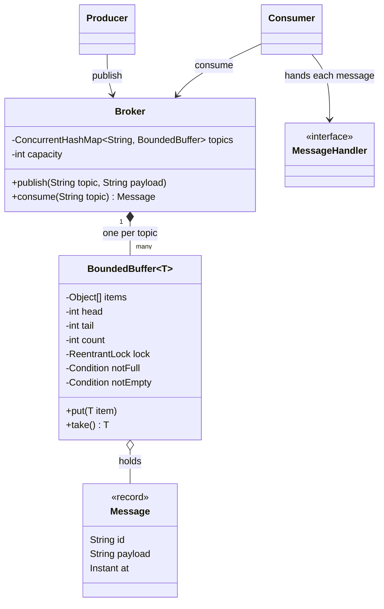
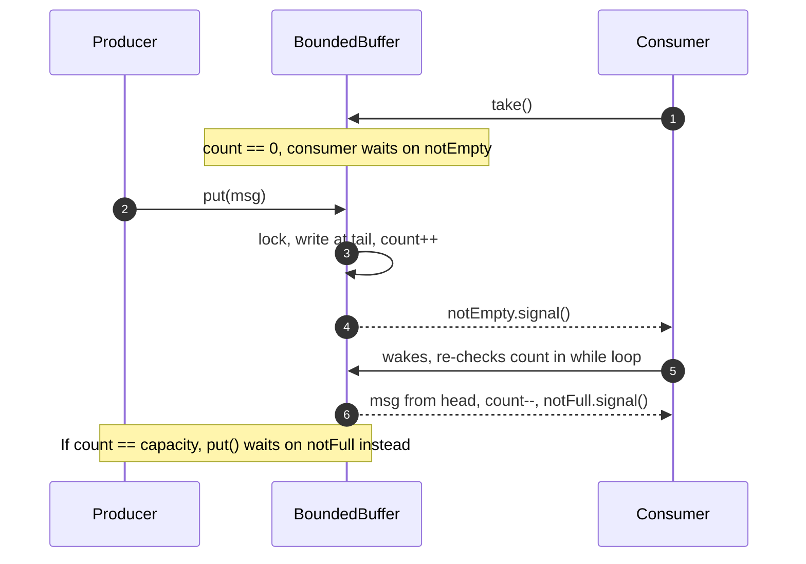

**Short answer:** The core is a bounded buffer shared by producers and consumers. Producers block when it is full, consumers block when it is empty. In Java I protect the buffer with one `ReentrantLock` and two `Condition`s (`notFull`, `notEmpty`), always waiting in a `while` loop. A semaphore version uses two counting semaphores for free and used slots plus a mutex for the buffer itself. Deadlock is avoided by having a single lock, never calling out while holding it, and always releasing in `finally`.

## Picture it





**How to read it:**
- The `Broker` keeps one `BoundedBuffer` per topic; producers and consumers only see the broker.
- All the concurrency lives inside the buffer: one lock and two conditions, `notFull` for producers and `notEmpty` for consumers.
- A consumer on an empty buffer sleeps on `notEmpty`; the next `put` signals it awake.
- Every wait sits in a `while` loop, so a woken thread checks the count again before acting.
- A full buffer makes producers wait on `notFull`, which is the back-pressure.

## Requirements

- Named topics. `publish(topic, message)` and `consume(topic)` (blocking), plus `poll(topic, timeout)`.
- Bounded capacity per topic for back-pressure; many producer and consumer threads.
- Each message goes to exactly one consumer of the topic (work-queue semantics).
- Clean shutdown. In memory, single process.

## Classes

- `Message` (record: id, payload, timestamp).
- `BoundedBuffer<T>`: the synchronised ring buffer. All the concurrency lives here.
- `Topic`: name plus a `BoundedBuffer<Message>`.
- `Broker`: registry of topics (`ConcurrentHashMap`), the public API.
- `Producer` / `Consumer`: thin clients that call the broker; a consumer runs a loop on its own thread and hands each message to a `MessageHandler`.

## Patterns used

- **Producer-consumer** (a concurrency pattern, not GoF) is the heart of it.
- **Monitor object**: the buffer encapsulates its lock and conditions, so callers cannot misuse them.
- **Strategy** for `MessageHandler`, so consumers plug in their logic.
- **Facade**: `Broker` hides topics and buffers.

## Code

```java
record Message(String id, String payload, Instant at) {}

final class BoundedBuffer<T> {
    private final Object[] items;
    private int head, tail, count;
    private final ReentrantLock lock = new ReentrantLock();
    private final Condition notFull = lock.newCondition();
    private final Condition notEmpty = lock.newCondition();

    BoundedBuffer(int capacity) { items = new Object[capacity]; }

    void put(T item) throws InterruptedException {
        lock.lockInterruptibly();
        try {
            while (count == items.length) notFull.await();   // while, not if: spurious wakeups
            items[tail] = item;
            tail = (tail + 1) % items.length;
            count++;
            notEmpty.signal();
        } finally {
            lock.unlock();
        }
    }

    @SuppressWarnings("unchecked")
    T take() throws InterruptedException {
        lock.lockInterruptibly();
        try {
            while (count == 0) notEmpty.await();
            T item = (T) items[head];
            items[head] = null;                               // let GC reclaim it
            head = (head + 1) % items.length;
            count--;
            notFull.signal();
            return item;
        } finally {
            lock.unlock();
        }
    }
}

final class Broker {
    private final ConcurrentHashMap<String, BoundedBuffer<Message>> topics = new ConcurrentHashMap<>();
    private final int capacity;
    Broker(int capacity) { this.capacity = capacity; }

    void publish(String topic, String payload) throws InterruptedException {
        topics.computeIfAbsent(topic, t -> new BoundedBuffer<>(capacity))
              .put(new Message(UUID.randomUUID().toString(), payload, Instant.now()));
    }
    Message consume(String topic) throws InterruptedException {
        return topics.computeIfAbsent(topic, t -> new BoundedBuffer<>(capacity)).take();
    }
}
```

The semaphore variant, for the "mutex vs semaphore" discussion:

```java
final class SemaphoreBuffer<T> {
    private final Deque<T> items = new ArrayDeque<>();
    private final Semaphore free, used = new Semaphore(0);
    private final Object mutex = new Object();
    SemaphoreBuffer(int capacity) { free = new Semaphore(capacity); }

    void put(T t) throws InterruptedException {
        free.acquire();                       // wait for a slot BEFORE taking the mutex
        synchronized (mutex) { items.addLast(t); }
        used.release();
    }
    T take() throws InterruptedException {
        used.acquire();
        T t;
        synchronized (mutex) { t = items.removeFirst(); }
        free.release();
        return t;
    }
}
```

## Extensions

- **Mutex vs semaphore.** A mutex (lock) gives exclusive access and has an owner: only the thread that locked it may unlock it. A counting semaphore holds N permits, has no owner, and any thread may release. Here the semaphores count slots, and the mutex protects the deque itself. A binary semaphore can act like a mutex but loses the ownership check and reentrancy.
- **Deadlock prevention.** In the semaphore version, acquiring `free` *inside* the mutex would deadlock: a producer holds the mutex while waiting for a slot, and a consumer cannot get the mutex to free one. Rules: one lock where possible; a global lock order when you need several; never call user code (handlers) while holding the lock; `tryLock` with a timeout where waiting forever is unacceptable. The four Coffman conditions (mutual exclusion, hold and wait, no preemption, circular wait) all must hold for deadlock; break one.
- **Why `signal` not `signalAll`.** With separate conditions for "not full" and "not empty", one signal wakes the right kind of waiter. With a single `wait/notify` monitor you must use `notifyAll`, or a producer could wake another producer and everyone sleeps.
- **In production use `ArrayBlockingQueue`** (one lock, two conditions, same design) or `LinkedBlockingQueue` (separate put and take locks, so producers and consumers do not contend).
- **Pub-sub / consumer groups.** Store messages in an append-only log per topic; each group keeps its own offset. That is the Kafka model and allows replay.
- **Delivery guarantees.** Add ack and redelivery: a taken message moves to an in-flight map with a deadline; if no ack arrives, it is put back. That gives at-least-once, so handlers must be idempotent.
- **Shutdown.** Interrupt consumer threads (the `lockInterruptibly` and `await` calls respond), or publish a poison-pill message per consumer.

Related: [B7 · Classic problems](../academy/lessons/B7.md), [B2 · Locks](../academy/lessons/B2.md), [B3 · Atomics, CAS and concurrent collections](../academy/lessons/B3.md).
