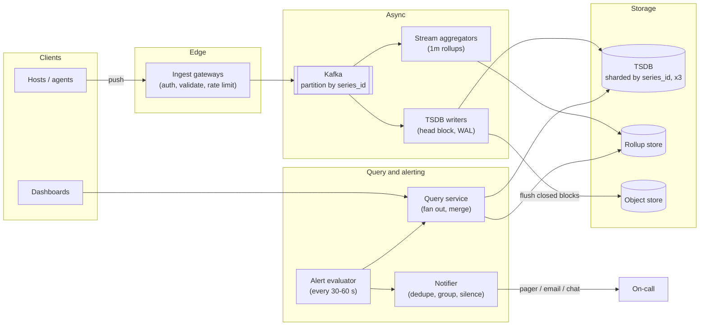
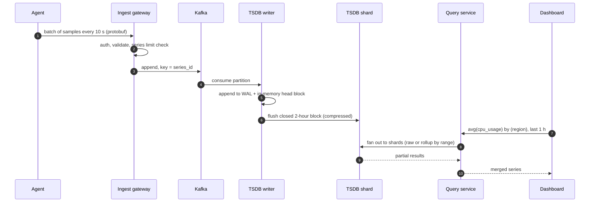
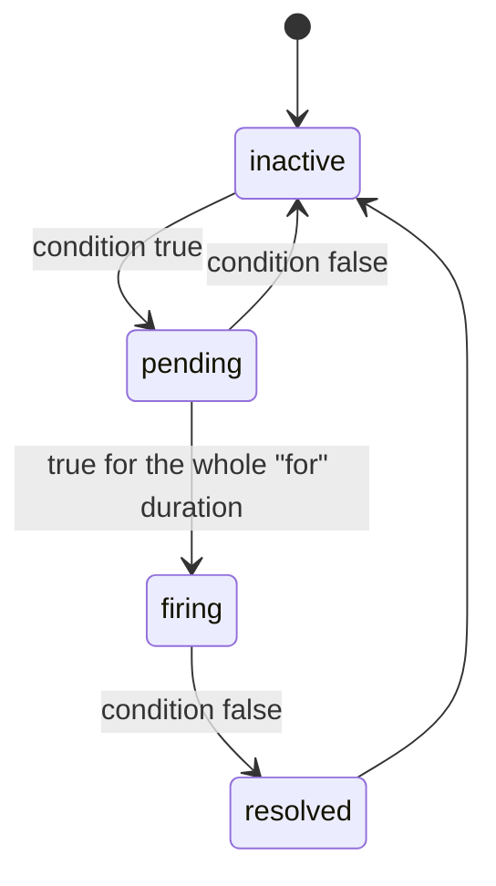

**Short answer:** Agents on each host collect metrics and push them (or a collector scrapes them) into a durable queue like Kafka. Stream processors pre-aggregate into fixed time buckets, and a time-series database stores them with compression and downsampling (raw for days, 1-minute for weeks, 1-hour for a year). A query service reads the TSDB for dashboards, and a separate alert evaluator runs rules on a schedule and sends notifications. The hardest parts are write volume, high cardinality of labels, and keeping alerting working when the pipeline itself is in trouble.

## Picture it







**How to read it:**
- Steps 1–3: agents push batches; stateless gateways check auth and cardinality limits, then write to Kafka, which absorbs spikes.
- Steps 4–6: TSDB writers keep the current block in memory with a WAL for crash safety and flush closed, compressed blocks. Partitioning by `series_id` keeps one series on one shard.
- Steps 7–10: the query service picks raw data or a rollup based on the time range, fans out to shards and merges.
- The state picture is one alert rule: it only fires after the condition holds for the `for` duration, and the notifier groups, silences and escalates.

## Requirements

Functional:
- Ingest metrics: `name`, labels (host, service, region, ...), timestamp, value. Counters, gauges, histograms.
- Query: time range, filters on labels, aggregations (sum, avg, p99, rate), group by label.
- Dashboards and alert rules (`p99 latency > 500 ms for 5 min`), notifications to email/pager/Teams.

Non-functional:
- Very write-heavy; reads are smaller but must be fast for recent data (dashboards < 1 s).
- Ingestion must not lose data during spikes; small delays are acceptable.
- Alerting must be more available than everything else.
- Retention: 1 year, cost-efficient.

## Estimates

- 100k hosts × 1,000 series each = 100M active series.
- One sample per series every 10 s → 10M samples/s.
- Raw sample 16 bytes (timestamp + double); with Gorilla-style delta-of-delta and XOR compression, roughly 1–2 bytes/sample. At ~1.5 bytes: 10M × 1.5 × 86,400 ≈ 1.3 TB/day raw.
- Keep raw 15 days (~20 TB), 1-minute rollups for 90 days, 1-hour rollups for a year: much smaller.

## API

```text
POST /v1/metrics   (batch, protobuf)  [{name, labels{}, samples[(ts, value)]}]
GET  /v1/query?expr=avg(cpu_usage{service="api"}) by (region)&start=&end=&step=60s
POST /v1/alerts    {expr, threshold, for: "5m", severity, channels[]}
GET  /v1/alerts/{id}/state
```

## Data model

- **Series identity:** `series_id = hash(name + sorted labels)`.
- **Inverted index:** `label=value -> set of series_id` (posting lists), so `service="api" AND region="eu"` is a set intersection.
- **Chunks:** per series, per 2-hour block, a compressed array of `(ts, value)`. Blocks are immutable once closed, then compacted and downsampled.
- **Rollup tables:** `(series_id, bucket_start, min, max, sum, count)`; percentiles need histogram buckets or sketches (t-digest, DDSketch), because you cannot average percentiles.
- **Metadata (Postgres):** dashboards, alert rules, notification channels, silences.

## Architecture

The diagram in **Picture it** above shows the components.

## Deep dives

**1. Write path.** Agents batch and compress (every 10 s). Gateways are stateless and write to Kafka, which absorbs spikes and lets TSDB nodes fall behind without dropping data. TSDB writers keep the current block in memory, append to a write-ahead log for crash recovery, and flush closed blocks to disk or object storage. Partitioning by `series_id` keeps a series on one shard, so its chunk compresses well and range queries hit one place.

**2. Cardinality.** The real danger is labels like `user_id` or `request_id`: each unique combination is a new series, so memory and index size explode. Defences: per-tenant series limits enforced at the gateway, label allow-lists, and dropping or hashing high-cardinality labels. Mention this early; senior interviewers expect it.

**3. Alerting reliability.** The evaluator queries recent data (last few minutes), keeps state per rule (`pending` → `firing` after the `for` duration → `resolved`) and sends notifications through a notifier that groups related alerts, applies silences and escalates. Run evaluators as a replicated pair with the notifier deduping, so one evaluator dying does not silence alerts. Also alert on **absence of data** ("no samples from service X for 5 min"), and monitor the monitoring system from a separate, smaller stack.

## Trade-offs

- **Push vs pull:** pull (Prometheus style) gives easy "is the target up" detection and server-controlled rate; push works better for short-lived jobs and across firewalls. Many systems support both.
- **TSDB vs SQL:** Postgres with time partitioning works for modest volumes; at 10M samples/s you need a purpose-built TSDB (columnar, compressed, append-only).
- **Pre-aggregation vs raw:** rollups make long-range queries cheap but lose detail; keep raw for a short window.
- **Exactness:** percentiles from sketches are approximate but mergeable across hosts, which exact values are not.

## Follow-ups

- *Late or out-of-order samples?* Accept within a window (e.g. the open head block); drop or side-store beyond it.
- *Multi-tenant fairness?* Per-tenant quotas on ingest and query cost.
- *Query of a year of data?* Read the hourly rollup, not raw; the query planner chooses resolution from the range and step.

See [F6 · Case studies: distributed cache, metrics & monitoring](../academy/lessons/F6.md) and [Q8 · Scaling databases: replicas, partitioning, sharding, caching, CQRS](../academy/lessons/Q8.md).
