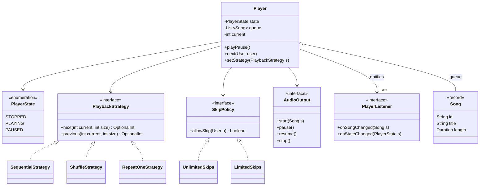
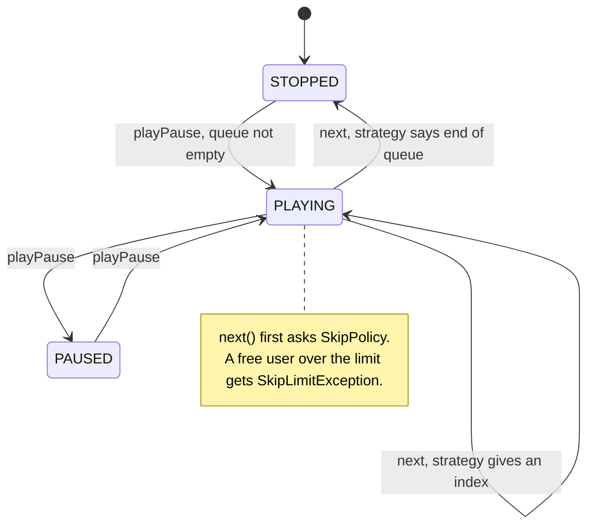

**Short answer:** Split the catalogue (Song, Album, Artist, Playlist), the user side (User, Library, Subscription) and the playback engine (Player, PlayQueue, playback state). The Player is a small state machine (STOPPED, PLAYING, PAUSED), the order of the next song comes from a pluggable `PlaybackStrategy` (sequential, shuffle, repeat-one), and UI parts subscribe to player events. The interviewer asked for classes, interfaces and enums, so I keep code to signatures and the one or two methods that carry logic.

## Picture it





**How to read it:**
- `Player` is the hub; everything it depends on is an interface, so tiers, play order and the sound device are swappable.
- `PlaybackStrategy` decides which index plays next (sequential, shuffle, repeat-one); `SkipPolicy` decides whether a skip is allowed.
- The state diagram is the whole `playPause()` switch: STOPPED starts the queue, PLAYING and PAUSED toggle.
- On `next`, an empty answer from the strategy stops the player; otherwise it plays the new song.
- Every song or state change is pushed to `PlayerListener`s (now-playing bar, analytics) without Player knowing them.

## Requirements

- Browse and search songs, albums, artists.
- Users create playlists, like songs, follow artists.
- Player: play, pause, resume, next, previous, seek; queue; shuffle and repeat modes.
- Free vs premium: free users get ads and limited skips (assumed rule: 6 skips per hour).
- Out of scope: audio decoding, streaming protocol, recommendations (mentioned in Extensions).

## Classes

- Catalogue: `Song` (id, title, duration, artistIds, albumId), `Album`, `Artist`. Immutable records.
- `Playlist`: owner, name, ordered song ids, visibility. Mutable list behind methods.
- `User`, `Subscription` (enum tier FREE / PREMIUM), `Library` (liked songs, saved playlists, followed artists).
- `CatalogService` (search), `PlaylistService` (CRUD, sharing).
- `PlayQueue`: the songs to play and the current index.
- `PlaybackStrategy` (interface): `SequentialStrategy`, `ShuffleStrategy`, `RepeatOneStrategy`.
- `Player`: holds `PlayerState`, the queue, the strategy, and a list of `PlayerListener`s.
- `SkipPolicy` (interface): `UnlimitedSkips` for premium, `LimitedSkips` for free.
- `AudioOutput` (interface): the actual sound device or stream, so Player is testable.

## Patterns used

- **State**: Player behaviour depends on `PlayerState`. With three states an enum plus a `switch` is enough; if states gain more behaviour (BUFFERING, AD_PLAYING), move to State classes.
- **Strategy**: `PlaybackStrategy` for next-song order, `SkipPolicy` for tier rules. Adding "smart shuffle" means one new class (Open/Closed).
- **Observer**: `PlayerListener` lets the now-playing bar, scrobbling and analytics react without the Player knowing them.
- **Dependency inversion**: Player depends on `AudioOutput`, not on a concrete device.

## Code

```java
enum PlayerState { STOPPED, PLAYING, PAUSED }
enum Tier { FREE, PREMIUM }

record Song(String id, String title, Duration length, List<String> artistIds, String albumId) {}
record Album(String id, String title, String artistId, List<String> songIds) {}
record Artist(String id, String name) {}

final class Playlist {
    private final String id, ownerId;
    private String name;
    private final List<String> songIds = new ArrayList<>();
    // add(songId), remove(index), move(from, to), songIds() returns a copy
}

interface PlaybackStrategy {
    OptionalInt next(int current, int size);
    OptionalInt previous(int current, int size);
}

final class SequentialStrategy implements PlaybackStrategy {
    public OptionalInt next(int cur, int size) { return cur + 1 < size ? OptionalInt.of(cur + 1) : OptionalInt.empty(); }
    public OptionalInt previous(int cur, int size) { return OptionalInt.of(Math.max(0, cur - 1)); }
}

final class ShuffleStrategy implements PlaybackStrategy {
    private int[] order = new int[0];  // a shuffled permutation, so every song plays once
    private int pos;
    // next(): build a new permutation when size changes; return order[++pos] or empty at the end
    // previous(): return order[--pos]
}

interface PlayerListener { void onSongChanged(Song s); void onStateChanged(PlayerState s); }
interface SkipPolicy { boolean allowSkip(User u); }
interface AudioOutput { void start(Song s); void pause(); void resume(); void stop(); }

final class Player {
    private PlayerState state = PlayerState.STOPPED;
    private final List<Song> queue = new ArrayList<>();
    private int current = -1;
    private PlaybackStrategy strategy = new SequentialStrategy();
    private final SkipPolicy skipPolicy;
    private final AudioOutput out;
    private final List<PlayerListener> listeners = new CopyOnWriteArrayList<>();

    Player(SkipPolicy skipPolicy, AudioOutput out) { this.skipPolicy = skipPolicy; this.out = out; }

    void playPause() {
        switch (state) {
            case PLAYING -> { out.pause();  setState(PlayerState.PAUSED); }
            case PAUSED  -> { out.resume(); setState(PlayerState.PLAYING); }
            case STOPPED -> { if (!queue.isEmpty()) playAt(Math.max(current, 0)); }
        }
    }

    void next(User user) {
        if (!skipPolicy.allowSkip(user)) throw new SkipLimitException();
        strategy.next(current, queue.size()).ifPresentOrElse(this::playAt, this::stop);
    }

    void setStrategy(PlaybackStrategy s) { this.strategy = s; }

    private void playAt(int index) {
        current = index;
        Song s = queue.get(index);
        out.start(s);
        listeners.forEach(l -> l.onSongChanged(s));
        setState(PlayerState.PLAYING);
    }
    private void stop() { out.stop(); setState(PlayerState.STOPPED); }
    private void setState(PlayerState s) { state = s; listeners.forEach(l -> l.onStateChanged(s)); }
}
```

## Extensions

- **Song finishes on its own**: `AudioOutput` calls back `onTrackEnded()`, which runs the same `strategy.next` without consulting the skip policy.
- **Ads for free users**: add an `AD_PLAYING` state, which is the point to switch from an enum switch to State classes; skip and seek are disabled in that state.
- **Repeat all / repeat one**: more strategies; repeat-one returns `current`, repeat-all wraps with modulo.
- **Thread safety**: UI events and audio callbacks arrive on different threads. Simplest correct option: post every command to a single player thread (an event loop with a queue), so Player state needs no locks. Listeners are in a `CopyOnWriteArrayList` because they are read far more than changed.
- **Offline downloads**: a `DownloadManager` with a per-song state (QUEUED, DOWNLOADING, DONE, FAILED) and DRM licence expiry.
- **Search and recommendations** are services behind interfaces; the LLD only needs the seam.
- **Collaborative playlists**: permission check in `PlaylistService`; concurrent edits use a version number (optimistic locking).

Related: [E4 · Behavioural patterns](../academy/lessons/E4.md), [E5 · The LLD interview method](../academy/lessons/E5.md).
