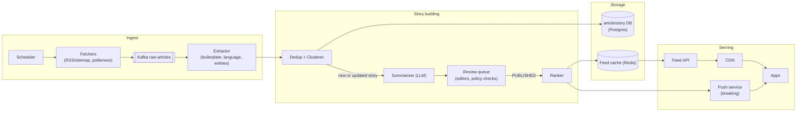
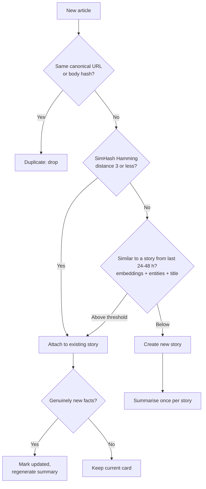
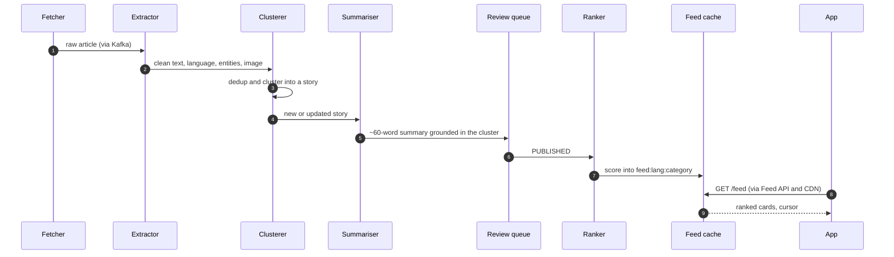

**Short answer:** Crawl publisher feeds (RSS/sitemaps first, page fetch second), extract and clean each article, then cluster articles about the same story using near-duplicate detection (SimHash/MinHash) plus embedding similarity and named entities within a time window. Generate one summary per story cluster (about 60 words, by an LLM or editors, with human review for sensitive topics), not per article. Serve a ranked, paginated feed per user and language from a cache, with push notifications for breaking stories.

## Picture it







**How to read it:**
- Steps 1–2: fetchers pull feeds politely and the extractor turns HTML into clean text with language, entities and image.
- Step 3 is the decision tree: exact match, then near-duplicate SimHash, then "same story, different writing" within a 48-hour window. Only a new story or genuinely new facts lead to a summary.
- Steps 4–6: one summary per story, grounded in the cluster's articles, with human review for sensitive topics.
- Steps 7–9: the ranker writes scored story ids into Redis every minute; the feed is served from cache and CDN, and breaking stories also go to the push service.

## Requirements

Functional:
- Ingest news from thousands of sources in several languages.
- One short summary card per story: headline, ~60-word summary, image, link to the source.
- Feed by category and language; personalised ordering; bookmarks; breaking-news push.

Non-functional:
- Fresh: breaking story on the feed within a few minutes.
- No duplicate cards for the same story.
- Feed reads are heavy and must be fast (< 200 ms); writes are modest.

## Estimates

- 5,000 sources, ~200k articles/day ≈ 2–3/s ingest. Clustering reduces that to maybe 10–20k stories/day.
- 20M daily users × 50 card views ≈ 1B card reads/day ≈ 12k/s average, spikes higher. Feeds must come from cache/CDN.
- Story card ~2 KB → 40 MB/day of summaries; images served by CDN.

## API

```text
GET  /feed?lang=en&category=top&cursor=      -> [{storyId, headline, summary, imageUrl, sourceUrl, publishedAt}]
GET  /stories/{id}
POST /users/{id}/bookmarks   {storyId}
POST /events                 [{storyId, type: VIEW|READ_MORE|SHARE, dwellMs}]
```

## Data model

- `source(id, name, feed_url, language, trust_score, crawl_interval)`
- `article(id, source_id, url UNIQUE, url_hash, title, body, simhash, embedding, entities jsonb, published_at, story_id)`
- `story(id, language, category, headline, summary, image_url, primary_article_id, status DRAFT|PUBLISHED, importance, first_seen, updated_at)`
- `user_pref(user_id, languages, categories)`, `bookmark(user_id, story_id)`
- Feed cache (Redis): `feed:{lang}:{category}` → sorted set of story ids by score.

## Architecture

The diagram in **Picture it** above shows the components.

## Deep dives

**1. Avoiding duplicate summaries (the follow-up).** Three layers:
- *Exact:* canonical URL (strip tracking params) and a hash of the cleaned body. Catches syndicated copies.
- *Near-duplicate:* SimHash of the body; Hamming distance ≤ 3 on 64 bits means the same text with small edits. Wire-agency stories republished by many outlets fall here.
- *Same story, different writing:* compare a new article only against stories from the last 24–48 hours in the same language (keeps it cheap). Score = cosine similarity of embeddings + overlap of named entities (people, places, organisations) + title similarity. Above a threshold → attach to the existing story; otherwise create a new story.

The summary is written per story. When a new article joins a story with genuinely new facts (casualty count changed, verdict announced), mark the story `updated` and regenerate the summary, rather than adding a second card.

**2. Summarisation quality.** LLM summaries are fast but can invent facts. Ground the prompt in the cluster's articles only, prefer the most trusted source, check that numbers and names in the summary appear in the source text, and route politics/health/disaster stories to human review. Store which model and prompt version produced each summary for audit.

**3. Feed ranking and serving.** Score = importance (cluster size, source trust, velocity of new articles) × freshness decay × user affinity (categories read, dwell time). The global ranked list per language/category is computed every minute into Redis; personalisation re-orders the top few hundred at request time. Cursor pagination on (score, storyId) avoids duplicates when the list shifts.

## Trade-offs

- **Per-article vs per-story summaries:** per-story cuts noise and cost but needs reliable clustering; wrong merges are worse than duplicates, so tune thresholds for precision.
- **LLM vs editors:** LLMs scale to many languages; editors give trust. Hybrid with review for sensitive categories.
- **Global feed vs fully personalised:** global lists cache well; personalisation adds compute. Re-ranking the top N is a cheap middle ground.

## Follow-ups

- *Copyright?* Short summary plus link to the publisher; respect robots.txt and publisher agreements.
- *Breaking news push?* Trigger when a story's velocity crosses a threshold; cap pushes per user per day.
- *Offline reading?* App prefetches the top N cards.

See [F5 · Case studies: chat, news feed, collaborative editor](../academy/lessons/F5.md).
