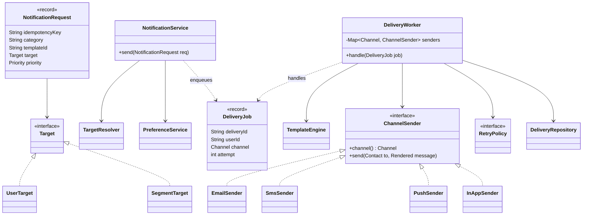
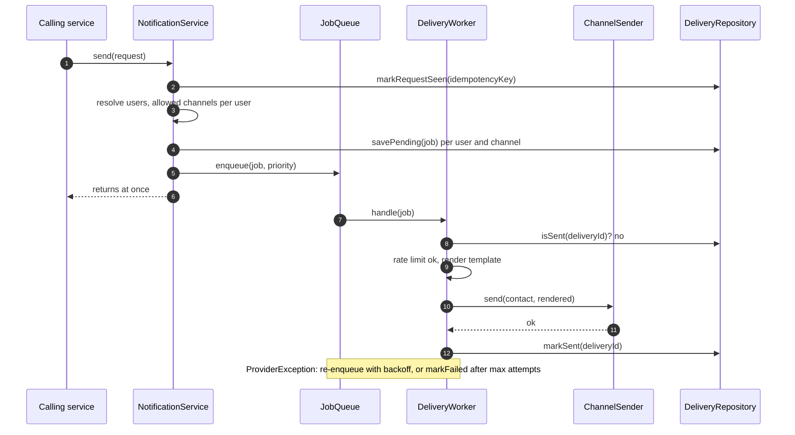

**Short answer:** Other services call one API: `send(NotificationRequest)` with a template id, target users and data. The module resolves the users' channel preferences, renders the template per channel, and hands each delivery to a channel sender (email, SMS, push, in-app) behind one `ChannelSender` interface. Sending is asynchronous through a queue with retries, idempotency keys and per-user rate limits. Observer is not the core here: callers know exactly when to notify, so what matters is a clean request contract, preferences, templates, and reliable delivery.

## Picture it





**How to read it:**
- Callers make one call, `send(request)`; it returns as soon as jobs are queued, so a slow provider never blocks them.
- `NotificationService` fans out: one `DeliveryJob` per user and allowed channel, saved as PENDING and then queued.
- `DeliveryWorker` does the real work: dedupe by `deliveryId`, rate limit, render, then call the right `ChannelSender`.
- New channels are new `ChannelSender` classes; the worker picks one from its registry map by `Channel`.
- Failures go back on the queue with a delay from `RetryPolicy`, and end as FAILED (then the dead-letter queue) when retries run out.

## Requirements

- Functional: any internal service can notify one user, a list of users, or a segment; channels email, SMS, push, in-app; templates with variables; user preferences (opt-out per channel and per category); priority (OTP is urgent, marketing is not); delivery status.
- Non-functional: callers never block on a slow provider; at-least-once delivery without duplicates for the user; easy to add a channel or provider; rate limits per user and per provider.

## Classes

- `NotificationRequest` (record): idempotencyKey, category, templateId, `Target`, data map, priority.
- `Target` (sealed): `UserTarget(ids)`, `SegmentTarget(segmentId)`.
- `NotificationService`: the entry point. Validates, persists the request, enqueues one job per (user, channel).
- `TargetResolver`: expands a segment to user ids (paged).
- `PreferenceService`: which channels this user allows for this category, and the contact details.
- `TemplateEngine`: renders subject and body per channel and locale.
- `ChannelSender` (interface) with `EmailSender`, `SmsSender`, `PushSender`, `InAppSender`. Each wraps a provider client.
- `DeliveryWorker`: takes jobs from the queue, checks rate limit and dedupe, calls the sender, records status, schedules retries.
- `RetryPolicy` (interface): exponential backoff with a max attempt count, then a dead-letter queue.
- `DeliveryRepository`: status per delivery (PENDING, SENT, FAILED, SKIPPED).

## Patterns used

- **Strategy** for `ChannelSender` and `RetryPolicy`: new channel = new class plus registration, no edits to the service (Open/Closed).
- **Factory / registry**: `Map<Channel, ChannelSender>` built by Spring from all sender beans.
- **Template Method** is optional for senders that share render-validate-send steps.
- **Producer-consumer** via the queue to decouple callers from providers.
- **Adapter** around each third-party provider so swapping SMS vendors does not leak.
- **Observer** fits only for the *status* side: other modules can subscribe to "delivery failed" events. For triggering sends, a direct API call is clearer than having the notifier observe every service.

## Code

```java
enum Channel { EMAIL, SMS, PUSH, IN_APP }
enum Priority { HIGH, NORMAL, LOW }

sealed interface Target permits UserTarget, SegmentTarget {}
record UserTarget(List<String> userIds) implements Target {}
record SegmentTarget(String segmentId) implements Target {}

record NotificationRequest(String idempotencyKey, String category, String templateId,
                           Target target, Map<String, Object> data, Priority priority) {}

record DeliveryJob(String deliveryId, String requestKey, String userId, Channel channel,
                   String templateId, Map<String, Object> data, int attempt) {}

record Rendered(String subject, String body) {}
record Contact(String address) {}

interface ChannelSender {
    Channel channel();
    void send(Contact to, Rendered message) throws ProviderException;
}

final class NotificationService {
    private final TargetResolver targets;
    private final PreferenceService prefs;
    private final JobQueue queue;
    private final DeliveryRepository repo;

    /** Returns quickly; delivery happens on workers. */
    void send(NotificationRequest req) {
        if (!repo.markRequestSeen(req.idempotencyKey())) return;   // caller retried: ignore
        for (String userId : targets.resolve(req.target())) {
            for (Channel ch : prefs.allowedChannels(userId, req.category())) {
                var job = new DeliveryJob(UUID.randomUUID().toString(), req.idempotencyKey(),
                                          userId, ch, req.templateId(), req.data(), 0);
                repo.savePending(job);
                queue.enqueue(job, req.priority());
            }
        }
    }
}

final class DeliveryWorker {
    private final Map<Channel, ChannelSender> senders;   // registry
    private final TemplateEngine templates;
    private final PreferenceService prefs;
    private final RateLimiter limiter;
    private final RetryPolicy retry;
    private final JobQueue queue;
    private final DeliveryRepository repo;

    void handle(DeliveryJob job) {
        if (repo.isSent(job.deliveryId())) return;                    // at-least-once queue, dedupe here
        if (!limiter.tryAcquire(job.userId(), job.channel())) {
            queue.enqueueDelayed(job, Duration.ofMinutes(1));
            return;
        }
        try {
            Rendered msg = templates.render(job.templateId(), job.channel(), job.data());
            senders.get(job.channel()).send(prefs.contact(job.userId(), job.channel()), msg);
            repo.markSent(job.deliveryId());
        } catch (ProviderException e) {
            retry.nextDelay(job.attempt()).ifPresentOrElse(
                d -> queue.enqueueDelayed(withAttempt(job, job.attempt() + 1), d),
                () -> repo.markFailed(job.deliveryId(), e.getMessage()));     // then to the DLQ
        }
    }
    private static DeliveryJob withAttempt(DeliveryJob j, int a) {
        return new DeliveryJob(j.deliveryId(), j.requestKey(), j.userId(), j.channel(), j.templateId(), j.data(), a);
    }
}
```

## Extensions

- **Why not Observer first.** The interviewer pushed back on that because Observer answers "who gets told when X changes" inside one process. The real problems are the contract for many callers, preferences, fan-out to large segments, provider failures and duplicates. Mention Observer for status events, not as the design.
- **Large segments.** `TargetResolver` pages through users and enqueues in batches, so a 10M-user campaign does not build one huge list in memory.
- **Priorities.** Separate queues (or topics) per priority with more workers on HIGH, so a marketing blast never delays an OTP.
- **Exactly-once to the user** is not achievable end to end with external providers; aim for at-least-once plus dedupe by `deliveryId`, and pass the id to providers that support idempotency keys.
- **Provider failover.** A `CompositeSmsSender` tries provider A, then B, with a circuit breaker per provider.
- **Quiet hours and digests.** A `SchedulingPolicy` delays LOW priority jobs to the user's daytime, or batches them into a digest.
- **Concurrency.** Workers are stateless; scale them horizontally. Rate limiting must be shared (Redis token bucket) once there is more than one worker instance.
- **In-app channel** writes to a `user_notification` table read by the app, with unread counts.

Related: [E6 · LLD case studies](../academy/lessons/E6.md), [F4 · Case studies: URL shortener, rate limiter, notification system](../academy/lessons/F4.md), [E4 · Behavioural patterns](../academy/lessons/E4.md).
