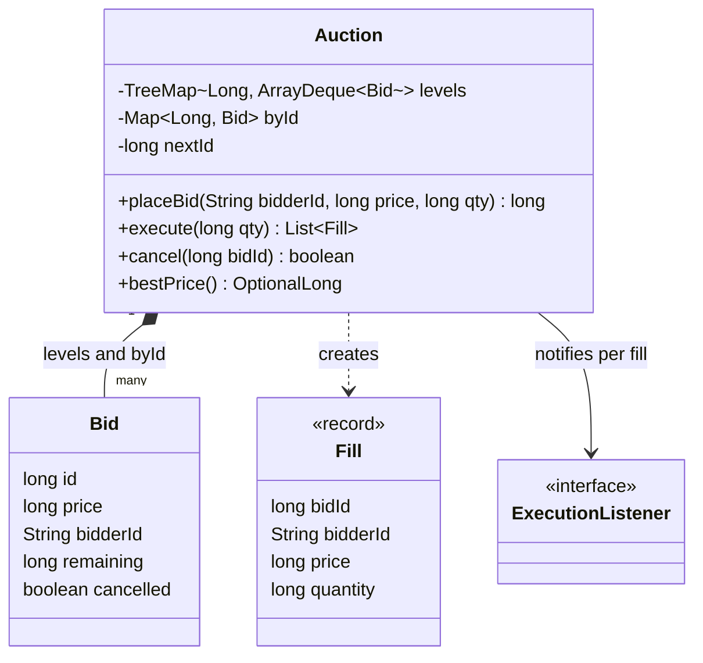
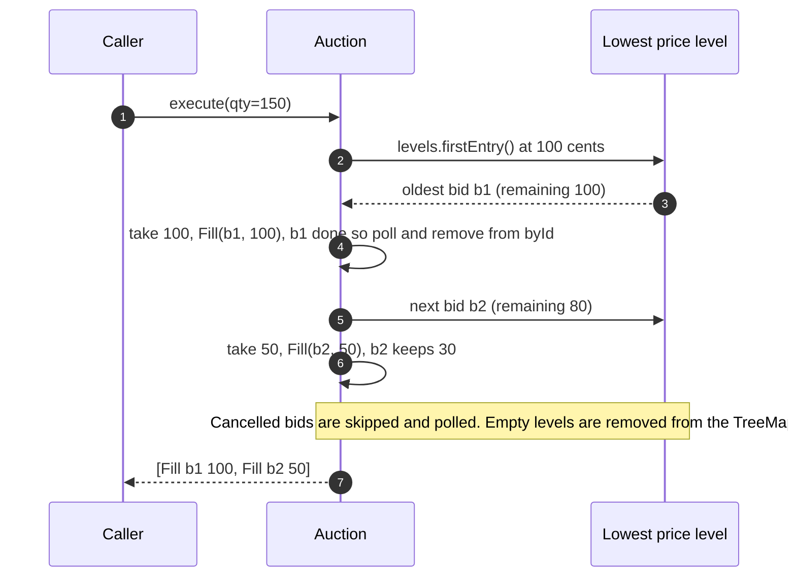

**Short answer:** I read the prompt as a reverse auction: sellers submit bids (price, quantity), and each execution fills against the lowest price first, oldest bid first on a tie. Store bids in a `TreeMap<price, Deque<Bid>>` (price levels, FIFO inside a level) plus a `HashMap<id, Bid>` for cancels. Add and execute are O(log P) where P is the number of distinct prices; a min-heap also works but needs lazy deletion for cancels.

## Picture it





**How to read it:**
- `Auction` owns everything: a `TreeMap` from price to a FIFO queue of bids (lowest price first) and a `byId` map for cancels.
- `execute` always works on the first (cheapest) level and the head (oldest) bid in it: price first, then time.
- Each slice taken becomes a `Fill`; a bid that hits zero is removed, and an empty level leaves the tree.
- `cancel` only flips a flag in O(1); `execute` skips flagged bids when it reaches them.

## Requirements

Assumed scope (state it out loud, the prompt is short):

- `placeBid(bidderId, price, quantity)` returns a bid id.
- `execute(quantity)` buys up to `quantity` units from the cheapest bids, partially filling the last one, and returns the fills.
- `cancel(bidId)`.
- `bestPrice()`.
- Tie on price: earlier bid wins (price-time priority).
- Prices as `long` in the smallest unit (cents), never `double`.

If the interviewer meant a two-sided book (buyers and sellers), this becomes the ask side of [the order book design](design-order-book.md); the data structure is the same.

## Classes

- `Bid`: id, bidderId, price, remaining quantity, sequence number. Mutable remaining quantity.
- `Fill` (record): bidId, bidderId, price, quantity.
- `PriceLevel`: a price plus a FIFO `ArrayDeque<Bid>` and total quantity.
- `Auction`: the book. Owns the `TreeMap` of levels and the id index; implements place, execute, cancel.
- `ExecutionListener` (interface): notified per fill (settlement, audit).

## Patterns used

- Mostly a data-structure question. The useful design ideas are **encapsulation** (only `Auction` mutates bids) and **Observer** for fill notifications so settlement is not hard-wired.
- A **Strategy** for priority (price-time vs pro-rata allocation) is a sensible seam if the follow-up asks for other rules.

## Code

```java
final class Bid {
    final long id, price;
    final String bidderId;
    long remaining;
    boolean cancelled;
    Bid(long id, String bidderId, long price, long qty) {
        this.id = id; this.bidderId = bidderId; this.price = price; this.remaining = qty;
    }
}

record Fill(long bidId, String bidderId, long price, long quantity) {}

final class Auction {
    private final TreeMap<Long, ArrayDeque<Bid>> levels = new TreeMap<>(); // ascending: lowest first
    private final Map<Long, Bid> byId = new HashMap<>();
    private long nextId = 1;

    synchronized long placeBid(String bidderId, long price, long qty) {
        if (price <= 0 || qty <= 0) throw new IllegalArgumentException();
        var bid = new Bid(nextId++, bidderId, price, qty);
        levels.computeIfAbsent(price, p -> new ArrayDeque<>()).addLast(bid);
        byId.put(bid.id, bid);
        return bid.id;
    }

    synchronized List<Fill> execute(long qty) {
        var fills = new ArrayList<Fill>();
        while (qty > 0 && !levels.isEmpty()) {
            var entry = levels.firstEntry();
            ArrayDeque<Bid> queue = entry.getValue();
            Bid best = queue.peekFirst();
            if (best.cancelled) { queue.pollFirst(); dropIfEmpty(entry.getKey(), queue); continue; }
            long take = Math.min(qty, best.remaining);
            best.remaining -= take;
            qty -= take;
            fills.add(new Fill(best.id, best.bidderId, best.price, take));
            if (best.remaining == 0) {
                queue.pollFirst();
                byId.remove(best.id);
                dropIfEmpty(entry.getKey(), queue);
            }
        }
        return fills;
    }

    synchronized boolean cancel(long bidId) {
        Bid b = byId.remove(bidId);
        if (b == null) return false;
        b.cancelled = true;   // lazily skipped by execute; O(1)
        return true;
    }

    synchronized OptionalLong bestPrice() {
        for (var e : levels.entrySet())                  // skip levels made of cancelled bids
            for (Bid b : e.getValue()) if (!b.cancelled) return OptionalLong.of(e.getKey());
        return OptionalLong.empty();
    }

    private void dropIfEmpty(long price, ArrayDeque<Bid> q) { if (q.isEmpty()) levels.remove(price); }
}
```

Complexity: place O(log P). Execute O(log P) per level touched plus O(1) per fill. Cancel O(1) with lazy removal. If cancels are frequent, store each bid's node in a doubly linked list per level so you remove it eagerly in O(1) and keep `bestPrice` O(1) too (see the order book answer).

## Extensions

- **Heap alternative.** `PriorityQueue<Bid>` ordered by (price, sequence) is simpler for "pop the lowest". Cancel is O(n) with `remove(Object)`, so use lazy deletion (a cancelled flag, skip on poll). The TreeMap wins when you also need "all bids at price X" or level totals.
- **Reserve price / limit.** `execute(qty, maxPrice)` stops when the best level is above `maxPrice`.
- **Sealed-bid auction** (all bids collected, then one clearing): sort once at close; no need for a live structure.
- **Concurrency.** `synchronized` on every public method is correct and fast enough for an interview. For high throughput, use a single-writer thread that consumes commands from a queue (the usual matching-engine design), so the book itself needs no locks.
- **Audit and replay.** Log every command with its sequence number; replaying the log rebuilds the book exactly.

Related: [B2 · Locks](../academy/lessons/B2.md), [E5 · The LLD interview method](../academy/lessons/E5.md).
