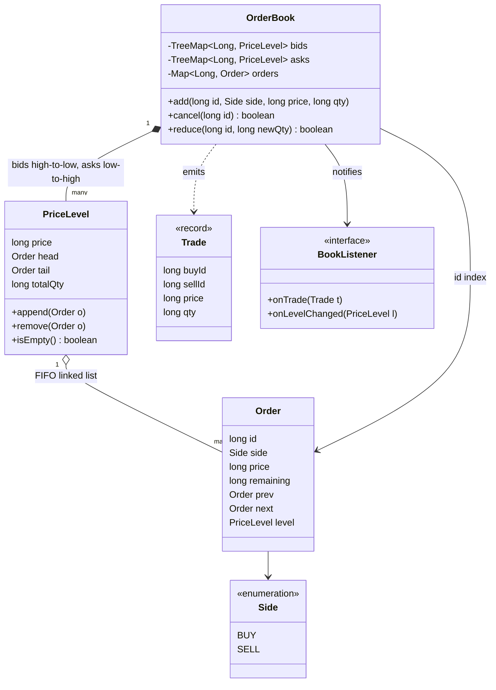
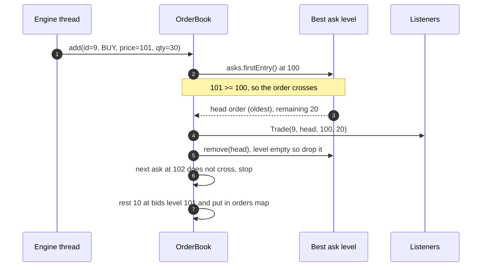

**Short answer:** Each side is a sorted map of price levels: bids sorted high to low, asks low to high. Each level is a FIFO doubly linked list of orders plus a running total, and a hash map from order id to its node gives O(1) cancel and modify. Matching takes the best opposite level, fills oldest first (price-time priority), and rests any remainder. For real low latency I would replace the tree with an array indexed by price tick and run the book on a single thread, so no locks.

## Picture it





**How to read it:**
- Each side is a `TreeMap` of `PriceLevel`s, so the best bid or ask is always the first entry.
- Inside a level, orders form a doubly linked list in arrival order; the head is the oldest, which gives time priority.
- The `orders` map points straight at each `Order` node, so cancel unlinks it in O(1) without a search.
- An incoming order eats the opposite side's best level while prices cross, trading at the resting price, then rests any remainder on its own side.
- Trades go out to listeners; the book never knows who consumes them.

## Requirements

- Limit orders: `add(id, side, price, qty)`; market orders as an extension.
- Matching with price-time priority: best price first, earlier order first within a price.
- `cancel(id)` and `modify(id, newQty)` in O(1).
- Queries: best bid, best ask, depth at a price, top N levels.
- Emit trades and book updates to listeners.
- Prices as `long` ticks, quantities as `long`. No floating point.

## Classes

- `Side` (enum BUY, SELL).
- `Order`: id, side, price, remaining qty, plus `prev`/`next` links (intrusive list node) and its `PriceLevel`.
- `PriceLevel`: price, head, tail, totalQty, count. Append at tail, remove any node in O(1).
- `BookSide`: `TreeMap<Long, PriceLevel>` with the right comparator; best level = `firstEntry()`.
- `OrderBook`: two `BookSide`s plus `Map<Long, Order> orders`. Owns add, cancel, modify and matching.
- `Trade` (record) and `BookListener` (interface: onTrade, onLevelChanged).

## Patterns used

- **Observer** for trades and market-data updates; the book does not know who consumes them.
- **Single-writer principle** (an architecture pattern rather than GoF): one thread owns the book, commands arrive through a queue.
- **Command** if you model add/cancel/modify as objects in that queue, which also gives a replayable journal.

## Code

```java
enum Side { BUY, SELL }

final class Order {
    final long id; final Side side; final long price;
    long remaining;
    Order prev, next;
    PriceLevel level;
    Order(long id, Side side, long price, long qty) { this.id = id; this.side = side; this.price = price; this.remaining = qty; }
}

final class PriceLevel {
    final long price;
    Order head, tail;
    long totalQty;
    PriceLevel(long price) { this.price = price; }

    void append(Order o) {
        o.level = this; o.prev = tail; o.next = null;
        if (tail == null) head = o; else tail.next = o;
        tail = o;
        totalQty += o.remaining;
    }
    void remove(Order o) {
        if (o.prev == null) head = o.next; else o.prev.next = o.next;
        if (o.next == null) tail = o.prev; else o.next.prev = o.prev;
        totalQty -= o.remaining;
        o.prev = o.next = null; o.level = null;
    }
    boolean isEmpty() { return head == null; }
}

record Trade(long buyId, long sellId, long price, long qty) {}

final class OrderBook {
    private final TreeMap<Long, PriceLevel> bids = new TreeMap<>(Comparator.reverseOrder());
    private final TreeMap<Long, PriceLevel> asks = new TreeMap<>();
    private final Map<Long, Order> orders = new HashMap<>();
    private final List<Consumer<Trade>> tradeListeners = new ArrayList<>();

    /** Called only from the engine thread. */
    void add(long id, Side side, long price, long qty) {
        var incoming = new Order(id, side, price, qty);
        var opposite = side == Side.BUY ? asks : bids;
        while (incoming.remaining > 0 && !opposite.isEmpty()) {
            PriceLevel best = opposite.firstEntry().getValue();
            boolean crosses = side == Side.BUY ? price >= best.price : price <= best.price;
            if (!crosses) break;
            Order resting = best.head;
            long q = Math.min(incoming.remaining, resting.remaining);
            var t = side == Side.BUY ? new Trade(id, resting.id, best.price, q)   // trade at the resting price
                                     : new Trade(resting.id, id, best.price, q);
            incoming.remaining -= q;
            resting.remaining -= q;
            best.totalQty -= q;
            tradeListeners.forEach(l -> l.accept(t));
            if (resting.remaining == 0) {
                best.remove(resting);
                orders.remove(resting.id);
                if (best.isEmpty()) opposite.remove(best.price);
            }
        }
        if (incoming.remaining > 0) {                      // rest the remainder
            var same = side == Side.BUY ? bids : asks;
            same.computeIfAbsent(price, PriceLevel::new).append(incoming);
            orders.put(id, incoming);
        }
    }

    boolean cancel(long id) {
        Order o = orders.remove(id);
        if (o == null) return false;
        PriceLevel lvl = o.level;
        lvl.remove(o);
        if (lvl.isEmpty()) (o.side == Side.BUY ? bids : asks).remove(lvl.price);
        return true;
    }

    /** Reducing quantity keeps queue position; anything else is cancel + new order. */
    boolean reduce(long id, long newQty) {
        Order o = orders.get(id);
        if (o == null || newQty <= 0 || newQty >= o.remaining) return false;
        o.level.totalQty -= (o.remaining - newQty);
        o.remaining = newQty;
        return true;
    }
}
```

Note: in `PriceLevel.remove` I subtract `o.remaining`; on a full fill it is already 0 and `totalQty` was reduced during matching, so the totals stay right.

## Extensions

Follow-up: **matching engine with price-time priority, cancel/modify in O(1).**

- **Price-time priority** comes from the structure: the best level is the first tree entry, and within a level the linked list is in arrival order, so the head is the oldest.
- **O(1) cancel**: the id map finds the node, and the intrusive doubly linked list unlinks it without searching. Removing an emptied level from the tree is O(log P). With the tick-array layout below it is O(1) too.
- **O(1) modify**: a quantity decrease updates in place and keeps priority. A price change or a quantity increase loses priority by exchange convention, so it is cancel plus add (the add is O(log P) if it creates a new level).
- **Why not a heap?** A heap gives the best price but cannot cancel an arbitrary order cheaply, cannot list depth by level, and sifts on every change. Why not `ArrayDeque` per level? Removing from the middle is O(n).
- **Lower latency.** Prices sit in a narrow band of ticks, so use an array of `PriceLevel` indexed by `(price - basePrice) / tickSize` and track the best index; moving best after a level empties scans a few slots. Pool `Order` objects to avoid GC pauses, keep primitives (`long`) and avoid boxing in the hot path (a primitive long-to-object map instead of `HashMap<Long, Order>`).
- **Threading.** One engine thread per instrument consumes a queue of commands (a ring buffer such as the LMAX Disruptor in practice). No locks in the book; parallelism comes from sharding instruments across threads.
- **Market and IOC orders**: same loop without the price check (market) or without resting the remainder (IOC).
- **Recovery**: journal every command before applying it; replay to rebuild the book.

Related: [B3 · Atomics, CAS and concurrent collections](../academy/lessons/B3.md), [B7 · Classic problems](../academy/lessons/B7.md).
