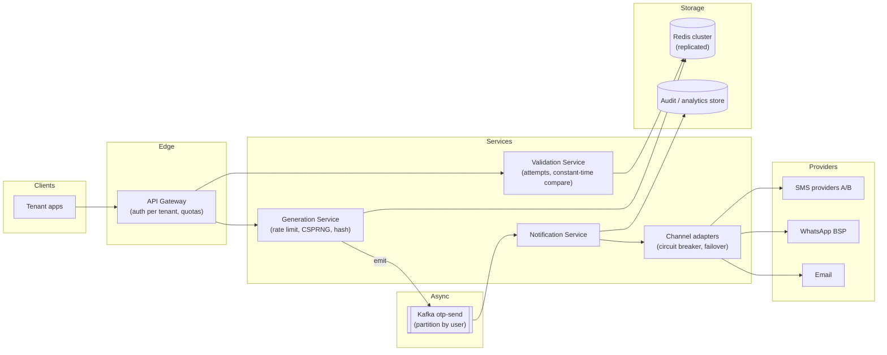
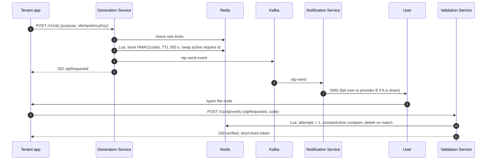
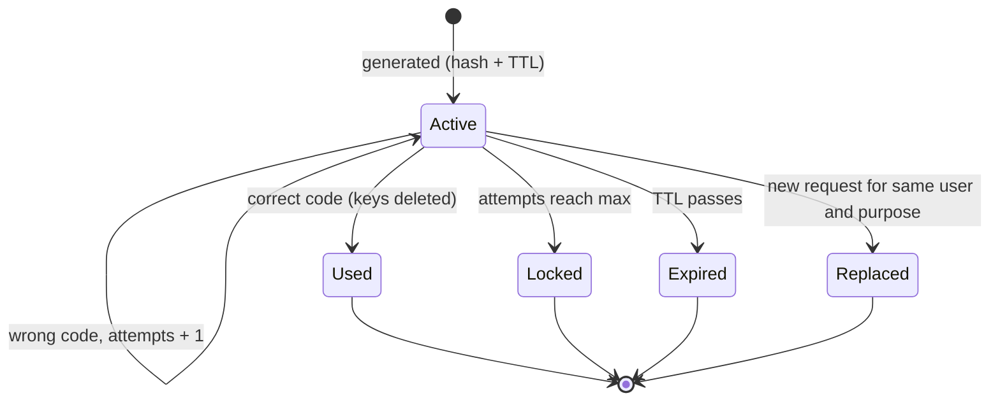

**Short answer:** Split into three services: **Generation** creates a random OTP for `(tenant, user, purpose, requestId)`, stores only a hash with a TTL and attempt counter, and emits an event; **Notification** consumes the event and delivers via SMS, WhatsApp or email with provider failover; **Validation** checks the code against the hash with constant-time compare, increments attempts, and deletes it on success so it is single-use. Redis holds the short-lived OTP state; rate limits protect users and cost; an audit log goes to durable storage.

## Picture it







**How to read it:**
- Steps 1–5: generation checks rate limits, stores only a hash with a 5-minute TTL, and atomically replaces any older OTP for the same user and purpose. It returns 202 at once; delivery is async.
- Steps 6–7: the Notification Service picks the channel and provider, with a circuit breaker and failover from provider A to B.
- Steps 8–11: validation runs in one Lua script, so two parallel guesses cannot both slip under the attempt limit. A correct code deletes the keys, so it is single-use.
- The state picture is one OTP's life: it ends as used, locked, expired or replaced; it never becomes valid again.

## Requirements

Functional:
- Client apps (tenants) request an OTP for a user and purpose (login, payment, reset).
- Channel: SMS, WhatsApp, email; tenant or user preference with fallback.
- Unique per user per request: a new request invalidates the previous OTP for that purpose.
- Validate within TTL (e.g. 5 min), max attempts (e.g. 5), single use.
- A user may have several clients (web, mobile); the OTP is tied to the request, not the device.

Non-functional:
- Generate p99 < 100 ms (delivery is async); validate p99 < 50 ms.
- Secure: no plaintext OTP stored or logged; brute force and SMS-pumping fraud prevented.
- Highly available; multi-tenant isolation and quotas.

## Estimates

- Assume 50M OTPs/day ≈ 600/s average, 5k/s peak (sale events, morning logins).
- Validations ~1.2× generations.
- Live state: 5k/s × 300 s TTL ≈ 1.5M keys × ~200 bytes ≈ 300 MB in Redis. Small.
- Audit log: 50M × 300 bytes = 15 GB/day.

## API

```text
POST /v1/otp            {tenantId, userId, destination?, purpose, channel?, idempotencyKey}
                        -> 202 {otpRequestId, expiresAt, channel}
POST /v1/otp/verify     {otpRequestId, code}  -> 200 {verified: true, token?} | 400 {reason, attemptsLeft}
POST /v1/otp/resend     {otpRequestId, channel?}
```

Clients verify with `otpRequestId`, so two clients of the same user cannot consume each other's OTP by accident.

## Data model

Redis (hot state):
```text
otp:{otpRequestId}         HASH {tenant, user, purpose, codeHash, salt, attempts, expiresAt}  TTL 300s
otp:active:{tenant}:{user}:{purpose} -> otpRequestId                                        TTL 300s
rl:{tenant}:{user}:gen     counter, TTL 1h (e.g. max 5 per hour)
rl:{destination}:gen       counter (stops one phone number being spammed)
```

Postgres (durable): `tenant(id, api_key_hash, quotas, allowed_channels, template_ids)`, `otp_audit(id, tenant, user_hash, purpose, channel, provider, status, created_at, verified_at)` partitioned by day.

## Architecture

The diagram in **Picture it** above shows the components.

This is CQRS-flavoured in the sense the question means: the write path (generate) and the read/check path (validate) are separate services that scale independently and share only the Redis state.

## Deep dives

**1. Generation and uniqueness.** Use a cryptographically secure random generator (`SecureRandom` in Java), 6 digits. Uniqueness does not mean "globally unique code"; it means one valid OTP per (user, purpose) at a time: set `otp:active:...` to the new request id and delete the old request atomically (a Lua script or `MULTI`). Store `HMAC(serverSecret, code + otpRequestId)` rather than the code, so a Redis dump does not reveal live OTPs. The `idempotencyKey` stops a double-click from sending two SMS messages.

**2. Validation.** In one atomic Lua script: load the hash; if missing → expired; if `attempts >= max` → locked; increment attempts; compare hashes in constant time; on match delete both keys and return success. Atomicity prevents two parallel guesses from both getting "attempt 5". On success the service can return a short-lived signed token the tenant exchanges for its session.

**3. Delivery.** The Notification Service renders the tenant's template, picks a channel (preference → fallback), and calls a provider through an adapter with timeouts and a circuit breaker. If provider A is failing or slow, route to B. Delivery receipts update the audit row. Retries carry the same message id so a provider-level duplicate is not charged twice. SMS-pumping fraud (bots requesting OTPs to premium numbers) is blocked with per-destination and per-country limits and CAPTCHA after thresholds.

## Trade-offs

- **Redis vs DB for OTP state:** Redis gives TTL and atomic scripts at low latency; durability is not needed because a lost OTP is simply re-requested. Use replication for availability.
- **Async send:** the API returns fast and providers' latency is hidden, but the user may wait; show "resend" after 30 s.
- **Hash vs encrypt:** hashing means the service itself cannot resend the same code; resend generates a new one, which is safer.
- **Channel cost vs reliability:** WhatsApp/email are cheaper; SMS has wider reach. Let tenants set the order.

## Follow-ups

- *Multi-region?* Route a user to a home region; OTP state need not be replicated across regions because TTL is short.
- *TOTP instead?* For authenticator apps, no delivery is needed; this design is for out-of-band codes.
- *Monitoring?* Delivery success rate per provider, verify-success rate, time-to-verify; alert on a sudden drop.

See [F4 · Case studies: URL shortener, rate limiter, notification system](../academy/lessons/F4.md) and [B7 · Classic problems: producer-consumer, bounded queue, concurrent LRU, rate limiter](../academy/lessons/B7.md).
