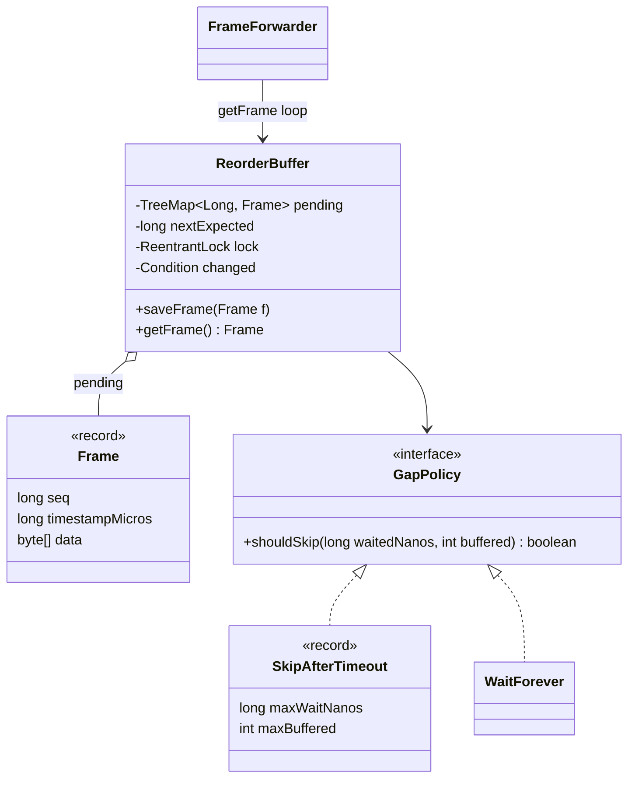
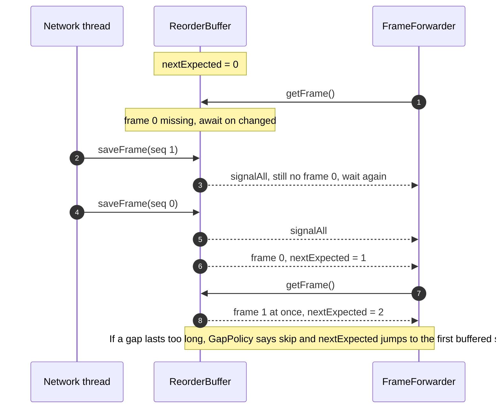

**Short answer:** Buffer arriving frames in a map keyed by sequence number (or a min-heap by timestamp) and keep `nextExpected`. `saveFrame` inserts; `getFrame` returns the frame for `nextExpected` only when it is present, then advances. Because "strictly in order" needs to know a frame is missing, I assume consecutive sequence numbers; with raw timestamps you need a latency window after which you give up on a gap. Thread safety: one lock plus a condition so `getFrame` can block until the next frame arrives.

## Picture it





**How to read it:**
- Network threads call `saveFrame` in any order; frames wait in a `TreeMap` keyed by sequence number.
- The forwarder only ever takes the frame whose seq equals `nextExpected`, so output is strictly in order.
- If that frame is missing it waits on the condition; every new frame signals it to look again.
- `GapPolicy` decides when a lost frame is given up on, so a hole cannot stall the stream or grow memory forever.
- Late or duplicate frames (seq below `nextExpected` or already buffered) are dropped on arrival.

## Requirements

- `saveFrame(frame)` is called by network threads in any order.
- `getFrame()` returns frames downstream in strictly increasing order, never skipping one that may still arrive.
- Assumption: each frame has a sequence number starting at 0 with no intentional gaps. (Clarify this first. If only timestamps exist, the API must be told the frame interval, or use a max-wait to declare a frame lost.)
- Duplicates and late frames (already forwarded) are dropped.
- Bounded memory: if a gap never fills, do not grow forever.

## Classes

- `Frame` (record: seq, timestamp, bytes).
- `ReorderBuffer`: the map of pending frames, `nextExpected`, the lock and condition, and the gap policy.
- `GapPolicy` (interface): what to do when the head frame is missing too long or the buffer is full. `WaitForever` and `SkipAfterTimeout` implementations.
- `FrameForwarder`: a loop on its own thread that calls `getFrame()` and pushes downstream.

## Patterns used

- **Producer-consumer** between network threads and the forwarder.
- **Strategy** for `GapPolicy`, since live video (skip quickly) and recording (wait longer) want different behaviour.
- Mostly a data-structure plus concurrency question; I would not force more patterns.

## Code

```java
record Frame(long seq, long timestampMicros, byte[] data) {}

interface GapPolicy {
    /** Returns true if the missing frame at the head should be skipped now. */
    boolean shouldSkip(long waitedNanos, int buffered);
}

record SkipAfterTimeout(long maxWaitNanos, int maxBuffered) implements GapPolicy {
    public boolean shouldSkip(long waited, int buffered) { return waited >= maxWaitNanos || buffered >= maxBuffered; }
}

final class ReorderBuffer {
    private final TreeMap<Long, Frame> pending = new TreeMap<>();
    private long nextExpected = 0;
    private final ReentrantLock lock = new ReentrantLock();
    private final Condition changed = lock.newCondition();
    private final GapPolicy gapPolicy;

    ReorderBuffer(GapPolicy gapPolicy) { this.gapPolicy = gapPolicy; }

    void saveFrame(Frame f) {
        lock.lock();
        try {
            if (f.seq() < nextExpected || pending.containsKey(f.seq())) return;  // late or duplicate
            pending.put(f.seq(), f);
            changed.signalAll();   // the forwarder may be waiting for this exact frame
        } finally {
            lock.unlock();
        }
    }

    /** Blocks until the next in-order frame is available (or the gap policy skips the hole). */
    Frame getFrame() throws InterruptedException {
        lock.lockInterruptibly();
        try {
            long waitStart = System.nanoTime();
            while (true) {
                Frame f = pending.remove(nextExpected);
                if (f != null) {
                    nextExpected++;
                    return f;
                }
                if (!pending.isEmpty()
                        && gapPolicy.shouldSkip(System.nanoTime() - waitStart, pending.size())) {
                    nextExpected = pending.firstKey();      // jump over the lost frame(s)
                    continue;
                }
                changed.await(5, TimeUnit.MILLISECONDS);    // timed, so the gap policy is re-checked
            }
        } finally {
            lock.unlock();
        }
    }
}
```

Complexity: `saveFrame` O(log n), `getFrame` O(log n) per frame, where n is the number of buffered frames. If sequence numbers are dense and the reorder window is small, a ring buffer of size W indexed by `seq % W` makes both O(1): slot `seq % W` is valid only if the stored frame's seq matches.

## Extensions

Follow-up: **make it thread-safe (mutexes, double-checked locking).**

- **Mutex.** All state (`pending`, `nextExpected`) is guarded by one `ReentrantLock`. Reads and writes happen only inside it, which gives both atomicity and visibility. The condition variable avoids busy waiting; the `while` loop handles spurious wakeups.
- **Double-checked locking** is a pattern for lazy one-time initialisation (create a singleton once without locking on every read). It is not the right tool for this buffer, because every operation mutates shared state. If it comes up, the correct Java form needs the field to be `volatile`; without `volatile` another thread can see a non-null reference to a not-yet-fully-constructed object. In modern Java a holder class or an enum singleton is simpler.
- **Non-blocking variant.** If `getFrame()` must not block, return `Optional<Frame>` and have the caller poll. Same lock, no condition.
- **Multiple consumers.** Not meaningful for strict order; keep one forwarder thread. Multiple producers are fine.
- **Higher throughput.** With a ring buffer and a single consumer, producers can write slots with `AtomicReferenceArray.set` and the consumer reads slot `nextExpected % W`; this avoids the lock, but you must handle a producer that is more than W ahead (drop or block).
- **Timestamps instead of sequence numbers.** Use a min-heap by timestamp and release the head once `now - head.arrivalTime >= jitterWindow` (a jitter buffer). Order is then "best effort within the window", which is what real video players do.
- **Memory bound.** `maxBuffered` in the gap policy caps memory; when hit, skip the hole and move on.

Related: [B7 · Classic problems](../academy/lessons/B7.md), [A6 · The Java Memory Model](../academy/lessons/A6.md), [B2 · Locks](../academy/lessons/B2.md).
