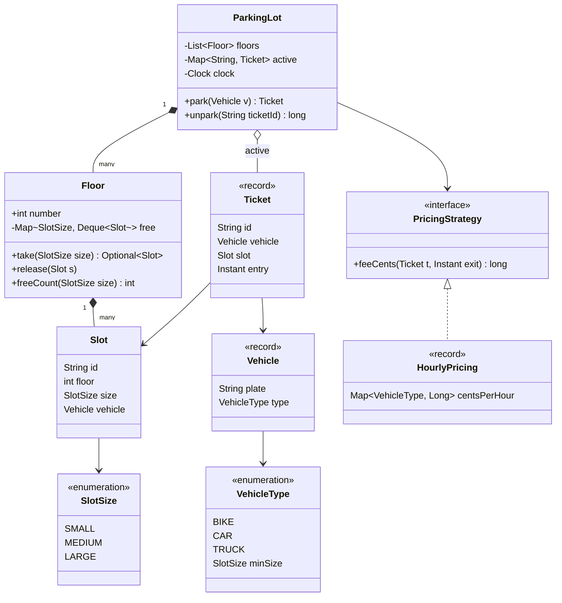
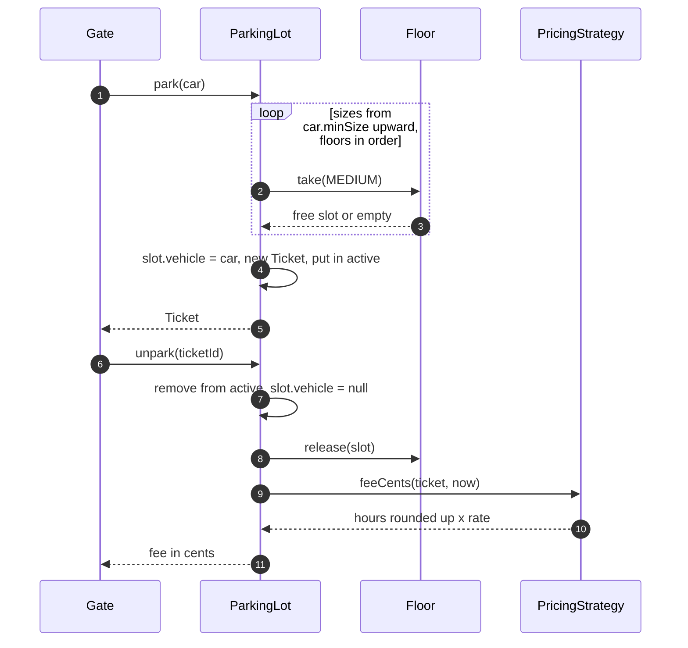

**Short answer:** `ParkingLot` has `Floor`s, each floor has `Slot`s of a size (SMALL, MEDIUM, LARGE). Park finds the first free slot that fits the vehicle, marks it occupied and returns a `Ticket`; unpark looks up the ticket, frees the slot and computes the fee through a `PricingStrategy`. Keep free slots per floor and size in queues so finding one is O(floors) instead of scanning every slot. The interviewer wanted a working, not over-engineered version, so I keep it to about six classes and add patterns only where they buy something.

## Picture it





**How to read it:**
- `ParkingLot` owns `Floor`s, each `Floor` owns its `Slot`s and keeps free ones in a queue per size.
- To park, the lot tries the smallest size that fits the vehicle, floor by floor, then the next size up; `take` is an O(1) poll.
- The `Ticket` ties the vehicle to its slot and entry time and sits in the `active` map until exit.
- On exit the slot goes back to its floor's free queue and the fee comes from the pluggable `PricingStrategy`.

## Requirements

- Multiple floors; each slot has a size; vehicle types BIKE, CAR, TRUCK.
- A vehicle fits a slot of its size or larger (bike can use a car slot if bikes are full).
- `park(vehicle)` returns a ticket or "lot full"; `unpark(ticketId)` returns the fee.
- Fee by hours parked and vehicle type.
- Show free slots per floor. Thread-safe for several entry and exit gates.
- Out of scope: payments, reservations, EV charging (Extensions).

## Classes

- `VehicleType`, `SlotSize` (enums). `VehicleType` knows its minimum `SlotSize`.
- `Vehicle` (record: plate, type).
- `Slot`: id, floor number, size, current vehicle (or null).
- `Floor`: number, slots, and a `Map<SlotSize, Deque<Slot>>` of free slots.
- `Ticket` (record: id, plate, slot, entry time).
- `PricingStrategy` (interface) with `HourlyPricing`.
- `ParkingLot`: floors, active tickets, the `park`/`unpark` API.

## Patterns used

- **Strategy** for pricing (weekend rates, flat rate) and optionally for slot allocation (nearest to the entrance vs lowest floor first). This is where change is likely.
- **Singleton** is often suggested for `ParkingLot`; I would rather create one instance and inject it (Spring bean), which keeps it testable. Say so if asked.
- SRP: `Floor` manages its own free slots; `ParkingLot` coordinates; pricing lives outside.

## Code

```java
enum SlotSize { SMALL, MEDIUM, LARGE }

enum VehicleType {
    BIKE(SlotSize.SMALL), CAR(SlotSize.MEDIUM), TRUCK(SlotSize.LARGE);
    final SlotSize minSize;
    VehicleType(SlotSize s) { minSize = s; }
}

record Vehicle(String plate, VehicleType type) {}

final class Slot {
    final String id; final int floor; final SlotSize size;
    Vehicle vehicle;
    Slot(String id, int floor, SlotSize size) { this.id = id; this.floor = floor; this.size = size; }
}

record Ticket(String id, Vehicle vehicle, Slot slot, Instant entry) {}

final class Floor {
    final int number;
    private final Map<SlotSize, Deque<Slot>> free = new EnumMap<>(SlotSize.class);

    Floor(int number, List<Slot> slots) {
        this.number = number;
        for (SlotSize s : SlotSize.values()) free.put(s, new ArrayDeque<>());
        slots.forEach(s -> free.get(s.size).add(s));
    }
    Optional<Slot> take(SlotSize size) { return Optional.ofNullable(free.get(size).pollFirst()); }
    void release(Slot s) { free.get(s.size).addLast(s); }
    int freeCount(SlotSize size) { return free.get(size).size(); }
}

interface PricingStrategy { long feeCents(Ticket t, Instant exit); }

record HourlyPricing(Map<VehicleType, Long> centsPerHour) implements PricingStrategy {
    public long feeCents(Ticket t, Instant exit) {
        long minutes = Duration.between(t.entry(), exit).toMinutes();
        long hours = Math.max(1, (minutes + 59) / 60);          // round up, minimum one hour
        return hours * centsPerHour.get(t.vehicle().type());
    }
}

final class ParkingLot {
    private final List<Floor> floors;
    private final PricingStrategy pricing;
    private final Map<String, Ticket> active = new HashMap<>();
    private final Clock clock;

    ParkingLot(List<Floor> floors, PricingStrategy pricing, Clock clock) {
        this.floors = floors; this.pricing = pricing; this.clock = clock;
    }

    synchronized Ticket park(Vehicle v) {
        for (SlotSize size : SlotSize.values()) {
            if (size.compareTo(v.type().minSize) < 0) continue;     // too small
            for (Floor f : floors) {
                Optional<Slot> slot = f.take(size);
                if (slot.isPresent()) {
                    Slot s = slot.get();
                    s.vehicle = v;
                    var t = new Ticket(UUID.randomUUID().toString(), v, s, clock.instant());
                    active.put(t.id(), t);
                    return t;
                }
            }
        }
        throw new IllegalStateException("No slot for " + v.type());
    }

    synchronized long unpark(String ticketId) {
        Ticket t = active.remove(ticketId);
        if (t == null) throw new IllegalArgumentException("Unknown or used ticket");
        Slot s = t.slot();
        s.vehicle = null;
        floors.get(s.floor).release(s);       // assumes floors indexed by number
        return pricing.feeCents(t, clock.instant());
    }
}
```

The `Clock` is injected so fee tests do not depend on real time. Money is in cents as `long`.

## Extensions

- **Concurrency.** `synchronized` on `park`/`unpark` is correct and simple; a parking lot does a few operations per second per gate, so the single lock is not a bottleneck. If it were, lock per floor (try floors in order, `tryLock` each) or use a `ConcurrentLinkedDeque` per size and `pollFirst()`, which is atomic, so two gates cannot get the same slot.
- **Allocation strategy.** Pull the loop into `SlotAllocator` (Strategy): smallest-fitting first (above), nearest to gate, or spread across floors.
- **Display board.** Floors publish free counts; a display subscribes (Observer). Only worth adding if asked.
- **New vehicle type** (EV): add an enum value and, if needed, a `SlotFeature` like CHARGER; pricing adds a charging component.
- **Payments**: `unpark` returns the amount; a `PaymentService` settles it and only then opens the gate.
- **Persistence / HLD** (some interviewers took this toward a database): tables `slot(id, floor, size, status)`, `ticket(id, plate, slot_id, entry_at, exit_at, fee)`. Allocate atomically with `UPDATE slot SET status='OCCUPIED' WHERE id = (SELECT id FROM slot WHERE status='FREE' AND size >= ? ORDER BY size, floor LIMIT 1 FOR UPDATE SKIP LOCKED) RETURNING id` in PostgreSQL. Index `(status, size, floor)`. Partition `ticket` by month for history. For many lots, shard by lot id.

Related: [E6 · LLD case studies: parking lot, LRU cache, rate limiter, notification system](../academy/lessons/E6.md), [E1 · SOLID](../academy/lessons/E1.md).
