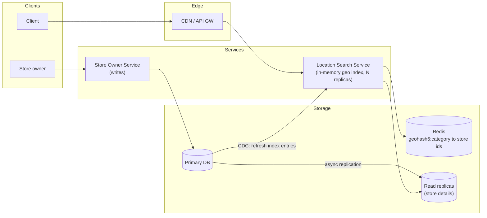
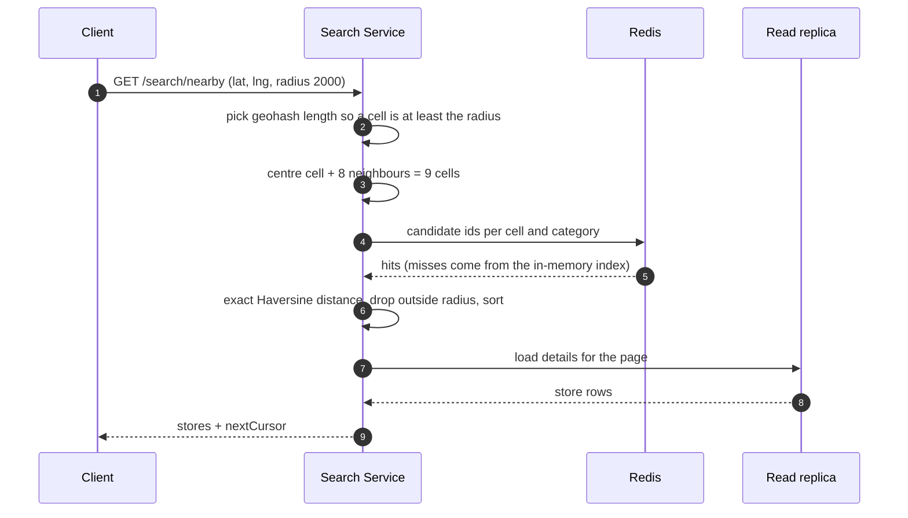
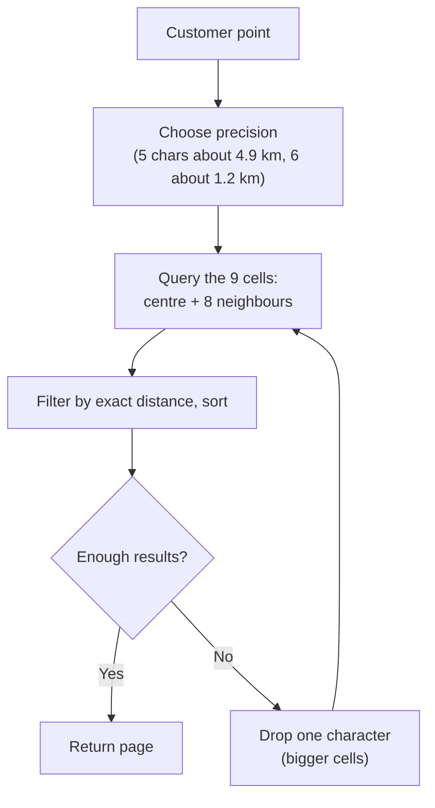

**Short answer:** Stores change rarely and searches are frequent, so this is a read-heavy geospatial index problem. Encode each store's location as a geohash (or use a quadtree / S2 cells), find the cell for the customer plus its 8 neighbours at a precision that matches the search radius, fetch candidate stores from those cells, then compute exact distance and sort. The store table lives in Postgres (PostGIS works well up to large scale); the geo index is cached in memory on read replicas or a dedicated location service, and results for popular areas are cached.

## Picture it







**How to read it:**
- Steps 1–3: the service turns the point into a geohash at a precision that matches the radius, and adds the 8 neighbours so a store just across a cell border is not missed.
- Steps 4–6: candidates come from Redis or the in-memory index, then exact Haversine distance removes the corners of the square cells.
- Steps 7–9: details for only the current page come from a read replica.
- Writes are rare: the owner service writes the primary, and replication plus CDC refresh the replicas and the in-memory index within a minute. The last picture is the "too few results, widen the cells" loop.

## Requirements

Functional:
- Search stores near a point (lat, lng) within radius r (e.g. 500 m to 20 km), optional filters (category, open now).
- Return sorted by distance, paginated; show store details.
- Store owners add, edit, remove stores (changes visible within minutes is fine).

Non-functional:
- Search p99 < 100–200 ms; very high availability.
- Read-heavy: writes are rare.
- Privacy: do not store customer locations longer than needed.

## Estimates

- 100M daily users × 5 searches = 500M/day ≈ 6k QPS average, ~30k peak.
- 200M stores × ~1 KB = 200 GB of details; the geo index itself (id, lat, lng, geohash) ≈ 200M × 30 bytes ≈ 6 GB: fits in memory on each search node.
- Writes: maybe 100k store changes/day, negligible.

## API

```text
GET /v1/search/nearby?lat=12.97&lng=77.59&radius=2000&category=pharmacy&openNow=true&cursor=
    -> {stores: [{id, name, lat, lng, distanceM, rating}], nextCursor}
GET /v1/stores/{id}
POST/PUT/DELETE /v1/stores/{id}   (owners; authenticated)
```

## Data model

```sql
CREATE TABLE store (
  id bigint PRIMARY KEY, name text, category text,
  lat double precision, lng double precision,
  geohash char(12),                    -- precomputed
  opening_hours jsonb, rating numeric, updated_at timestamptz);
CREATE INDEX store_geohash ON store (geohash text_pattern_ops);   -- prefix search
-- with PostGIS instead: geog geography(Point, 4326) + GiST index, query with ST_DWithin
```

Geohash precision vs cell size (approximate): 4 chars ≈ 39 km × 20 km, 5 ≈ 4.9 km × 4.9 km, 6 ≈ 1.2 km × 0.6 km. Pick the length where a cell is at least the radius, then search that cell plus its neighbours.

## Architecture

The diagram in **Picture it** above shows the components.

## Deep dives

**1. Geohash search and its edge problem.** Geohash interleaves bits of latitude and longitude into a base-32 string; nearby points usually share a prefix, so a prefix query on a B-tree finds a cell. Two edge cases: two points close together across a cell boundary share no prefix, and cells are not circles. Both are solved by querying the 9 cells (centre + 8 neighbours) and then filtering by exact Haversine distance. If too few results, drop one character of precision (bigger cells) and repeat.

**2. Geohash vs quadtree vs PostGIS vs S2.**
- *Geohash:* simple, works in any DB or Redis (`GEOSEARCH` uses geohash-based sorted sets), easy to shard by prefix. Fixed grid, so dense cities and empty deserts get the same cell size.
- *Quadtree:* an in-memory tree that splits a cell when it holds more than k stores (say 100), so density adapts. Built at startup on each server (seconds to minutes for 200M points); updates need care. Good for "k nearest" searches.
- *PostGIS:* `ST_DWithin(geog, point, radius)` with a GiST index; the simplest correct answer for a Spring Boot + Postgres shop up to tens of millions of rows and a few thousand QPS per replica.
- *S2 / H3:* hierarchical cells on a sphere with better shape properties; used at large scale.

Give the simple answer (PostGIS or geohash on read replicas) first, then the in-memory quadtree when QPS or density demands it.

**3. Scaling reads.** The index is small enough to replicate everywhere, so scale horizontally with read replicas and stateless search nodes; no need to shard by geography until the details data is huge. Cache hot cells (`geohash6 + category`) in Redis with a short TTL. Updates flow by CDC to search nodes; staleness of a minute is acceptable.

## Trade-offs

- **Replicate the whole index vs shard by region:** replicating is simpler and avoids cross-shard queries near borders; shard only when memory forces it.
- **Precision choice:** small cells mean fewer false candidates but more neighbour lookups for large radii.
- **Freshness vs cost:** batch index refresh is cheap; real-time update matters only for things like "open now".

## Follow-ups

- *Moving entities (delivery riders)?* Different problem: frequent writes, keep location in Redis geo sets with TTL, not a DB index.
- *Ranking beyond distance?* Score = distance + rating + open-now + popularity, applied to the candidate set.
- *Multi-region?* Serve each region from its own replica set; stores rarely need cross-region search.

See [F1 · Building blocks: load balancers, caches, queues, databases](../academy/lessons/F1.md), [Q5 · Indexes and reading EXPLAIN](../academy/lessons/Q5.md) and [Q8 · Scaling databases: replicas, partitioning, sharding, caching, CQRS](../academy/lessons/Q8.md).
